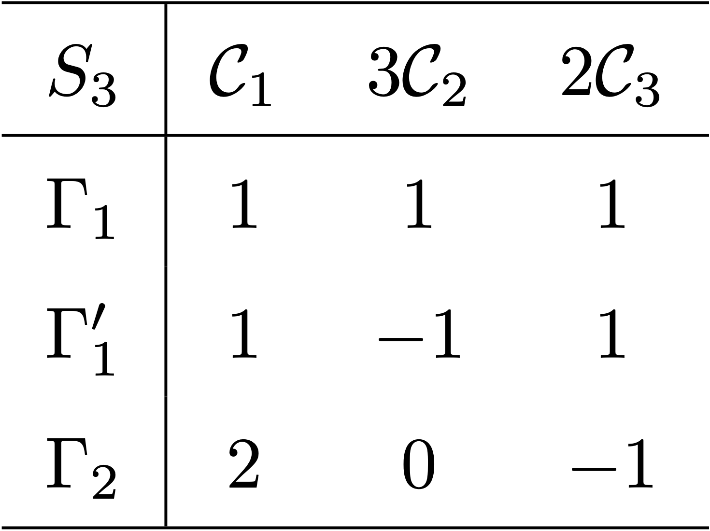
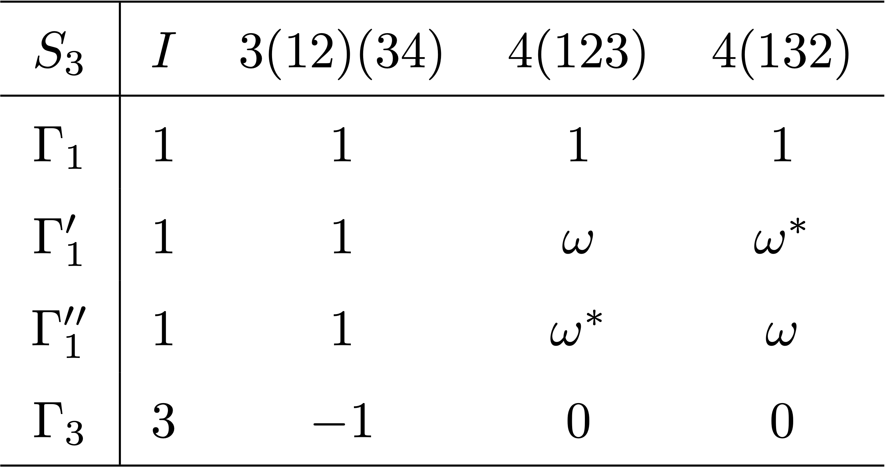

---
title: "군의 지표"
number-sections: true
number-depth: 3
crossref:
  chapters: true
---  



## 지표 테이블

### 지표 테이블이란 {#sec-Group_character_table}

지표 테이블은 군의 특성을 아는데 매우 중요하다. 이것을 어떻게 구성하는지 $S_3$ 군에 대한 예를 통해 알아보기로 하자. 

 

::: {#exm-Group_character_table_of_D3}

#### $S_3=D_3$ 에 대한 켤레류

순열군 $S_3$ 는 $(1,\,2,\,3)$ 에 대한 순열군으로 $D_3$ 와 같다. 다 쓰기 복잡하므로 각 원소에 이름을 아래와 같이 붙인다.

$$
S_3=\{E=i_{S_3},\, A=(12),\, B=(13),\, C=(23),\, D=(123),\, F=(132)\}
$$

군의 켤레류가 군을 분할한다는 것을 이용하여 $S_3$ 의 켤레류를 구해보자.

&emsp;($1$) 모든 $g\in S_3$ 에 대해 $gEg^{-1}=E$ 이므로 $\{E\}$ 는 conjugacy class 이다. 즉 $[E]=\{E\}$ 이다.

&emsp;($2$) $BAB^{-1}= C,\, CAC^{-1}=B,\, DAD^{-1}=C,\, FAF^{-1}=B$ 이므로 $[A]=\{A,\,B,\,C\}$ 이다.

&emsp;($3$) $ADA^{-1}=F$ 이므로 $[D]=\{D,\,F\}$ 이다. 

즉 $3$ 개의 $S_3$ 에 대해 켤레류가 존재한다. 이를 각각 $\mathcal{C}_1,\, \mathcal{C}_2,\, \mathcal{C}_3$ 라고 하자. 또한 3개의 동등하지 않은 기약표현이 존재한다. $S_3$ 에 대한 정칙표현은 $6 \times 6$ 행렬이며 3개의 기약 표현에 대해 $d_1^2+d_2^2+d_3^3 = 6$ 이어야 한다. 자명한 표현(@exm-Group_trivial_representation) $A_1$ 에 대해 $d_1=1$ 이며 따라서 가능한 것은 $d_2=1,\, d_3=2$ 뿐이다(@prp-Group_regular_representation_is_not_irreducible_3). 이를 $A_2,\, E$ 라고 하자.(1차원 기약표현은 $A,\,B$, 2 차원 기약표현을 $E$, 3 차원 기약표현을 $T$ 로 표기하는 관례를 따른다.) 이 기약표현을 정리하면 아래와 같다. 

<!-- \renewcommand{\arraystretch}{1.5} \begin{tabular}{ c|cccccc } 
\hline  
$D_3$ & $E$ & $A$ & $B$ & $C$ & $D$ & $F$ \\ 
\hline 
$A_1$ & $[1]$ & $[1]$ & $[1]$  & $[1]$ & $[1]$ & $[1]$ \\
$A_2$ & $[1]$ & $[-1]$ & $[-1]$ & $[-1]$ & $[1]$ & $[1]$ \\[0.3em]
$E$ & $\begin{bmatrix} 1 & 0 \\ 0 & 1\end{bmatrix}$ & $\begin{bmatrix} -1 & 0 \\ 0 & 1\end{bmatrix}$ & $\begin{bmatrix} \frac{1}{2} & -\frac{\sqrt{3}}{2} \\ -\frac{\sqrt{3}}{2} & -\frac{1}{2}\end{bmatrix}$ &  $\begin{bmatrix} \frac{1}{2} & \frac{\sqrt{3}}{2} \\ \frac{\sqrt{3}}{2} & -\frac{1}{2}\end{bmatrix}$ &  $\begin{bmatrix} -\frac{1}{2} & \frac{\sqrt{3}}{2} \\ -\frac{\sqrt{3}}{2} & -\frac{1}{2}\end{bmatrix}$ &  $\begin{bmatrix} -\frac{1}{2} & -\frac{\sqrt{3}}{2} \\ \frac{\sqrt{3}}{2} & -\frac{1}{2}\end{bmatrix}$\\[1.5em]
\hline
\end{tabular} -->

{#tbl-Group_irreducible_representation_of_S3 width=600}

지표 테이블은 첫번째 행에 클래스를, 첫번째 열에 기약표현을 나열하고 안을 지표값으로 채우는 방식과, 첫번째 행에 기약표현을, 첫번재 열에 클래스를 열하는 표기법이 있다. @Zee2016Group 는 두번째 표기법을 사용하지만 여기서는 좀 더 많이 사용하는 첫번째 표기법을 사용하겠다.

지표 테이블의 첫번째 행은 켤레류를 나열한다. 켤레류 이름 앞에 각 켤레류의 원소의 개수를 쓰는 경우도 있다. 특정한 이름을 붙일 수도 있고 각 클래스의 대표 원소에 $[\;]$ 를 붙여 표기할 수도 있다. 좀 재멋대로다. 첫번째 행 첫번째 열에 군의 기호를 쓰기도 한다. $D_3$ 의 경우 $\mathcal{C}_1,\, 3\mathcal{C}_2,\, 2\mathcal{C}_3$ 가 된다. 지표 테이블의 첫번째 열은 각각의 기약표현에 대한 정보가 들어간다. 한줄로 아래와 같이 표현할 수도 있고, 이를 분할하여 여러 정보를 넣는 경우도 있다. 역시 제멋대로다. 그리고 나머지 행과 열은 각 기약표현의 켤레류의 지표를 나열한다. $D_3$ 에 대한 지표 테이블은 아래와 같다. 

<!--  \renewcommand{\arraystretch}{1.5} \begin{tabular}{ c|ccc } 
\hline  
$S_3$ & $\mathcal{C}_1$ & $3\mathcal{C}_2$ & $2\mathcal{C}_3$ \\ 
\hline 
$D^{(1)}$ & $1$ & $1$ & $1$\\
$D^{(2)}$ & $1$ & $-1$ & $1$ \\
$D^{(3)}$ & $2$ & $0$ & $-1$ \\
\hline
\end{tabular}  -->

{#tbl-Group_character_table_of_S3 width=160}

:::

 

위와 같은 지표 테이블에는 우리가 지금껏 알아보았던 여러가지 명제들이 사용된다. 여기서 한가지를 추가하도록 하자. 

::: {#prp-Group_class_multiplication_and_character}

$c_{jkl}$ 은 @eq-Group_class_multiplication_rule 에서 정의된 대로 $K_jK_k=\sum_l c_{jkl}K_l$ 를 만족하는 상수 이다. 이 때 다음이 성립한다.

$$
|K_j|\chi^{(i)}(K_j) |K_k|\chi^{(i)}(K_k) = d_i \sum_l c_{jkl} |K_l| \chi^{(i)}(K_l)
$${#eq-prp_Group_class_multiplication_and_character}

:::

::: {.proof}

유한군 $G$ 와 $G$ 의 켤레류의 집합 $\mathcal{K}_G=\{K_1,\ldots,\,\}$ 를 생각하자. $G$ 에 대한 $d_i$ 차원 기약표현 $D^{(i)}$ 와 $g\in G$ 에 대해 $\overline{g} := D^{(i)}(g)$ 라고 하자. 그리고

$$
\overline{K}_k = \sum_{x\in K_k} D^{(i)}(x)
$$

라고 하자. 그렇다면 모든 $g\in G$ 에 대해 $\overline{g}\overline{K}_k = \overline{K}_k \overline{g}$ 이며 슈어 보조정리(@lem-Group_schur_lemma) 에 따라 $\overline{K}_k$ 는 항등행렬의 스칼라배이다. $\overline{K}_k = \eta_k I_{d_i}$ 라고 놓자.

이제 @eq-Group_class_multiplication_rule 를 생각하자. $K_jK_k = \sum_{l}c_{jkl}K_l$ 이므로

$$
\eta_j \eta_l = \sum_l c_{jkl}\eta_l
$$ {#eq-prp_Group_class_multiplication_and_character_1}

이 성립한다. $\overline{K}_k = \eta_k I_{d_i}$ 이므로 

$$
\tr(\overline{K}_k) = \eta_k d_i
$$

이며

$$
\tr(\overline{K}_k) = \sum_{x\in K_i}\tr(D^{(i)}(x)) = |K_k| \chi^{(i)} (K_i)
$$

이다. 따라서

$$
\eta_k = \dfrac{|K_k| \chi^{(i)}(K_i)}{d_i}
$$

이다. 이 식을 @eq-prp_Group_class_multiplication_and_character_1 에 대입하면 @eq-prp_Group_class_multiplication_and_character 를 얻는다. $\square$

:::

 

### 지표 테이블 구성 규칙 {#sec-Group-character_table_construction_rules}

@exm-Group_character_table_of_D3 의 경우 원소가 6개이고 켤레류가 3개 이므로 비교적 쉽게 지표 테이블을 구했다. 그러나 일반적으로는 쉽지 않으며 우리가 지금까지 알아본 것들을 이용하여 구해야 한다. 이제 여기에 중요한 것을 요약하고자 한다.

유한군 $G$ 의 모든 동등하지 않은 기약표현 $D^{(1)},\ldots,\,D^{(N_R)}$ 와 켤레류의 집합 $\mathcal{K}_G =\{K_1,\ldots,\,K_{N_C}\}$ 를 생각하자. 기약표현 $D^{(i)}$ 에 대한 지표를 $\chi^{(i)}$ 라고 하고, $D^{(i)}$ 의 차원을 $d_i$ 라고 하자. $D^{(i)}$ 와 동등한 유니터리 표현을 $U^{(i)}$ 라고 하자. 이 때 다음이 성립한다.

#### **(R1) 표현의 차원과 군의 크기**

$$
\displaystyle\sum_{i} {d_i}^2 = |G|,
$$ {#eq-Group_c1}

#### **(R2) 지표와 기약 표현의 개수**

$$
N_C=N_R
$$ {#eq-Group_c2}

#### **(R3) $\bf{E=\{i_G\}}$ 와 지표**

$$
\chi^{(i)}(E)=d_i
$${#eq-Group_c3}

#### **(R4) 1차원 표현의 지표**

$D^{(i)}$ 가 1차원 표현일 때 $|\chi^{(i)}(g)|^2=1$.

#### **(R5) 위대한 직교 정리** 

$$
\displaystyle \sum_{g\in G} D^{(i)}(g^{-1})_{\nu \mu} D^{(j)}(g)_{\alpha\beta} = \dfrac{|G|}{d_i}\delta_{ij}\delta_{\mu\alpha}\delta_{\nu\delta}.
$$ {#eq-Group_c5}

#### **(R5-1)** 

사소한 표현 $D^{(i)}(g)=1$ 과 사소하지 않은 기약표현 $D^{(j)}(g)$ 에 대해 위대한 직교정리를 적용하면
$$
\displaystyle \sum_{g\in G} D^{(j)}(g)_{\alpha\beta} = 0
$$ {#eq-Group_c5_1}

#### **(R6) 유니터리 표현에 대한 위대한 직교 정리** 

$$
\displaystyle \sum_{g\in G} {\left[U^{(i)}(g)\right]^\dagger} _{\mu \nu}U^{(j)}(g)_{\alpha\beta} = \dfrac{|G|}{d_i}\delta_{ij}\delta_{\mu\alpha}\delta_{\nu\delta}.
$$ {#eq-Group_c6} 

#### **(R7) 지표에 대한 제 1 직교 정리** 

$$
\displaystyle \sum_{K_i\in \mathcal{K}_G} |K_i| \left(\chi^{(j)}(K_i)\right)^\ast\chi^{(k)}(K_i) = |G|\delta_{jk}
$$ {#eq-Group_c7}

#### **(R8) 지표에 대한 제 2 직교 정리** 

$$
\sum_k \left(\chi^{(k)}(K_i)\right)^\ast\chi^{(k)}(K_j) = \dfrac{|G|}{|K_i|} \delta_{K_i,\, K_j}
$$ {#eq-Group_c8} 

#### **(R9) 지표 곱 규칙**

$K_jK_k =\sum_{l} c_{jkl} K_l$ 에 대해 
$$
|K_j|\chi^{(i)}(K_j) |K_k|\chi^{(i)}(K_k) = d_i \sum_l c_{jkl} |K_l| \chi^{(i)}(K_l)
$${#eq-Group_c9} 

 

여기서 **(R4)** 는 다른 곳에서 명제로 명시적으로 밝히지 않았지만 유용하기 때문에 여기에 넣었다. 증명은 간단하다. $D^{(i)}$ 가 1차원 표현일 이고 $G$ 가 유한군이라면 $g^{|G|}=1_G$ 이며, $D^{(i)}(g^{|G|}) = (D^{(i)}(g))^{|G|}=1$ 이고 $D^{(i)}(g) = \chi^{(i)}(g)$ 이기 때문이다. 

 

### 간단한 군의 지표 테이블

여기서 $n$ 차원 기약표현을 $\Gamma_{n}$ 이라고 하자. $n$ 차원 기약표현이 여러개 있을 경우 $\Gamma_n',\, \Gamma_n'',\ldots$ 와 같이 표현하기로 하자. 

::: {#exm-Group_character_table_of_Zn}

#### **$Z_n$ 군 과 순환군**

(정수에서의 $\Z/n\Z$ 와는 다르다). $\C$ 에서의 $z^n=1$ 의 해의 집합 $Z_n$ 은 곱셈 연산에 대해 군이다. $z^n=1$ 의 해는 $e^{2ki/n}$, $k=1,\ldots,\, n$ 이며 $\gcd(n,\,k_0)=1$ 인 $k_0\in \Z_+$ 에 대해 $Z_n = \langle e^{2 \pi k_0/n} \rangle$ 인 순환군이며 $g^n=1$ 인 $\langle g\rangle$ 과 동형이다. 순환군이므로 아벨군이다. $n$ 이 소수일 경우는 모든 $k=1,\ldots,\,n$ 이 $Z_n$ 을 생성시키지만 $n$ 이 소수가 아닐 경우는 그렇지 않다. $Z_4$ 에 대한 지표 테이블은 아래와 같다.

{#tbl-Group_character_table_Z4 width=200}

:::

  

::: {#exm-Group_character_table_of_A3}

#### **$A_3$ 군**

$e$ 를 항등원이라고 할 때 $A_3 =\{e,\, (123), (132)\}$ 이며 순환군으로 $A_3 \approx Z_3$ 이다. @eq-Group_c1 에 의하면 $c=1^2+1^2+1^2$ 이므로 3개의 1차원 기약표현이 존재하며 따라서 $3$ 개의 지표가 존재한다. $A_3$ 가 순환군이며, 따라서 아벨군이기 때문에 당연한 결과이다. 

<!-- \renewcommand{\arraystretch}{1.5} \begin{tabular}{ c|ccc } 
\hline  
$A_3$ & $e$ & $(123)$ & $(123)$ \\ 
\hline 
$\Gamma_1$ & $1$ & $1$ & $1$\\
$\Gamma'_1$ & $1$ & $e^{i\pi/3}$ & $e^{2i\pi/3}$ \\
$\Gamma''_1$ & $1$ & $e^{2i\pi/3}$ & $e^{i\pi/3}$ \\
\hline
\end{tabular}  -->

{#tbl-Group_character_table_A3 width=200}

::: 

 

::: {#exm-Group_character_table_of_S3}

#### **$S_3$ 군**

$S_3=\{e,\, (12), (13), (23), (123), (132)\}$ 이며 $\mathcal{C}_1=[e],\, \mathcal{C}_2=[(12)], \mathcal{C}_3=[(123)]$ 클래스를 가진다. $|S_3|=6$ 이며 3 개의 class 를 가지므로 3개의 기약표현을 가지는데 6 을 세개의 제곱수의 합으로 표현하는 방법은 $1^1+1^2+2^2$ 뿐이다. 즉 2 개의 1차원 기약표현과 1개의 2차원 기약표현을 가진다. 

$\mathcal{C}_1$ 클래스에 대항하는 지표는 각 기약표현의 차원이므로 $1,\,1,\,2$ 이다. $\Gamma_1$ 은 $1$ trivial reprentation 이므로 해당 행은 모두 $1$ 이다. 여기 까지만 하면 다음과 같다. 아직 정해지지 않은 부분은 미지수 $a,\,b,\,c,\,d$ 로 채웠다.

<!-- \renewcommand{\arraystretch}{1.5} \begin{tabular}{ c|ccc } 
\hline  
$S_3$ & $\mathcal{C}_1$ & $3\mathcal{C}_2$ & $2\mathcal{C}_3$ \\ 
\hline 
$\Gamma_1$ & $1$ & $1$ & $1$\\
$\Gamma'_{1}$ & $1$ & $-1$ & $1$ \\
$\Gamma_2$ & $2$ & $0$ & $-1$ \\
\hline
\end{tabular} -->

{#tbl-Group_character_table_S3_p1 width=150}

지표에 대한 제 1 직교 정리를 통해

$$
\begin{aligned}
\sum_{K\in \mathcal{K}_G} |K|\left(\chi^{(\Gamma'_1)}(K)\right)^\ast \chi^{(\Gamma'_1)}(K) &= 1+3|a|^2+2|b|^2=6, \\
\sum_{K\in \mathcal{K}_G} |K|\left(\chi^{(\Gamma_2)}(K)\right)^\ast \chi^{(\Gamma_2)}(K) &= 4+3|c|^2+2|d|^2=6, \\
\sum_{K\in \mathcal{K}_G} |K|\left(\chi^{(\Gamma_1)}(K)\right)^\ast \chi^{(\Gamma'_1)}(K) &= 1+3a+2b=0, \\
\sum_{K\in \mathcal{K}_G} |K|\left(\chi^{(\Gamma_1)}(K)\right)^\ast \chi^{(\Gamma_2)}(K) &= 2+3c+2d=0, \\
\sum_{K\in \mathcal{K}_G} |K|\left(\chi^{(\Gamma'_1)}(K)\right)^\ast \chi^{(\Gamma_2)}(K) &= 2+3a^\ast c+2b^\ast d=0, \\
\end{aligned}
$$

을 얻는다. 또한 제 2 직교정리를 통해 $\Gamma = \{\Gamma_1,\, \Gamma'_1,\, \Gamma_2\}$ 에 대해

$$
\begin{aligned}
\sum_{\gamma \in \Gamma} \left(\chi^{(\gamma)} (\mathcal{C}_2)\right)^\ast \chi^{(\gamma)} (\mathcal{C}_2) &= 1+|a|^2+|c|^2=2, \\
\sum_{\gamma \in \Gamma} \left(\chi^{(\gamma)} (\mathcal{C}_3)\right)^\ast \chi^{(\gamma)} (\mathcal{C}_3) &= 1+|b|^2+|d|^2=3, \\
\sum_{\gamma \in \Gamma} \left(\chi^{(\gamma)} (\mathcal{C}_1)\right)^\ast \chi^{(\gamma)} (\mathcal{C}_2) &= 1+a+2c=0,\\
\sum_{\gamma \in \Gamma} \left(\chi^{(\gamma)} (\mathcal{C}_1)\right)^\ast \chi^{(\gamma)} (\mathcal{C}_3) &= 1+b +2d=0,\\
\sum_{\gamma \in \Gamma} \left(\chi^{(\gamma)} (\mathcal{C}_2)\right)^\ast \chi^{(\gamma)} (\mathcal{C}_3) &= 1+a^\ast b+c^\ast d=0,
\end{aligned}
$$

을 얻는다. $\Gamma'_1$ 은 1차원 표현이므로 $|a|^2=|b|^2=1$ 이다. 따라서 제 2 직교정리 결과의 첫번째 식에 의해 $|c|^2=0,\, |d|^2=1$ 이며, 제 2 직교정리의 세번째 식에 의해 $a=-1$, 제 1 직교정리의 네번째 식에 의해 $d=-1$, 제 1 직교정리의 세번째 식에 의해 $b=1$ 이다. 따라서 @tbl-Group_character_table_of_S3 같은 @tbl-Group_character_table_S3 를 얻었다.

<!-- \renewcommand{\arraystretch}{1.5} \begin{tabular}{ c|ccc } 
\hline  
$S_3$ & $\mathcal{C}_1$ & $3\mathcal{C}_2$ & $2\mathcal{C}_3$ \\ 
\hline 
$\Gamma_1$ & $1$ & $1$ & $1$\\
$\Gamma'_{1}$ & $1$ & $-1$ & $1$ \\
$\Gamma_2$ & $2$ & $0$ & $-1$ \\
\hline
\end{tabular} -->

{#tbl-Group_character_table_S3 width=150}

:::

 

 

### 지표 테이블에서 표현까지 {#sec-Group_from_character_table_to_representation}

- 크기가 작은 군의 경우 지표 테이블로부터 군의 표현을 얻을 수 있다.

#### **Examples**

::: {#exm-Group_getting_irreducible_representation_of_S3_from_character_table}

#### $S_3$ 의 유니타리 기약표현

$S_3$ 에 대한 $\Gamma_2$ 를 구해보자. 일단 $2 \times 2$ 단위행렬 $I_2$ 는 $D^{(\Gamma_2)}(\mathcal{C}_1)=I_2$ 라는 것을 안다. @exm-Group_character_table_of_S3 에서 $S_3$ 에 대한 기약표현은 1차원 2개와 2차원 1개임을 안다. 1차원 기약표현 $\Gamma_1,\,\Gamma'_1$ 은 자명하므로 2차원 기약표현 $\Gamma_2$ 를 구해보자. 우선 $(123)$ 과 $(132)$ 를 대각화 하는 기저로 2차원 유니타리 행렬로 표현하면

$$
D^{(\Gamma_2)}(123)= \begin{bmatrix} \omega & 0 \\ 0 & \omega^\ast\end{bmatrix},\qquad D^{(\Gamma_2)}(132) = \begin{bmatrix} \omega^\ast & 0 \\ 0 & \omega\end{bmatrix}
$$

와 같다. $\omega+\omega^\ast = -1$ 이므로 지표 테이블과 일치한다.

이제 $D^{(\Gamma_2)}(12),\,D^{(\Gamma_2)}(13),\, D^{(\Gamma_2)}(23)$ 을 구해보자. $D^{(\Gamma_2)}(12) = \begin{bmatrix} 0 & 1 \\ 1 & 0\end{bmatrix}$ 라고 놓으면(유니타리 조건, trace 조건 만족) $(123)(12) = (13),\, (132)(12) = (23)$ 으로부터 $D^{(\Gamma_2)}(13),\, D^{(\Gamma_2)}(23)$ 를 다음과 같이 구할 수 있다.

$$
D^{(\Gamma_2)}(12) = \begin{bmatrix} 0 & 1 \\ 1 & 0\end{bmatrix},\quad D^{(\Gamma_2)}(13) = \begin{bmatrix} 0 & \omega \\ \omega^\ast & 0\end{bmatrix},\quad D^{(\Gamma_2)}(23) = \begin{bmatrix} 0 & \omega^\ast \\ \omega & 0\end{bmatrix}
$$

우리는 $S_n$ 이 $n\times n$ 차원 표현을 갖는다는 것을 안다(@exm-Group_defining_representation_of_Sn). 이것은 정칙 표현이 아닌데 $S_n$ 에 대한 정칙 표현은 $n! \times n!$ 차원이다. $S_3$ 의 경우 $3\times 3$ 행렬 표현은 기약표현이 될 수 없으므로(**R1**) $3\times 3$ 행렬표현은 기약표현이 아니다. 이 표현을 $D^{(3)}$ 라고 하면 $\mathcal{C}_1,\, 3\mathcal{C}_2,\,2\mathcal{C}_3$ 의 지표는 각각 $3,\,1,\,0$ 이다. 따라서 $D^{(3)} = D^{(\Gamma_1)}\otimes D^{(\Gamma_2)}$ 임을 알 수 있다.

:::

 

아래 두 명제는 쉽게 보일 수 있다.

::: {#prp-Group_character_of_inverse_class}

군 $G$ 의 동치류의 집합 $\mathcal{K}_G$ 에 대해 $K\in \mathcal{L}$ 일 때 $\overline{K}= \{x^{-1}:x\in K\} \in \mathcal{K}_G$ 이며,

$$
\chi(\overline{K}) = (\chi(K))^\ast
$$

이다.

:::

 

::: {#prp-Group_character_of_inverse_class}
유한군 $G$ 의 차수 $n$ 인 성분 $g$ 와 $G$ 의 유한차원 복소 표현 $D$ 에 대해 $\det (D(g))$ 는 $z^n=1$ 의 해 가운데 하나이다.

:::

::: {.proof}

$g^n=1_G$ 이므로 $D(g)^n = I$ 이다. 따라서 $\det(D(g))^n=1$ 이다. $\square$
:::

 

::: {#exm-Group_getting_irreducible_representation_of_A4}

#### 정사면체의 불변군 $T$ 와 $A_4$

정사면체의 불변군 $T$ 와 $A_4$ 는 동형이다. @exm-Group_example_invariant_subgroup_V4_is_invariant_subgroup_of_A4 에서 $A_4$ 에는 4개의 켤레류가 존재한다는 것을 보였다. 4개의 기약 표현이 존재하며 군의 성분은 12 이므로 $1+d_1^2+d_2^2+d_3^2=12$ 를 만족하는 $d_1,\,d_2,\,d_3$ 는 $1,\,1,\,3$ 뿐이다. 즉 $A_4$ 는 3종류의 1차원 기약표현과 1종류의 3차원 기약표현이 존재한다. 지표에 관한 직교 정리들을 사용하면 아래와 같이 지표 테이블을 구할 수 있다. $3(12)(34)$ 는 $(12)(34)$ 가 포함된 3개의 성분으로 된 켤레류를 의미한다. $4(123)$ 은 $(123)$ 을 포함하는 $4$ 개의 성분으로 이루어진 켤레류를 의미한다.

<!-- \renewcommand{\arraystretch}{1.5} 
\begin{tabular}{ c|cccc } 
\hline  
$S_3$ & $I$ & $3(12)(34)$ & $4(123)$ & $4(132)$ \\ 
\hline 
$\Gamma_1$ & $1$ & $1$ & $1$ & $1$ \\
$\Gamma'_{1}$ & $1$ & $1$ & $\omega$ & $\omega^\ast$ \\
$\Gamma''_{1}$ & $1$ & $1$ & $\omega^\ast$ & $\omega$ \\
$\Gamma_{3}$ & $3$ & $-1$ & $0$ & $0$\\
\hline
\end{tabular} -->

{#tbl-Group_character_table_A4 width=200}

첫번째 행과 첫번째 열은 자동적으로 정해진다. 1차원 유니타리 기약표현은 절대값이 $1$ 인 복소수임을 이용한다. 이를 이용하면 지표 테이블을 모두 구할 수 있다.

이제 3차원 표현을 구해보자 $D^{(\Gamma_3)}(I)=I_3$ 이다. 켤레류 $\{(12)(34),\, (13)(24),\, (14)(23)\}$ 은 서로 commute 함을 보일 수 있다. 또한 유니타리 행렬은 정규행렬이다. 따라서 각각의 3차원 표현은 동시에 대각화 가능하다. 각각을 $R_1,\,R_2,\,R_3$ 라고 하면 각각은 trace 가 $-1$ 인 대각행렬이다. 또한 이 행렬은 차수가 2인 행렬이므로($R_i^2=I_3$), 행렬식의 값은 $\pm 1$ 이다. $R_i$ 의 대각성분을 각각 $a,\,b,\,c$ 라고 하면 $R_i^2=I_3$ 로부터 $a^2=b^2=c^2=1$ 이므로 각 성분은 $\pm 1$ 이며, $\tr (R_i) = -1$ 이므로 가능한 셋은

$$
R_1= \begin{bmatrix} 1 & 0 & 0 \\ 0 & -1 & 0 \\ 0 & 0 & -1\end{bmatrix},\quad R_2 = \begin{bmatrix} -1 & 0 & 0 \\ 0 & 1 & 0 \\ 0 & 0 & -1\end{bmatrix},\quad R_3=\begin{bmatrix} -1 & 0 & 0 \\ 0 & -1 & 0 \\ 0 & 0 & 1\end{bmatrix}
$$

이다.

이제 $M=D^{(\Gamma_3)}(123)$ 을 구해보자. 우리는

$$
\begin{aligned}
(123)(12)(34)(123)^{-1} &= (14)(23), \\[0.3em]
(123)(13)(24)(123)^{-1} &= (12)(34), \\[0.3em]
(123)(14)(23)(123)^{-1} &= (13)(24).
\end{aligned}
$$

임을 안다. 즉 $MR_1M^{-1}=R_3,\, MR_2M^{-1}=R_1,\, MR_3M^{-1}M=R_1$ 이다. 또한 $M^3=I$ 이다.@exr-conjugation_of_digonal_matrix 로 부터 $M$ 은 permutation 이며 이를 이용하여 풀면

$$
D^{(\Gamma_3)}(123)=\begin{bmatrix} 0 & 0 & 1 \\ 1 & 0 & 0 \\ 0 & 1 & 0\end{bmatrix}
$$

임을 안다. $(132)=(123)^{-1}$ 이므로 

$$
D^{(\Gamma_3)}(132)=\begin{bmatrix} 0 & 1 & 0 \\ 0 & 0 & 1 \\ 1 & 0 & 0\end{bmatrix}
$$

이다. 나머지 성분에 대한 행렬 표현은 지금까지 구했던 것들의 곱으로 얻을 수 있다.

:::

#### **접시법**

- @Zee2016Group 에는 *The tray method* 라고 소개되지만 실제로 불리는 이름은 아닌것 같다.

$1,\,2,\,3,\,4$ 라는 번호가 붙은 4개의 공을 접시에 2개 올려 놓는다고 행각하자. 이를 $\langle i,\,j\rangle$ 로 표기하자. 가능한 경우를 

$$
X=\{\langle 1,\,2\rangle,\, \langle 1,\,3\rangle,\, \langle 1,\,4\rangle,\, \langle 2,\,3\rangle,\, \langle 2,\,4\rangle,\, \langle 3,\,4\rangle\}
$$

라고 하자. 이 $X$ 에 [작용](group_introduction.qmd#sec-Group_action_of_group0)하는 $A_4$ 를 생각 할 수 있다. 우리는 $\sigma \in A_n$ 에 대해

$$
\sigma(\langle i,\,j\rangle) := \langle \sigma(i),\, \sigma(j)\rangle
$$

라고 정의하면 이 $\sigma$ 는 $X$ 에 대한 $A_4$ 의 작용이다.

즉 $A_4$ 의 $X$ 에 대한 작용을 생각 할 수 있다. 이제 $X$ 의 성분들을 순서대로 $e_1,\ldots,\,e_6$ 라고 하면 $\sigma \in A_4$ 에 대해 $\sigma e_i \in X$ 이며 이 $(e_i)$ 를 기저로 하는 6차원 행렬표현을 생각할 수 있다.이 6차원 표현을 $D$ 라고 하자. 이 행렬 표현에 대한 지표를 구하면

$$
\begin{aligned}
\chi(I) &= 6, \\[0.3em]
\chi((12)(34)) &= 2, \\[0.3em]
\chi((123)) &=0,\\[0.3em]
\chi(132) &= 0
\end{aligned}
$$

임을 알 수 있다. $(12)(34)\langle 1,\, 2\rangle =\langle 1,\,2\rangle$ 이며 $\langle 3,\,4\rangle$ 에 대해서도 동일한 결과이므로 둘째 줄의 결과를 얻는다. 이제 이 표현이 어떤 기약표현의 직합인지 확인해보자. 우선 $6<d_i^2=36$ 이므로 이 표현은 기약표현이 아니다. 지표에 대한 제 1 직교정리를 사용하면 $D$ 와 $\Gamma^1$ 에 대해 적용하면

$$
1\cdot 1 \cdot 6 + 3 \cdot 1 \cdot 2 + 0 + 0 = 12 = |A_4$
$$

이므로 $\Gamma_1$ 표현을 한번 포함한다는 것을 안다. 같은 방법을 모두 적용하면 $\Gamma_1',\, \Gamma_1'',\, \Gamma_3$ 도 역시 한번씩 포함한다는 것을 안다. 즉

$$
D=D^{(\Gamma_1)}\oplus D^{(\Gamma_1')} \oplus D^{(\Gamma_1'')} \oplus D^{(\Gamma_3)}
$$

이다.

 

## 실표현, 유사 실표현, 복소 표현과 제곱근

### 켤레 표현 {#sec-Group_conjugate_represenntation}

::: {.callout-note icon="false"}

#### **켤레 표현**

::: {#def-Group_conjugate_representation}

$D$ 가 복소일반선형군 $GL_n(\C)$ 에서의 표현일 때 

$$
\forall g\in G,\, 1 \le i,\,j \le n,\, D^\ast(g)_{ij} = (D(g)_{ij})^\ast
$$

인 표현 $D^\ast$ 를 $D$ 에 대한 **켤레 표현 (conjugate representation)** 이라고 한다.

:::
:::

::: {.callout-note icon="false"}

#### **복소 표현**

::: {#def-Group_complex_representation}

$D$ 가 켤레표현 $D^\ast$ 가 서로 동등하지 않을 때 $D$ 를 **복소 표현 (complex representation)** 이라고 한다.

:::
:::

 

다음은 켤레 표현에 대한 기본 성질이다.

::: {#prp-Group_properties_of_cojugate_representation}

군 $G$ 에 대한 표현 $D$ 에 대한 켤레표현 $D^\ast$ 와 켤레 표현의 지표 $\chi^\ast$ 에 대해 다음이 성립한다.

&emsp;($1$) $D^\ast (g_1g_2) = D^\ast(g_1)D^\ast(g_2)$,

&emsp;($2$) $\chi^\ast(g)=(\chi(g))^\ast$.

&emsp;($3$) $\chi^\ast (g) \ne \chi(g)$ 인 $g\in G$ 가 존재하면 $D^\ast$ 와 $D$ 는 동등하지 않다.
:::

::: {.proof}
($1$), ($2$) 는 자명하다. $D^\ast = SDS^{-1}$ 인 가역행렬 $S$ 가 존재하면 $\chi(g) = \chi^\ast (g)$ 이어야 한다.

:::

- 복소표현은 고에너지 이론가들에게 유용할 수 있다. 양자장 이론에서, 입자가 어떤 표현에 해당하는 대칭군에 따라 변환하면, 그 반입자는 그 표현의 켤레 표현에 따라 변환한다.

 

### 실표현과 유사 실표현 {#sec-Group_real_and_pseudoreal_representation}

::: {#prp-Group_real_and_pseudoreal_representation}

기약 유니타리 표현 $D$ 에 대해 켤레표현 $D^\ast$ 가 원래의 표현과 동등하다고 하자. 즉 $D$ 가 복소표현이 아니라면 

$$
\forall g\in G,\quad D^\ast(g) = SD(g)S^{-1}
$$ {#eq-Group_real_and_pseudoreal_representation_1}

를 만족하는 가역행렬 $S$ 는 $S^T = \pm S$ 를 만족한다. 즉 $S$ 는 대칭행렬이거나 반대칭 행렬이다. 또한 $S$ 는 유니타리가 되도록 선택 할 수 있다.

:::

::: {proof}

@eq-Group_real_and_pseudoreal_representation_1 에 에르미트 conjugation 을 취하면

$$
D^\dagger (g) = (D^\ast (g))^T = (S^{-1})^TD(g)^TS^T
$$

이다. $D$ 가 유니타리 표현이므로 $D^\dagger (g) = D(g^{-1})$ 이며

$$
D(g^{-1}) = (D^\ast (g))^T = (S^{-1})^TD(g)^TS^T
$$

이다. 여기서

$$
D(g) = (S^{-1})^TD(g^{-1})^TS^T =  (S^{-1})^T\left(SD(g^{-1})S^{-1}\right)S^T = \left((S^{-1}S^T)^{-1}\right) D(g) \left(S^{-1}S^T\right)
$$

이다. 모든 $g$ 에 대해 성립하며 슈어의 보조정리(@lem-Group_schur_lemma) 에 의해 $S^{-1}S^T = \eta I$ 이다. $S^T=\eta S$ 로부터 $S=(S^T)^T=\eta^2S$ 이므로 $\eta= \pm 1$ 이다. 즉 $S$ 는 대칭행렬이거나 반대칭 행렬이다. 

@eq-Group_real_and_pseudoreal_representation_1 와 $D$ 의 유니타리성으로부터 $SD(g) =D^\ast(g)S^{-1} = \left(D^\dagger (g)\right)^T S$ 이므로 $S =\left(D(g)\right)^T SD(g)$ 이다. 에르미트 켤레를 구하면 $S^\dagger = D^\dagger (g) S^\dagger D^*(g)$ 이며 이로부터

$$
SS^\dagger = \left[\left(D(g)\right)^T SD(g)\right] \left[D^\dagger (g) S^\dagger D^*(g)\right] =\left(D(g)\right)^T SS^\dagger D^*(g)
$$

이다. $D(g)$ 는 유니타리 이므로 $D^\ast(g) SS^\dagger = SS^\dagger D^\ast (g)$ 이다. 슈어 보조정리로부터 $SS^\dagger = \alpha I$ 이며 $S'=S/\sqrt{\alpha}$ 로 놓아도 성립하므로 우리는 $S$ 를 유니타리가 되도록 선택 할 수 있다. $\square$

:::

 

::: {.callout-note icon="false"}

#### **실표현과 유사 실표현**

::: {#def-Group_real_and_pseudoreal_representation}

기약 유니타리 표현 $D$ 가 복소표현이 아니라고 하자. $D^\ast=SDS^{-1}$ 을 만족하는 $S$ 에 대해

&emsp;($1$) $S$ 가 대칭행렬일 때 이 표현을 **실표현 (real representation)** 이라고 하며,

&emsp;($2$) $S$ 가 반대칭 행렬일 때 이 표현을 **유사 실표현 (pseudoreal representation)** 이라고 한다.

:::
:::

- 홀수차원 반대칭 행렬의 행렬식은 0 이다(@exr-Group_zee_0_8). 따라서 유사 실표현은 짝수차원 표현에 대해서만 존재한다.

- 우리가 접하고 접할 표현중 많은 표현들은 명백히 실표현이며 $D(g)$ 가 실수 항목만을 갖는다는 의미이다. 그 경우, $S$ 는 단지 항등행렬이다.

 

기약 유니타리 표현 $D$ 가 실표현일 경우 $D$ 의 모든 성분이 실수임을 보일 수 있다. 

::: {#lem-Group_real_representation_is_real}

$U$ 가 대칭 유니타리 행렬일 때 $W^2=U$ 를 만족하는 대칭 유니타리 행렬 $W$ 가 존재한다.

:::

::: {.proof}

$U$ 는 유니타리 이므로 정규행렬이고 따라서 유니타리 변환에 의해 대각행렬로 변환된다. 즉 어떤 대각행렬 $M$ 과 유니타리행렬 $P$ 에 대해 $U=PDP^\dagger$ 이다. 이 때 $M$ 의 대각성분은 복소수로 표현 할 수 있다. $M$ 이 유니타리 행렬이므로 대각성분은 그 크기가 1인 복소수이다. $i$ 번째 대각성분 $m_i = e^{i\theta_1}$ 에 대해 $M^{1/2}$ 를 $i$ 번째 대각성분이 $e^{i\theta/2}$ 인 대각행렬로 정의하자. 그렇다면 $(M^{1/2})^2=M$ 이다. 그리고 $W:=PM^{1/2}P^\dagger$ 라고 하자. 그렇다면 $W^2 = U$ 이며

$$
W^\dagger W = \left(P(M^{1/2})^\dagger P^{-1}\right)\left(PM^{1/2}P^\dagger\right) = I
$$

이므로 $W$ 는 유니타리 행렬이다. 이제 $W$ 가 대칭행렬임을 보이자. $U$ 의 서로 다른 고유값을 $\lambda_1,\ldots,\lambda_k$ 라고 하자. 이 때 다항식 $q(z)$ 를 다음과 같이 정의하자.

$$
q(z) = \sum_{i=1}^k \sqrt{\lambda_i}\prod_{j=1,\, j\ne i}^k \dfrac{z-\lambda_j}{\lambda_i-\lambda_j}
$$

그렇다면 $U$ 를 대각화하는 기저 $(e_m)$ 에 대해 $q(U)e_m = \sqrt{\lambda_m}e_m$ 이므로 $q(U) = W$ 이며 $U$ 가 대각화 가능 하므로

$$
q(U)= Pq(M)P^\dagger = PM^{1/2}P^\dagger = W
$$

이다. 즉 $W$ 는 $U$ 의 다항식으로 표현 가능하며 일반적인 다항식 $p(t)$ 와 정사각 행렬 $A$ 에 대해 $p(A^T)= (p(t))^T$ 임을 안다. 따라서 $W^T = (q(U))^T = q(U^T) = q(U)=W$ 이다. 즉 $W$ 는 대칭행렬이다. $\square$

:::

 

::: {#thm-Group_real_representation_is_real}

군 $G$ 의 기약 유니타리 표현 $D$ 이 실표현이면 실수 성분으로만 이루어진 동등한 표현이 존재한다.

:::

::: {.proof}

$D^\ast (g) SD(g)S^{-1}$ 의 $S$ 를 유니타리 대칭행렬이 되도록 선택한다. @lem-Group_real_representation_is_real 에 따라 $S=W^2$ 인 유니타리 대칭행렬 $W$ 가 존재한다. $D^\ast (g) = W^2D(g)W^{-2}$ 이므로

$$
WD(g)W^{-1} = W^{-1}D^\ast (g) W = W^\ast D^\ast(g) \left(W^{-1}\right)^\ast = \left(WD(g)W^{-1}\right)^\ast
$$

이다. 즉 $WD(g)W^{-1}$ 은 모든 성분이 실수인 행렬이며 $D(g)$ 와 닮은 표현이다. $\square$

:::

 

$D$ 가 $n$ 차원 기약표현이라고 하자. $x,\,y\in \F^{n}$ 에 대해 다음이 성립한다.

 

::: {#thm-Group_invariant_bilinear_for_non_complex_representation}

실표현 혹은 유사실표현인 $n$ 차원 유니타리 기약표현 $D$ 와 $D(g)$ 에 의해 변환되는 $x,\,y\in \F^{n}$ 을 생각하자. $y^TSx$ 는 $D$ 에 의한 변환에 대해 불변인 쌍선형 형식이다.

:::

::: {.proof}

$D$ 가 실표현 혹은 유사실표현이므로 $D^\ast = SDS^{-1}$ 를 만족하는 $S$ 가 존재한다. $x$, $y$ 는 각각 $D(g)$ 에 의해 $D(g)x,\,D(g)y$ 로 변환한다. $D^\ast(g) = SD(g)S^{-1}$ 의 양변에 역행렬을 취하면 $D^T(g) = SD^\dagger(g) S^{-1}$ 을 얻는다. 이로부터

$$
(D(g)y)^T S(D(g)x) = y^T D(g)^TSD(g)x = y^TSD^\dagger(g) S^{-1} S D(g) x = y^TSx. \quad \square 
$$

:::

 

### 프로베니우스-슈어 지표 {#sec-Group_frobenius_schur_indicator}

주어진 $n$ 차원 유니타리 기약표현 $D$ 를 생각하자. 그리고 임의의 $n\times n$ 행렬 $X$ 에 대해

$$
S:= \sum_{g'\in G} D(g')^T XD(g')
$$ {#eq-Group_frobenius_shure_indicator_1}

라고 하자. 그렇다면 임의의 $g\in G$ 에 대해

$$
D(g)^TSD(g) = \sum_{g'\in G}D(g)^T D(g')^T X D(g')D(g) = \sum_{g'\in G}D(g'g)^TXD(g'g) = S
$$

이다. $D$ 가 유니타리 이므로 $D^\ast = S^TD(g)(S^T)^{-1}$ 이다. 즉 $D$ 는 실표현이거나 유사실표현이다. 따라서 다음과 같은 결론을 얻는다. 따라서 $D$ 가 복소표현이면 임의의 $X\in \F^{n\times n}$ 에 대해 @eq-Group_frobenius_shure_indicator_1 의 값은 $0$ 이어야 한다.

이제 @eq-Group_frobenius_shure_indicator_1 의 각 행렬성분을 계산해 보자.

$$
\begin{aligned}
\left[\sum_{g\in G} D(g)^T XD(g)\right]_{jk} &=\sum_{g\in G} \sum_{i,l}\left(D(g)^T\right)_{ji}X_{il}(D(g))_{lk} \\[0.3em]
&= \sum_{g\in G} \sum_{i,l} D(g)_{ij}X_{il}D(g)_{lk}
\end{aligned}
$$

여기서 $X$ 를 특정 $i$ 행 $l$ 성분은 1이며 나머지 성분을 $0$ 으로 놓으면

$$
\sum_{g\in G} D(g)_{ij}D(g)_{lk} = 0
$$ {#eq-Group_frobenius_shure_indicator_2}

를 얻는다. 이 값은 $i,\,j,\,k,\,l$ 가운데 어떤 것을 선택해도 성립한다. $l=j$ 로 놓고 $j$ 에 대해 합을 취해도 그 합은 $0$ 이므로

$$
0 = \sum_j \sum_{g\in G} D(g)_{ij}D(g)_{jk} = \sum_{g\in G}D(g^2) 
$$ {#eq-Group_frobenius_shure_indicator_3}

를 얻는다. 이에대한 표현의 지표를 구하면 다음과 같다.

$$
\sum_{g\in G}\chi (g^2) = 0.
$${#eq-Group_frobenius_shure_indicator_4}

이제만약 $D$ 가 복소표현이 아닌 실표현이나 유사 실표현일 경우를 생각해보자. 우리는 $\eta=\pm 1$ 에 대해 $S^T=\eta S$ 임을 안다. 이것과 @eq-Group_frobenius_shure_indicator_1 를 이용하면

$$
\sum_{g\in G} D(g)^TX^TD(g) = \eta \sum_{g\in G}D(g)^TXD(g)
$$

$X$ 의 $i$ 행 $l$ 열 성분만 $1$ 이며 나머지를 $0$ 으로 놓으면

$$
\sum_{g\in G} D(g)_{lj}D(g)_{ik} = \eta \sum_{g\in G} D(g)_{ij}D(g)_{lk}
$$

이며 여기서 $i=j$, $k=l$ 로 놓고 $i,\,k$ 에 대해 더하면

$$
\sum_{g\in G} \chi(g^2) = \eta \sum_{g\in G} \chi(g)\chi(g) 
$$

이다. $D$ 가 실표현 혹은 유사 실표현이므로 @prp-Group_properties_of_cojugate_representation 에 의해 $\chi(g)$ 는 항상 실수이다. 따라서 지표에 대한 제 1 직교정리에 의해

$$
\sum_{g\in G} \chi(g^2) = \eta \sum_{g\in G} \chi(g)\chi(g) = \eta |G|
$$ {#eq-Group_frobenius_shure_indicator_5}

이다. 이로부터 우리는 다음을 얻는다.

 

::: {#thm-Group_frobenius_schur_indicator}

#### 프로베니우스-슈어 지표

유한군 $G$ 의 기약표현에 대한 지표 $\chi^{(r)}$ 는 다음을 만족한다.

$$
\sum_{g\in G} \chi^{(r)}(g^2) = \eta^{(r)} |G|,\qquad \text{where }\eta^{(r)} = \left\{\begin{array}{ll} 1\qquad& \text{if real}\\ -1&\text{if pseudoreal}\\ 0 &\text{if complex} \end{array}\right.
$$

:::

 

## 연습문제 {.unnumbered}

::: {#exr-Group_conjugation_of_digonal_matrix}

$D$ 가 $n$ 차원 대각행렬이고 $M$ 가 $n$ 차원 가역행렬일 때 $MDM^{-1}$ 역시 대각행렬이라면 $Me_i=e_j$ 임을 보여라.
:::

::: {.solution}

$D$ 와 $D'$ 의 $i$ 번째 대각성분을 $d_i,\,d'_i$ 라고 하자. $MDM^{-1}e_i = D'_ie_i = d'_i e_i$ 이며 양 변의 앞에 $M^{-1}$ 을 곱해주면 $D(M^{-1}e_i) = d'_i (M^{-1}e_i)$ 이다. 즉 $M^{-1}e_i$ 는 $d'_i$ 의 고유값을 갖는 $D$ 의 고유벡터이며 따라서 어떤 $j$ 에 대해 $e_j = M^{-1}e_i$ 이다. $e_i = Me_j$ 이므로 $D$ 와 $D'$ 의 대각성분은 순서를 무시했을 때 동일하다.

:::

 

::: {#exr-Group_zee_0_8}

#### Zee 0.8

반대칭 $n \times n$ 행렬의 행렬식이 $n$ 이 홀수이면 0 임을 보여라.
:::

::: {.solution}

임의의 홀수차원 반대칭 행렬 $A$ 를 생각하자. 우리는 정사각 행렬에 대해 $\det (A)= \det (A^T)$ 임을 안다. 반대칭 행렬이므로 $A^T = -A$ 이다. 즉 $\det (A^T) = \det (-A) = (-1)^{\text{dim}(A)}\det (A)$ 이다. 따라서 $\dim(A)$ 가 홀수 이면 $\det (A)=0$ 이다.

:::

