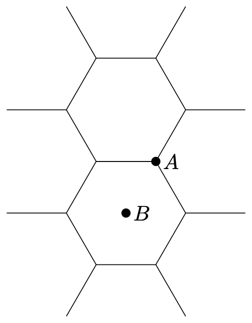
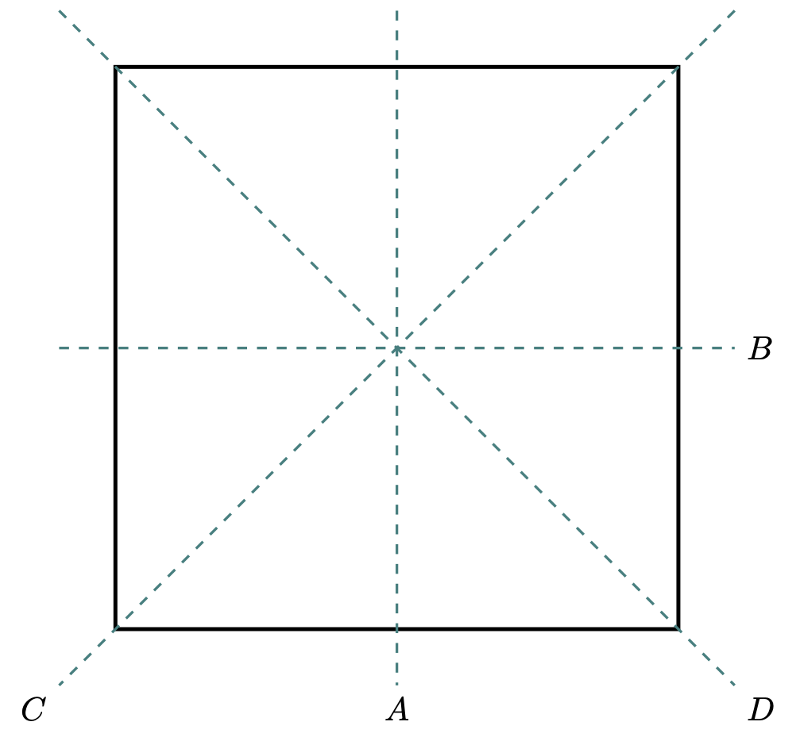

---
title: "군의 기본적인 성질"
number-sections: true
number-depth: 3
crossref:
  chapters: true
---  



 

## 군의 정의와 기본적인 성질 (Group)

### 군의 정의 {#sec-Group_group}

::: {.callout-note  icon="false"}

#### **군**

::: {#def-Group_groups}

집합 $G$ 에 이항연산 $\cdot$ 이 정의되어 있으며, 아래 세 조건을 만족 할 때 $G$ 를 **군(Group)** 이라고 한다.

&emsp;($1$) **결합 규칙** : $\forall a,\,b,\,c\in G,\, a\cdot (b \cdot c)=(a\cdot b)\cdot c$, 

&emsp;($2$) **항등원의 존재** : $\exists e\in G,\, \forall a\in G,\, a\cdot e=e\cdot a$, 

&emsp;($3$) **역원의 존재** : $\forall a\in G,\, \exists a^{-1}\in G,\, a\cdot a^{-1} = a^{-1}\cdot a = e$

군을 이루는 집합과 연산을 합쳐 $(G,\cdot)$ 이라고 쓰기도 한다. 이 때 ($2$) 의 $e$ 를 $G$ 의 항등원 이라고 한다. 항등원의 표기는 $e$ 혹은 연산이 곱셈이면 $1$ 이라고 쓰거나, 소속된 군을 표현하기 위해 $1_G$ 와 같이 쓰기도 한다. 연산이 덧셈이라면 $0$ 혹은 $0_G$ 로 쓰기도 한다. ($3$) 의 $a^{-1}$ 을 $a$ 의 역원 이라고 한다.
:::
:::

군에서의 연산 기호는 $a\circ b$, $a \cdot b$, $ab$, $a+b$ 처럼 다양한 기호가 사용 될 수 있다. 기호를 생략하는 $ab$ 와 같은 표기법도 많이 사용된다. 군을 정의할 때 집합과 연산을 묶어 $(G,\, \cdot)$ 와 같은 표기법도 흔히 사용된다. 

 

::: {#prp-Group_left_and_right_inverse}

$g,\,x,\,y \in G$ 에 대해 다음이 성립한다. 

&emsp;($1$) $xg=gy=1_G$ 이면 $x=y$ 이다. 

&emsp;($2$) $xg=yg$ 이면 $x=y$ 이다.

:::

::: {.proof}

($1$) $x=x1_G =x(gy)= (xg)y = 1_Gy = y$. 

($2$) $xg=yg \implies xgg^{-1} = ygg^{-1} \implies x=y.\qquad \square$
:::

 

### 군의 성질

::: {.callout-note icon="false"}

#### **중요한 군들**
::: {#def-Group_properties}

$G$ 가 군이다.

1. $G$ 의 원소의 갯수가 유한개일 때 **유한군(finite group or discrete group)** 이라고 하고, 유한군이 아닐 때 **무한군 (infinite group)** 이라고 한다.

2. 어떤 대칭 연산의 경우 군을 이루며 성분의 개수가 무한개 이지만 유한개의 연속인 변수로 기술 될 수 있다. 이런 군을 **연속군 (continuous group)** 이라고 한다.

3. $G$ 가 유한군일 때 원소의 갯수를 $G$ 의 **차수(order)** 라고 하며 $|G|$ 로 표기한다. $G$ 가 연속군일 경우 연속인 변수의 개수를 **차수(order)** 라고 한다.

4. $g\in G$ 일 때 $g^n=1_G$ 가 되는 가장 작은 양의 정수 $n$ 을 $g$ 의 **차수(order)** 라고 한다. (군의 차수와 군의 성분의 차수는 다르다)

5. $\forall a,\,b\in G$ 에 대해 $ab=ba$ 일 때 $G$ 를 **아벨군 (abellian group)** 이라고 한다.

6. 어떤 $g\in G$ 에 대해 $\{g^k:k\in \Z\}=G$ 일 때 $G$ 를 **순환군 (cyclic group)** 이라고 하고 $G=\langle g \rangle$ 이라고 표기한다. 이 때 $G$ 는 $g$ 에 의해 생성된다고 한다.
   
7. $H \subset G$ 이며 $H$ 가 $G$ 와 같은 연산에 대해 군일 때 $H$ 를 $G$ 의 **부분군(subgroup)** 이라고 하고 $H \le G$ 라고 표기한다. $H$ 가 $G$ 와 일치하지 않을 때 $H$ 를 $G$ 의 **진부분군(proper subgroup)** 이라고 하고 $H< G$ 라고 표기한다.

:::
:::

 

::: {#prp-Group_how_to_be_subgroup}

#### 부분군 판정법

$G$ 가 군이고 $H$ 가 $G$ 의 부분집합이며 같은 연산이 정의되었다고 하자. 이 때 다음 세 명제는 동치이다.

&emsp;($a$) $H\le G$

&emsp;($b$) (1) $\forall a,\,b\in H \implies ab\in H$, (2) $\forall h\in H,\, h^{-1}\in H$.

&emsp;($c$) $\forall a,\,b\in H,\, ab^{-1} \in H$. 
:::

::: {.proof}

($a \implies b$) $H$ 가 군이고 따라서 군의 정의에 의해 자명하다.

($b \implies c$) ($b-2$) 에 의해 $b^{-1}\in H$ 이며, ($b-1$) 에 의해 $ab^{-1}\in H$ 이다.

($c \implies a$) 같은 연산이 정의되었으므로 $H$ 의 원소에 대해 결합규칙이 성립한다. $aa^{-1}=1_G\in H$ 이다. $1_Gb^{-1}=b^{-1}\in H$ 이므로 역원이 존재한다. 따라서 $H\le G$ 이다. $\square$

:::

보통 ($c$) 를 이용하여 부분집합이 부분군임을 증명한다.

 

::: {.callout-note icon="false"}

#### **생성 부분군**

::: {#def-Group_generated_subgroup}
 
$G$ 가 군이고 $A$ 가 $G$ 의 부분집합일 때 $A$ 의 원소와 각 원소의 역원의 유한곱으로 이루어진 집합을 $\langle A \rangle$ 로 표기하며 이를 $A$ 에 의한 **생성 부분군 (generated subgroup)** 이라고 한다.

:::
:::

 

::: {#prp-Group_generated_subgroup_is_subgroup}

$A$ 가 군 $G$ 의 부분집합일 때 $\langle A \rangle \le G$ 이다.
:::

::: {.proof}

$\langle A \rangle \subseteq G$ 임은 자명하다. 이제 $x,\,y \in \langle A \rangle$ 에 대해 $xy^{-1}\in \langle A \rangle$ 임을 보이면 된다. $x,\,y$ 는 $A$ 의 원소와 그 역원의 유한곱이므로 $y^{-1}$ 역시 그렇고 $xy^{-1}$ 역시 그렇다. 따라서 $\langle A \rangle \le G$ 이다. $\square$

:::

 

::: {.callout-note icon="false"}

#### **곱군**

::: {#def-Group_product_group}
 
$G,\,F$ 가 군일 때 

$$
G \otimes F := \{(g,\, f): g\in G,\, f\in F\}
$$

에 대한 연산을 

$$
(g_1,\,f_1)(g_2,\,f_2) = (g_1g_2,\,f_1f_2)
$$

로 정의하면 $G\otimes F$ 역시 군이 되며(@prp-Group_product_group) $G \otimes F$ 를 $G$ 와 $F$ 에 의한 **곱군(direct product group)** 이라고 한다.

:::
:::

 

::: {#prp-Group_product_group}

군 $G,\,F$ 에 대해 곱군은 군이다.

:::

::: {.proof}

($1$) $g_1,\,g_2 \in G$, $f_1,\,f_2\in F$ 에 대해 $(g_1,\,f_1)(g_2,\,f_2)= (g_1g_2,\,f_1f_2)\in G\otimes F$ 이므로 연산에 대해 닫혀 있다. 

($2$) $g\in G,\, f\in F$ 에 대해 $(g,\,f)(1_G,\,1_F)= (1_G,\, 1_F)(g,\,f)=(g,\,f)$ 이므로 $(1_G,\,1_F)$ 는 $G\otimes F$ 의 항등원이다. 

($3$) $g\in G,\, f\in F$ 에 대해 $(g,\,f)(g^{-1},\,f^{-1}) = (g^{-1},\,f^{-1})(g,\,f)=(1_G,\,1_F)$ 이므로 역원이 존재한다. $\square$

:::

 

## 잉여류와 라그랑쥬 정리

::: {.callout-note icon="false"}

#### **잉여류**

::: {#def-Group_coset}

군 $G$ 와 부분군 $H$ 를 생각하자. $g\in G$ 에 대해 $gH = \{gh:h\in H\}$ 를 $g$ 가 속하는 $H$ 에 대한 **왼쪽 잉여류(left coset)** 이라고 한다. 마찬가지로 $g$ 가 속하는 $H$ 에 대한 **오른쪽 잉여류(right coset)** $Hg=\{hg:h\in H\}$ 를 정의 할 수 있다.

:::
:::

앞으로 잉여류로 여려가지를 증명하는데 왼쪽 잉여류를 쓰든 오른쪽 잉여류를 쓰든 상관 없지만 보통 왼쪽 잉여류를 많이 사용한다.

 

::: {#lem-Group_coset_and_equivalence_relation}

$H\le G$ 일 때 

&emsp;($1$) $G$ 가 유한군이면 $H$ 에 의한 잉여류가 포함하는 원소의 수는 모두 같다.

&emsp;($2$) $H$ 에 의한 두 잉여류는 같거나 서로소이다.

&emsp;($3$) $G$ 의 모든 원소는 단 하나의 $H$ 에 의한 잉여류에 포함된다.
:::

::: {.proof}

($1$) $H$ 자체도 잉여류이다. $gH$ 에 대해 $gh_1 = gh_2$ 이면 $h_1=h_2$ 이다. 따라서 모든 잉여류가 포함하는 원소의 갯수는 $H$ 의 원소의 갯수와 같다.

($2$) $g_1H$ 와 $g_2H$ 를 생각하자. $x\in g_1H \cap g_2H$ 라고 하자. $x=g_1h_1=g_2h_2$ 인 $h_1,\,h_2\in H$ 가 존재하며 따라서 $g_1 = g_2h_2h_1^{-1}$ 이다. 즉 $h\in H$ 에 대해 $g_1h=g_2h_2h_1^{-1}h \in g_2H$ 이므로 $g_1H \subset g_2H$ 이다. 같은 논리로 $g_2H \subset g_1H$ 임을 보일 수 있다. 즉 $g_1H\cap g_2H \ne \varnothing$ 이면 $g_1H=g_2H$ 이다. 

($3$) $g\in G$ 이면 $g\in gH$ 이다. ($2$) 에 의해 모든 잉여류는 같거나 서로소이므로 $g$ 는 단 하나의 잉여류에만 포함된다. $\square$

:::

 

이로부터 자연스럽게 다음의 결론이 나온다.

 

::: {#thm-Group_Lagrange_theorem}

#### 라그랑쥬 정리

$G$ 가 유한군이고 $H\le G$ 이면 $|H|$ 는 $|G|$ 를 나눈다.

:::

::: {.proof}

$G$ 의 모든 원소는 어떤 $H$ 의 잉여류에 포함되며, $H$ 의 잉여류는 같거나 서로소이다. 따라서 $H$ 에 의한 잉여류가 $m$ 개라면 $m|H| = |G|$ 이다. $\square$

:::

 

## 중요한 군 {#sec-Group_important_groups}

::: {#exm-Group_permutation_group}

#### 대칭군과 치환군

집합 $X$ 에 대해 $X \mapsto X$ 전단사 함수의 집합을 **대칭군(symmetric group)** 이라고 하고  $S_X$ 혹은 $\text{Sym}(X)$ 라고 표기한다. 특별히 $1$ 부터 $n$ 까지의 자연수의 집합에 대한 순환군은 $S_n$ 이라고 표기한다. $S_X$ 가 함수 합성 연산에 대해 군이라는 것은 쉽게 보일 수 있다. 대칭군의 부분군울 **순열군(permutation group)** 이라고 하고 순열군의 원소를 **순열(permutation)** 이라고 한다.

($1$) $f\in \text{Sym}(X)$ 에서 $a,\,b\in X$ 에 대해 $f(a)=b,\, f(b)=a$ 이며 $x\ne a,\,b$ 일 때 $f(x)=x$ 인 경우 $f$ 를 **호환(transposition)** 이라고 한다. 

($2$) 모든 $\text{Sym}(X)$ 의 원소는 호환의 곱으로 표현 할 수 있다. $g\in \text{Sym}(X)$ 에 대해 호환의 곱은 유일하지 않고 곱해지는 호환의 갯수도 유일하지 않지만 호환의 갯수가 짝수인지 홀수인지는 불변이다. 함수 $\text{sgn}: \text{Sym}(X) \to \{1,\,-1\}$ 은 $\sigma\in \text{Sym}(X)$ 가 짝수개의 호환의 곱일 때 $\text{sgn}(\sigma)=+1$ 이며 홀수개이면 $\text{sgn}(\sigma)=-1$ 로 정의되는 함수이다. 

($3$) 짝수일 때를 짝순열, 홀수일 때는 홀순열이라고 하며 짝순열의 집합은 $\text{Sym}(X)$ 의 부분군으로 **교대군(alternating group)** 이라고 하며 흔히 $A_X$ 로 표현한다.

:::

 

::: {#exm-Group_linear_group}

#### 일반선형군과 특수선형군

체 $\F$ 위에서 정의된 $n\times n$ 행렬의 집합 $\mathbb{F}^{n \times n}$ 에 속하는 가역행렬의 집합은 행렬의 곱셈 연산에 대해 군이며 이를 **일반선형군 (general linear group)** 이라고 하고 $GL_n(\mathbb{F})$ 라고 표기한다. 이 가운데 행렬식이 $1$ 인 행렬의 집합도 군이며 이를 **특수선형군 (special linear group)** 이라고 하며 $SL_n(\mathbb{F})$ 라고 표기한다.
:::

 

::: {#exm-Group_orthogonal_group}

#### 직교군과 특수직교군

실수체 $\R$ 위에서 정의된 직교행렬, 즉 $A^TA=AA^T=I$ 을 만족하는 $n\times n$ 정사각 행렬의 집합은 행렬의 곱 연산에 대해 군이다. 이를 **직교군 (orthogonal group)** 이라고 하고 $O(n)$ 으로 표기한다. 직교군의 행렬식은 $\pm 1$ 인데 이가운데 행렬식이 $+1$ 인 행렬의 집합은 $O(n)$ 의 부분군으로 **특수직교군 (special orthogonal group)** 이라고 하고 $SO(n)$ 으로 표기한다.

:::

 

::: {#exm-Group_unitary_group}

#### 유니터리군과 특수유니터리군

복소수체 $\C$ 위에서 정의된 직교행렬, 즉 $A^\dagger A=AA^\dagger=I$ 을 만족하는 $n\times n$ 정사각 행렬의 집합은 행렬의 곱 연산에 대해 군이다. 이를 **유니터리군 (unitary group)** 이라고 하고 $U(n)$ 으로 표기한다. 유니터리군의 행렬식은 $\pm 1$ 인데 이가운데 행렬식이 $+1$ 인 행렬의 집합은 $U(n)$ 의 부분군으로 **특수 유니터리군 (special unitary group)** 이라고 하고 $SU(n)$ 으로 표기한다.

:::

 

::: {#exm-Group_rotation_and_orthogonal_group}

#### 회전과 특수직교군

$n$ 차원 유클리드 공간에서의 회전은 $SO(n)$ 과 같다. 

:::

 

::: {#exm-Group_d3_multiplication_table}

#### $D_3$, 정삼각형에 대한 대칭 연산
 

정삼각형에 대한 대칭 연산은 6개의 원소를 가진 군을 이룬다. 항등 연산 $E$, 삼각형의 중심에 대한 $\pi/3$ 만큼의 반시계 방향 회전 $D$ 와 $F$($D$ 연산 2번 연속), 각 꼭지점과 맞은편 모서리의 중점을 잇는 직선을 회전축으로 하는 $\pi/2$ 회전 $A,\,B,\,C$ (아래 그림을 참고하라.)

{#fig-Group_d3 width=200}

 

정삼각형의 꼭지점 $1$, $2$, $3$ 에 $D_3$ 의 연산을 수행했을 때의 결과는 아래 그림 @fig-Group_d3_2 과 같다. 

{#fig-Group_d3_2 width=600}

이 연산에 대한 수행 결과를 아래의 표로 정리 할 수 있다. 이런 표를 Caylay table 이라고 한다.

<!-- 
\renewcommand{\arraystretch}{1.5}
\begin{tabular}{ c|cccccc }
\hline
 $D_3$ & $E$ & $A$ & $B$ & $C$ & $D$ & $F$ \\
\hline
$E$ &  $E$ & $A$ & $B$ & $C$ & $D$ & $F$ \\
$A$ &  $A$ & $E$ & $F$ & $D$ & $C$ & $B$ \\
$B$ &  $B$ & $D$ & $E$ & $F$ & $A$ & $C$ \\
$C$ &  $C$ & $F$ & $D$ & $E$ & $B$ & $A$ \\
$D$ &  $D$ & $B$ & $C$ & $A$ & $F$ & $E$ \\
$F$ &  $F$ & $C$ & $A$ & $B$ & $E$ & $D$ \\
\end{tabular} 
-->

{#tbl-d3_caylay_table width=200}

 

이 군은 여러가지 이름으로 불리지만 대표적으로 $D_3$ 라고 불린다. $D$ 는 **dihedral** 의 두문자이며 보통 주 대칭축에 수직인 평면에 $\pi$ 회전 대칭축이 있을 때 붙인다. 여기서 주 대칭축은 원점을 우리가 보는 평면에 수직으로 통과하는 축이며, $A,\,B,\,C$ 축이 주 대칭축과 수직한 $\pi$ 회전 대칭축이다. .

:::

 

::: {#thm-Group_rearrangement_theorem}

#### Group rearrangement theorem

위에서 설명한 Caylay 테이블에서 제목행과 제목열을 제외한 테이블 내용에 대해 각 행과 각 열에서는 모든 군의 원소가 단 한번씩만 나온다.

:::

::: {.proof}

see @exr-Arfken_17_1_3 $\square$ 

:::
 

::: {#exm-Group_rotation_of_plane_circle}

#### 평면상의 원의 회전
 

평면상의 원은 원의 중심에 대한 임의의 각 회전에 대해 대칭이다. 이 연산은 반시계 방향 회전각을 나타내는 변수 $\varphi \in [0,\, 2\pi)$ 에 대해 $R(\varphi)$ 로 표현 할 수 있으므로 차수가 1인 연속군이다. 또한 $R(\varphi)$ 에 대한 역변환은 $R(2\pi - \varphi)$ 이다.

:::

 

::: {#exm-Group_viergrouppe}

#### Vierergrouppe
 

4 원소로 아래의 연산 규칙을 만족하는 군을 클라인 4원군(Keine 4 group) 혹은 **Vierergrouppe** 라고 한다. 아래 표현에서 $e$ 는 항등원이다.

<!-- 
\renewcommand{\arraystretch}{1.5}
\begin{tabular}{ c|cccc }
\hline
 & $e$ & $a$ & $b$ & $ab$ \\
\hline
$e$ & $e$ & $a$ & $b$ & $ab$ \\
$a$ & $a$ & $e$ & $ab$ & $b$ \\
$b$ & $b$ & $ab$ & $e$ & $a$ \\
$ab$ & $ab$ & $a$ & $b$ & $e$ \\
\end{tabular} 
-->

{#tbl-viergrouppe_caylay_table width=200}

:::

 

::: {#exm-Group_lorentz_group}
#### 로런츠 군

특수상대성이론에서 $x$ 축 방향으로 속도 $v$ 로 상대적으로 움직이는 두 관찰자 각각의 시공간 좌표계는 로런츠 변환으로 연관되어 있다.

$$
\begin{aligned}
ct' &= \cosh \varphi ct + \sinh \varphi x, \\[0.3em]
x' &= \sinh \varphi ct + \cosh \varphi x, \\[0.3em]
y' &= y, \\[0.3em]
z' &= z.
\end{aligned}
$$ {#eq-Group_lorentz_boost}

여기서 $\varphi$ 를 부스트 각 이라고 하며 $\tanh \varphi = v/c$ 이다. (즉 $\cosh \varphi = 1/\sqrt{1-v^2/c^2}$, $\sinh \varphi = (v/c)\sqrt{1-v^2/c^2}$ 이다.) 변화가 없는 $y,\,z$ 를 무시하면 로런츠 변환은 다음과 같다.

$$
\begin{bmatrix} c't \\ x'\end{bmatrix} = \begin{bmatrix} \cosh \varphi & \sinh \varphi \\ \sinh\varphi & \cosh \varphi \end{bmatrix}.
$$ {#eq-Group_lorentz_transform}

두번째 관찰자가 첫번째 관찰자에 대해 부스트각 $\varphi_1$ 으로, 세번째 관찰자가 두번째 관찰자에 대해 부스트각 $\varphi_2$ 로 움직인다면(그리고 모두 다 $x$ 방향이라고 가정한다면) 첫번째 관찰자와 세번째 관찰자의 로런츠 변환은 $\varphi_1,\, \varphi_2$ 에 의해 아래와 같이 정해지며 군을 이룬다. 

$$
\begin{bmatrix} \cosh \varphi_2 & \sinh \varphi_2 \\ \sinh\varphi_2 & \cosh \varphi_2 \end{bmatrix}\begin{bmatrix} \cosh \varphi_1 & \sinh \varphi_1 \\ \sinh\varphi_1 & \cosh \varphi_1  \end{bmatrix} = \begin{bmatrix} \cosh (\varphi_1+\varphi_2) & \sinh  (\varphi_1+\varphi_2) \\ \sinh (\varphi_1+\varphi_2) & \cosh  (\varphi_1+\varphi_2) \end{bmatrix}
$$

:::

## 동형사상과 켤레류

### 동형사상 {#sec-Group_homomorphism}

::: {.callout-note icon="false"}

#### **동형사상, 준동형사상, 자기동형사상**

::: {#def-Group_homomorphism}

두 군 $G,\,G'$ 사이에 어떤 함수 $\phi : G \to G'$ 이 존재하여

$$
\forall a,\,b\in G,\, \phi (a)\phi(b)=\phi(ab)
$$

일 때 $\phi$ 를 $G$ 에서 $G'$ 으로의 **준동형사상(homomorphism)** 이라고 하며 $G$ 에서 $G'$ 으로의 준동형 사상의 집합을 $\text{Hom}(G,\,G')$ 이라고 표기한다. $\phi$ 가 전단사 함수 일 때 $\phi$ 를 **동형 사상(isomorphism)** 이라고 하며 $G$ 에서 $G'$ 으로의 동형사상의 집합을 $\text{Iso}(G,\,G')$ 이라고 표기한다. 두 군 사이에 동형사상이 존재할 경우 이 두 군은 **동형 (isomorphic)** 이라고 하며 $G \approx G'$ 이라고 표기한다. 그리고 $G \to G$ 동형사상을 **자기동형사상 (automorphism)** 이라고 하며 $G$ 에서의 자기동형사상의 집합을 $\text{Aut}(G)$ 로 표기한다.
:::
:::

 

::: {#exm-Group_C4}

#### $C_4$ 군의 동형사상과 준동형사상.
 

정사각형의 중심에 대한 $0^\circ$, $90^\circ$, $180^\circ$, $270^\circ$ 회전은 군을 이루며 각각 $I,\,C_4,\,C_2,\,C_4'$ 라고 한다. 즉 $G_1=\{I,\,C_4,\,C_2,\,C_4'\}$ 이라고 하자. 또한 $G_2=\{1,\, i,\, -1,\, -i\}$ 는 곱에 대한 군을 이룬다. 이 두 군에 대한 함수 $\phi : G \to G'$ 를

$$
\phi(I)=1,\quad \phi(C_4)=i,\quad \phi(C_2)=-1,\quad \phi(C_4')=-i
$$

로 정의하면 $\phi$ 는 동형사상이다. 즉 $\phi \in \text{Iso}(G_1,\,G_2)$ 이다. 또한 이 군은 $C_4$ 혹은 $i$ 에 의해 생성되는 순환군이다.

곱 연산으로 정외된 집합 $G_3=\{1,\,-1\}$ 은 역시 군이며 $\psi: G_1\to G_3$ 를

$$
\psi (I)= \psi(C_2)=1,\qquad \psi (C_4)=\psi (C_4')= -1
$$

로 정의하면 $\psi \in \text{Hom}(G_1,\,G_3)$ 이다. 

:::

 

::: {#exm-Group_nth_roots_of_unit_and_Zn}

#### $Z_n$ 과 $\Z_n$

@Zee2016Group 는 $Z_n$ 을 $z^n=1$ 의 모든 복소해의 집합으로 정의하며 이는 곱셈 연산에 대해 군이다. 예를 들어 $Z_3 = \{1,\,\omega,\,\omega^2\}$. 

$\Z_n=\{0, 1, 2, \ldots, n-1\}$ 은 $n$ 을 법(mod)으로 하는 덧셈에 대해 닫혀 있는 군이다. $\phi : Z_n \to \Z_n$ 을 $\phi(\omega^k) = k$ 로 정의하면 $\phi$ 는 동형사상이며 따라서 $Z_n \approx \Z_n$ 이다.

:::

 

::: {#exm-Group_SO2_and_U1}

#### $SO(2)$ 와 $U(1)$ 

$SO(2)$ 는 2차원 평면에서의 회전 연산의 집합으로 이루어진 군이며 $U(1) = \{e^{i\theta} : \theta\in \R\}$ 이다. 반식

:::

 

::: {.callout-note icon="false"}

#### **kernel** 과 **상**

::: {#def-Group_homomorphism_kernel}

준동형사상 $\phi \in \text{Hom}(G,\,G')$ 의 **kernel** $\text{ker}(\phi)$ 와 $\text{im}(\phi)$ 는 다음과 같이 정의된다.

$$
\begin{aligned}
\ker(\phi) &:= \{g\in G : \phi (g) = 1_{G'}\},\\[0.3em]
\im(\phi) &:= \{\phi(g) : g\in G\}.
\end{aligned}
$$ {#eq-Group_kernel_and_image_of_homomorphism}

즉 $\ker (\phi) = \phi^{-1}(\{1_{G'}\})$ 이다. 

:::
:::

 

::: {#prp-Group-kernel_of_homomorphism}

$\phi \in \text{Hom}(G,\,G')$ 일 때 다음이 성립한다.

&emsp;($1$) $1_G \in \ker(\phi)$, $1_{G'} \in \im(\phi)$, 

&emsp;($2$) $\ker (\varphi) \le G$,

&emsp;($3$) $\im(\phi) \le G'$

:::

::: {.proof}

($1$) 각각의 $g\in G$ 에 대해 $\phi(g)= \phi(g)\phi(1_G)$ 이므로 $\phi(1_G)=1_{G'}$ 이다.

($2$) @prp-Group_how_to_be_subgroup 을 보자. $1_G\in \ker (\phi)$ 이며 $a,\,b\in \ker (\phi)$ 일 때 $\phi(ab)=\phi(a)\phi(b)=1_{G'}$ 이므로 $ab\in \ker (\phi)$ 이다. $a\in \ker (\phi)$ 일 때 $1_{G'} = \phi(a)\phi(a^{-1})$ 이므로 $\phi(a^{-1})=1_{G'}$ 이다. 즉 $a \in \ker (\phi) \implies a^{-1}\in \ker (\phi)$ 이다. 따라서 $\ker (\phi)\le G$ 이다. 

($3$) ($1$) 에서 $1_{G'}\in \phi(G')$ 임을 보였다. $a',\,b'\in G'$ 이면 $\phi(a)=a',\, \phi(b)=b'$ 인 $a,\,b\in G$ 가 존재하며 $a'b' = \phi(a)\phi(b) = \phi(ab) \in \im(\phi)$ 이다. $a'\in G'$ 이라면 $\phi(a)=a'$ 인 $a\in G$ 가 존재하며 $a^{-1} \in G$ 이므로 $\phi(a^{-1})\in G'$ 이다. $1_{G'}=\phi(aa^{-1}) = \phi(a)\phi(a^{-1})$ 이므로 $\phi(a^{-1}) = (\phi(a))^{-1} =a'^{-1}\in \im (G)$ 이다. $\square$
:::

 

유한군에 대해 중요한 정리 중의 하나가 케일리 정리(Caylay's theorem) 이다. 

::: {#thm-Group-caylay_theorem}

#### Caylay 정리
유한군 $G$ 는 $\text{Sym}(G)$ 의 어떤 부분군과 동형이다.

:::

::: {.proof}

$\phi_g :G \to G$ 를 $\phi_g(x):= gx$ 로 정의하자. @thm-Group_rearrangement_theorem 에 의해 $\phi_g$ 는 전단사이므로 $\phi_g \in \text{Sym}(G)$ 이다. $\Phi_G = \{\phi_g: g\in G\}$ 는 함수의 합성 연산에 대해 군이라는 것을 보이자. $\phi_{i_G}$ 는 $\Phi_G$ 에서의 항등원이며 $\phi_{g^{-1}}$ 은 $\phi_g$ 의 역원이다. 또한 함수의 합성의 정의에 의해 $\phi_{g_1}\circ (\phi_{g_2}\circ \phi_{g_3})= (\phi_{g_1} \circ \phi_{g_2})\circ \phi_{g_3}$ 이다. 따라서 $\Phi_G \le \text{Sym}(G)$ 이다. 

이제 $G$ 와 $\Phi(G)$ 가 동형임을 보이자. $\theta : G \to \Phi_G$ 에 대해 $\theta(g) := \phi_g$ 라고 하자. 각각의 $g\in G$ 에 대해

$$
\theta(x)\theta(y)(g) =\phi_x(\phi_y(g))= xyg = \phi_{xy}(g)= \theta(xy)(g)
$$ 

이므로 $\theta$ 는 준동형사상이다. $\theta_x = \theta_y$ 이면 모든 $g\in G$ 에 대해 $xg = yg$ 이므로 $x=y$ 이다. 즉 $\theta$ 는 동형사상이다. $\square$ 

:::

  

### 켤레류와 불변부분군 {#sec-Group_conjugacy_class_and_invariant_subgroup}

앞으로의 사용을 위헤 군의 부분집합에 관련된 연산을 아래와 같이 정의한다.

::: {.callout-note icon="false"}

#### **군의 부분집합의 연산**

::: {#def-Group_equivalent_class}

곱 연산으로 정의된 군 $G$ 를 생각하자. $X,\, Y \subset G$ 이고(부분군이 아닌 부분집합이다) $a\in G$ 일 때, $aX,\, Xa,\, XY$ 를 다음과 같이 정의한다.

$$
\begin{aligned}
aX &:= \{ag: g\in G\}, \\[0.3em]
Xa& := \{ga: g\in G\},\\[0.3em]
XY &:= \{xy : x\in X,\, y\in Y\}
\end{aligned}
$$ {#eq-Group_multiplication_of_subset_of_group}

군의 정의에 의해 $aX\subset G,\, XY \subset G$ 라는 것을 알 수 있다.

:::
:::

 

::: {.callout-note icon="false"}

#### **동치관계와 동치류**

::: {#def-Group_equivalent_class}

집합 $X$ 에 대해 정의된 어떤 함수 $f:X\times X \to \{0,\,1\}$ 를 생각하자. $f(x,\,y) = 1$ 일 때 $x \sim y$ 라고 표기하며 다음 세 조건을 만족할 때 함수 $f$ 에 대해 **동치관계(equivalent relation)** 라고 한다. 

&emsp;($1$) $x \sim x$,

&emsp;($2$) $x \sim y \implies y \sim x$,

&emsp;($3$) $x \sim y,\, y \sim z \implies x \sim z$.

$x\in X$ 에 대해 $\{y\in X : y \sim x\}$ 를 $x$ 에 대한 **동치류(equivalece class)** 라고 한다.

:::
:::

 

::: {#thm-Group_equivalency_class}

집합 $X$ 에 어떤 동치관계 $\sim$ 이 정의되고 $x$ 에 대한 동치류를 $[x]$ 라고 하자. 집합 $X$ 는 성분의 동치류들로 분할된다. 즉,

&emsp;($1$) 모든 $x\in X$ 는 어떤 동치류에 포함된다.

&emsp;($2$) $x,\,y \in X$ 일 때 $[x]$ 와 $[y]$ 는 같거나 서로소이다.

&emsp;($3$) 따라서 $X$ 는 서로소인 동치류들의 합집합과 같다.
:::

::: {.proof}

($1$) 동치관계의 정의 ($1$) 의 해 $x\sim x$ 이므로 $x\in [x]$ 이다.

($2$) $z\in [x]\cap [y]$ 이면 $x\sim z,\, y \sim z$ 이므로 $x \sim y$ 이다. 따라서 $[x]=[y]$ 이다.

($3$) 모든 $x\in X$ 는 어떤 동치류에 포함되며, 각각의 동치류는 서로소이거나 동일하므로 $X$ 는 서로소인 동치류들의 합집합과 같다. $\square$

:::

 

::: {.callout-note icon="false"}

#### **켤레와 켤레류**

::: {#def-Group_conjugacy_class}

군 $G$ 에서 $a,\,b\in G$ 에 대해 $\exists g\in G,\, gag^{-1}=b$ 일 때 $a$ 와 $b$ 는 서로 **켤레 (conjugate)** 라고 한다. 어떤 $a\in G$ 에 대해 $\{gag^{-1}:g\in G\}$ 를 $a$ 에 의한 **켤레류 (conjugacy class)** 라고 한다.
:::
:::

 

::: {#thm-Group_conjugacy_and_equivalence_class}

군 $G$ 를 생각하자. $a,\,b\in G$ 가 켤레인 것은 동치관계이다.

:::

::: {.proof}
@def-Group_equivalent_class 를 생각하자. $a,\,b\in G$ 가 어떤 $g\in G$ 에 대해 $a=gbg^{-1}$ 일 때 $a \sim b$ 라고 하자. $a=aaa^{-1}$ 이므로 $a\sim a$ 이다. $a=gbg^{-1}$ 이면 $b=g^{-1}a(g^{-1})^{-1}$ 이므로 $a\sim b \implies b \sim a$ 이다. $a\sim b,\, b\sim c$ 이면 $a=gbg^{-1},\, b=g'cg'^{-1}$ 이며 따라서 $a=(gg')c(gg')^{-1}$ 이므로 $a\sim c$ 이다. $\square$
:::

 

집합 $A$ 와 $A$ 의 부분집합 $A_1,\,A_2,\ldots$ 에 대해 $A=\bigcup A_i$ 이고 $i\ne j\implies A_i\cap A_j=\varnothing$ 일 때 $A_1,\,A_2,\ldots$ 가 $A$ 를 분할한다고 한다. @thm-Group_conjugacy_and_equivalence_class 로부터 다음 결론은 자연스럽다.

::: {#cor-Group_conjugacy_and_equivalent_class}

군 $G$ 는 켤레 관계에 의해 분할된다.

:::

 

::: {#prp-Group_properties_on_conjugacy_class}

군 $G$ 에 대해 다음이 성립한다.

&emsp;($1$) 항등원 $i_G$ 에 대해 $E=\{i_G\}$ 는 켤레류이다.

&emsp;($2$) $G$ 가 아벨군이면 모든 $g\in G$ 에 대해 $\{g\}$ 는 켤레류이다.

&emsp;($3$) $g\in G,\, H\le G$ 일 때 $gHg^{-1} = \{ghg^{-1}: h\in H\}$ 는 $G$ 의 부분군이다.

&emsp;($4$) $K$ 가 $G$ 의 켤레류 일 때 $\overline{K} = \{g^{-1}: g\in K\}$ 도 켤레류이다.
:::

::: {.proof}
($1$), ($2$) 는 자명하며 ($3$) 은 @exr-Arfken_17_1_4 로 넘긴다.

($4$) $g\in K$ 이면 $g^{-1}\in \overline{K}$ 이다. $(xgx^{-1})^{-1}=xg^{-1}x^{-1}$ 이므로 $g' \sim g \implies g'^{-1} \sim g^{-1}$ 이다. 따라서 $\overline{K}$ 도 켤레류이다. $\square$
:::

 

::: {#exm-Group_conjugacy_class_of_D3}

#### $D_3$ 군의 켤레류

@exm-Group_d3_multiplication_table 의 Caylay table 을 이용하여 $D_3$ 의 켤레류를 구해보자. 우선 $\{E\}$ 는 켤레류이다. $A,\,B,\,C$ 는 각각 스스로의 역원이며 $D,\,F$ 는 서로간의 역원이다. $ABA^{-1}=ABA=C$ 이므로 $B\sim C$ 이다. $BAB^{-1}=A$ 이므로 $A\sim C$ 이다. 이것을 반복해보면 $\{A,\,B,\,C\}$ 가 켤레류 임을 알 수 있다. 또한 $AFA^{-1}=D$ 이므로 $F\sim D$ 임을 알 수 있다. 즉 $D_3$ 군에는 아래와 같은 $3$ 개의 켤레류가 존재한다.

$$
\{E\},\qquad \{A,\,B,\,C\},\qquad \{D,\,F\}.
$$

:::

 

::: {.callout-note icon="false"}

#### **켤레 부분군**

::: {#def-Group_conjugate_subgroup}

$g\in G,\, H\le G$ 일 때 $gHg^{-1}$ 는 $H$ 에 의한 **켤레 부분군 (conjugate subgroup)** 이라고 한다.
:::
:::

 

::: {.callout-note  icon="false"}

#### **불변부분군(정규부분군)**

::: {#def-Group_normal_subgroup}

$N \le G$ 이며 각각의 $g\in G$ 에 대해 $gNg^{-1}\subseteq N$ 이면 $N$ 을 $G$ 의 **불변 부분군(invariant subgroup)**, **정규부분군(normal subgroup)** 혹은 **normal devisor** 라고 하고 $N \trianglelefteq G$ 라고 표기한다.
$N$ 이 $G$ 의 진부분집합이며 $N \trianglelefteq G$ 일 때 **진불변 부분군 (proper invariant subgroup)** 혹은 **진정규 부분군 (proper normal subgroup)** 이라고 하고 $N \triangleleft G$ 로 표기한다.
:::
:::

 

다음은 정규분분군에 대한 중요한 동치관계이다.

::: {#thm-Group_equivalent_contitions_for_normal_subgroup}

군 $G$ 의 부분군 $N$ 에 대해 다음은 동치이다.

&emsp;($1$) 각각의 $g\in G$ 에 대해 $gNg^{-1} \subseteq N$ 이다. 

&emsp;($2$) 각각의 $g\in G$ 에 대해 $gNg^{-1} = N$ 이다.

&emsp;($3$) 각각의 $g\in G$ 에 대해 $gN = Ng$ 이다.

:::

::: {.proof}

($1 \implies 2$) $gNg^{-1} \subseteq N$ 이므로 $N \subseteq gNg^{-1}$ 임을 보이면 된다. $n\in N$ 에 대해 $g^{-1}ng = n'$ 인 $N'\in N$ 이 존재하며 따라서 $n=gn'g^{-1}\in gNg^{-1}$ 이다. 즉 $N \subseteq gNg^{-1}$ 이다. 

($2 \implies 3$) $x\in gN$ 이면 어떤 $n\in N$ 에 대해 $x=gn$ 이며 $x=gn=\left(gng^{-1}\right)g \in Ng$ 이므로 $gn\subset Ng$ 이다. 같은 방법으로 $Ng\subset gN$ 임을 보일 수 있으며 따라서 $gN=Ng$ 이다.

($3\implies 1$) $n\in N$ 에 대해 $gn=n'g$ 를 만족하는 $n'\in N$ 이 존재한다. 따라서 $gng^{-1}\in N$ 이므로 $gNg^{-1}\subseteq N$ 이다. $\square$

:::

 

::: {#prp-Group_multiplication_of_cosets_of_invariant_subgroup}

$N \trianglelefteq G$ 일 때 임의의 $x,\, y\in G$ 에 대해 $xNyN = xyN$ 이다.

:::

::: {.proof}

$xn_1yn_2 = xy(y^{-1}n_1y)n_2$ 이며 $y^{-1}n_1y =n_1'\in N$ 이므로 $xn_1yn_2 = xyn_1'n_2 \in xyN$ 이다. 즉 $xNyN \subset xyN$ 이다. 또한 $1_G\in N$ 이므로 $xyn=x1_Gyn \in xNyN$ 이다. 즉 $xyN\subset xNyN$ 이다. $\square$
:::

 

::: {#exm-Group_example_invariant_subgroup_alternating_group}

#### 교대군

교대군 $A_n$ 은 짝수개의 호환의 곱으로 표현되며 따라서 교대군 $S_n$ 의 불변 부분군이다.

:::

 

::: {#exm-Group_example_invariant_subgroup_product_of_invariant_subgroups}

#### 불변부분군의 곱군

$E\trianglelefteq G,\, F\trianglelefteq H$ 일 때 $E\otimes F \trianglelefteq G \otimes H$ 이다. 

:::

 

::: {#exm-Group_example_invariant_subgroup_V4_is_invariant_subgroup_of_A4}

#### Viergrouppe 와 $A_4$

교대군 $A_4$ 는 다음과 같다.

$$
A_4 = \left\{\begin{array}{l} I,\,(123),\, (124),\, (132),\, (134), (142),\, (143),\, (234),\, (243)\\[0.3em]
(12)(34),\, (13)(24),\, (14)(23)
\end{array}\right \}
$$ {#eq-Group_A4}

여기서

$$
\{I,\,(12)(34),\, (13)(24),\, (14)(23)\}
$$

는 Viergrouppe (@exm-Group_viergrouppe) 와 동형이며 $A_4$ 의 정규부분군이다.

:::

 

::: {#exm-Group_example_invariant_subgroup_product_derived_subgroup}

#### 유도 부분군/교환자 부분군

군 $G$ 에 대해 $A=\{a^{-1}b^{-1}ab : a,\,b\in G\}$ 에 의한 생성 부분군 $\langle A \rangle$ 을 $G$ 에 대한 **유도 부분군 (derived subgroup)** 혹은 **교환자 부분군 (commutator subgroup)** 이라고 한다. @prp-Group_generated_subgroup_is_subgroup 에 의해 $\langle A \rangle \le G$ 이다. 이제 $\langle A \rangle \trianglelefteq G$ 임을 보이자. 정해진 $a,\,b\in G$ 와 임의의 $g\in G$ 에 대해 

$$
g^{-1}(a^{-1}b^{-1}ab)g = (g^{-1}a^{-1}g) (g^{-1}b^{-1} g) (g^{-1}a g) (g^{-1}b g)
$$

이며 $\overline{a} = g^{-1}a g,\, \overline{b} = g^{-1}b g$ 라고 하면 $\overline{a},\,\overline{b}\in G$ 이며 

$$
g^{-1}(a^{-1}b^{-1}ab)g  = \overline{a}^{-1}\overline{b}^{-1}\overline{a}\overline{b} \in \langle A \rangle
$$

이다. $a_1,\ldots,\,a_n \in A$ 와 $\epsilon_1,\ldots,\,\epsilon_n \in \{\pm 1\}$ 에 대해 $g\in G$ 일 때 $g^{-1}a_ig\in G$ 라면 

$$
g^{-1}(a_1^{\epsilon_1}\cdots a_n^{\epsilon_n})g^{-1} = (g^{-1}a_1g)^{\epsilon_1} \cdots  (g^{-1}a_ng)^{\epsilon_n} \in \langle A \rangle 
$$

이다. 즉 $\langle A \rangle \trianglelefteq G$ 이다.

:::

 

::: {.callout-note icon="false"}

#### **단순군**

::: {#def-Group_simple_group}

$\{1_G\}$ 와 자기 자신을 제외한 불변부분군이 존재하지 않을 때 $G$ 를 **단순군 (simple group)** 이라고 한다.

:::
:::

 

::: {#thm-Group_kernel_of_homomorphism_is_invariant_subgroup}

$\phi \in \text{Hom}(G,\,G')$ 일 때 $\ker (\phi) \trianglelefteq G$ 이다.

:::

::: {.proof}

$K = \ker(\phi),\, g\in G$ 라고 하자. $k\in K$ 에 대해 $\phi(gkg^{-1})=1_{G'}$ 이므로 $gKg^{-1}\subseteq K$ 이다. 따라서 @def-Group_normal_subgroup 에 따라 $\ker (\phi )\trianglelefteq G$ 이다.  $\square$ 

:::

 

### 몫군 {#sec-Group_quotient_group}

$N \trianglelefteq G$ 일 때 $l=|G|/|N|$ 개의 $N$ 의 왼쪽 잉여류가 존재하며 이 잉여류 집합을 $X_G=\{N,\, g_1N,\ldots,\, g_{l-1}N\}$ 라고 쓸 수 있다. @prp-Group_multiplication_of_cosets_of_invariant_subgroup 에 의해 $(g_iN)(g_jN)= g_ig_jN$ 인 연산을 정의 할 수 있으며 이 때 $N$ 은 항등원 역할을 한다. $(g_iN)(g_i^{-1}N)=N$ 이므로 $g_iN$ 에 대한 역원도 존재한다. 또한 

$$
(g_iN)[(g_jN)(g_kN)] = (g_iN)(g_jg_kN)=g_ig_jg_kN = [(g_iN)(g_jN)](g_kN)
$$

이므로 연산의 결합법칙도 성립한다. 즉 $X_G$ 는 군이며 $G/N$ 으로 표기한다.

 

::: {.callout-note icon="false"}

#### **몫군**

::: {#def-Group_quotient_group}

군 $G$ 의 불변부분군 $N$ 에 대해 $N$ 의 모든 왼쪽 잉여류의 집합 $\{N,\, g_1N,\ldots,\,g_nN\}$ 에 $(g_1N)(g_2N)=g_1g_2N$ 이라는 연산을 부여할 수 있으며 이 구조는 $N$ 을 항등원으로 갖고 $gN$ 에 대해 $g^{-1}$ 을 역원으로 갖는 군이 된다. 이렇게 정의된 군을 $N$ 에 의한 몫군이라고 하며 $G/N$ 으로 표기한다.

:::
:::

몫군에서 정규부분군 $N$ 은 나눗셈의 제수(divisor) 역할을 수행한다고 볼 수 있다. 이런 이유로 정규부분군을 **normal divisor** 라고 부르기도 한다.

 

::: {#thm-Group_invariant_subgroup_is_a_kerel_to_homomorphism}

군 $G$ 와 불변부분군 $N \trianglelefteq G$ 이 주어졌을 때 $N$ 을 kernel 로 하는 준동형사상이 존재한다.

:::

::: {.proof}

$\pi : G \to G/N$ 을 $\pi (g) := gN$ 로 정의하자. $\pi(g_1g_2)= g_1g_2N = g_1Ng_2N = \pi(g_1)\pi(g_2)$ 이므로 $\pi \in \text{Hom}(G,\,G/N)$ 이며 $\ker (\pi)=N$ 이다. $\square$

:::

 

### 여러가지 군 {#sec-Group_example_of_groups}

::: {#exm-Group_example_dihedral_group_DN}

#### 정이면체군 $D_n$ 

정이면체군 $D_n$ 은 정 $n$-각형의 대칭군이다. $2\pi/n$ 만큼의 회전 $R$ 과 반사 $r$ 에 의해 생성된다. 반사는 $n$ 이 홀수일때는 한 꼭지점과 이 꼭지점과 마주보는 모서리의 중심을 지나는 직선에 대한 반사이며 $n$ 이 짝수일때는 마주모는 꼭지점을 잇는 직선에 대한 반사와 마주보는 모서리 각각의 중앙을 잇는 직선에 대한 반사이다. $0^\circ$ 회전을 포함하여 $n$ 개의 회전과 $n$ 개의 반사가 존재한다. 이 군의 항등원을 $I$ 라고 하면 $R^n = r^2 = I$ 이다. $D_n$ 에서 $rRr=R$, 즉 $Rr= rR^{-1}$ 이며 따라서 아래와 같이 $2n$ 개의 성분을 가진다.

$$
D_n = \{I,\,R,\ldots,\,R^{n-1},\, r,\,Rr,\ldots,\,R^{n-1}r\}
$$

:::

 

::: {#exm-Group_example_quartenionic_group}

#### 사원수군 $\mathcal{Q}$ 

해밀토는 2차원에서의 복소평면을 일반화하여 다음과 같은 규칙을 갖는 사원수 규칙을 만들었다.

$$
i^2=j^2=k^2=-1,\qquad ij=-ji = k,\, jk=-kj = i,\, ki=-ik = j.
$$

이 규칙에 대해

$$
\mathcal{Q} = \{\pm 1,\, \pm i,\, \pm j,\, \pm k\}
$$

는 군을 이루며 이를 **사원수군(quatenionic group)** 이라고 한다.

:::

 

::: {#exm-Group_exmple_coexter_group}

#### 콕서터 군

$A=\{a_1,\ldots,\,a_k\}$ 에 대해 $a_i^2=1$ 이며 $(a_ia_j)^{n_{ij}}=1$ 인 $n_{ij}\ge 2$ 가 항상 존재한다고 하자. 이 때 $A$ 에 의해 생성되는 군을 콕서터 군이라고 한다. 콕서터 군에서 $n_{ij}=n_{ji}$ 임을 보이자. 우선 $(ab)^n=1$ 일 때

$$
1 = b^2 = b(ab)^nb = baba\cdots ba = (ba)^nb^2=(ba)^n
$$

:::

 

### Class 곱 {#sec-Group_class_multiplication}

$G$ 의 켤레류의 집합 $\mathcal{K}_G=\{K_1,\ldots,\,K_m\}$ 를 생각하자. $g\in G$ 에 대해

$$
gK_i g^{-1}= K_i
$$

임은 쉽게 알 수 있다. 그렇다면 두 클래스의 곱은 어떻게 될 까?

$$
K_iK_j = \left(g^{-1}K_ig\right)\left(g^{-1}K_j g\right) = g^{-1} K_iK_j g 
$$

이다. 이것은 $K_iK_j$ 가 켤레류일 경우 뿐만 아니라 켤레류의 합집합 일 때도 성립하며, 실제로 그러하다. $K_i,\,K_j$ 의 곱이 두개 이상의 conjugace class 의 합집합이며, 어떤 경우 같은 원소가 여러번 등장하기도 한다. 이 때 합집합과 등장 횟수를 모두 포함하는 다음과 같은 식을 정의 할 수 있다.

$$
K_iK_j = \sum_k c_{ijk}K_k
$$ {#eq-Group_class_multiplication_rule}

위 식은 $K_iK_j$ 를 계산 했을 때 $K_k$ 가 몇번 등장하는지를 표기하는 식이며 $2K_1+3K_2$ 라면 $K_1$ 이 $2$ 번 $K_3$ 가 $3$ 회 등장한다는 뜻이다. 아래의 예를 보고 더 정확히 알아보자.

 

::: {#exm-Group_conjugacy_class_multipliciation_of_D3}

#### $D_3$ 군의 클래스 곱

@exm-Group_d3_multiplication_table 과 @exm-Group_conjugacy_class_of_D3 을 이용하여보자. 

$$
K_1\{E\},\qquad K_2=\{A,\,B,\,C\},\qquad K_3=\{D,\,F\}
$$

라고 하자. $K_2K_2$ 는 총 9개의 곱이 나타나며 집합으로 표현하면 중복을 무시하지 않고 고려하면

$$
K_2K_2 = 3K_1+3K_3
$$

이다. 

:::

 

## 연습문제 {.unnumbered}

::: {#exr-Zee_1_2_2}
#### Zee 1.2.2

$n\ge 3$ 에 대해 $A_n$ 은 3-cycle 에 의해 생성됨을 보여라. 즉 $A_n$ 의 모든 성분은 3-cycle 의 곱으로 표현된다.
:::

::: {.solution}

$a,\,b,\,c,\,d$ 는 모두 다르다고 하자. $(a\,b)(a\,c) = (a\,c\,b)$ 이며 $(a\,b)(c\,d)=(a\,b\,c)(b\,c\,d)
$ 이다. 즉 모든 두 호환의 곱은 3-cycle 의 곱으로 표현된다. 교대군은 짝수개의 호한의 곱이므로 3-cycle 의 곱으로 표현된다.
:::

 

::: {#exr-Group_order_of_alternating_group}

$|S_n|=n!$ 이며 $|A_n|=n!/2$ 임을 보여라. 
:::

::: {.solution}

$S_n$ 은 $1$ 부터 $n$ 까지를 순서대로 한번씩 배치한는 방법이므로 $|S_n|=n!$ 이다. $A_n\triangleleft S_n$ 이다(@exm-Group_example_invariant_subgroup_alternating_group). @exm-Group_permutation_group 의 $\text{sgn} : S_n \to \{\pm 1\}$ 함수는 준동형 사상이며 $\ker(\text{sgn})= A_n$ 임을 쉽게 보일 수 있다. 

$S_n$ 은 홀치환과 짝치환으로 분할된다. 홀치환을 $X_n$ 라고 하자. 임의의 고정된 호횐 $\sigma \in S_n$ 에 대해 $\phi: A_n \to X_n$ 을 $\phi (x)= \sigma x$ 로 정의하자. $\sigma x_1 = \sigma x_2 \implies x_1 = x_2$ 이므로 $\phi$ 는 단사이다. 임의의 $y\in X_n$ 에 대해 $\sigma y\in A_n$ 이며 $\sigma^2 y = y$ 이므로 $\phi$ 는 전사이다. 다라서 $|A_n| = |X_n|$ 이며 $|S_n| = |A_n|+|X_n|=2|A_n|$ 이다. 

:::

 

::: {#exr-Group_Zee_1_2_3}

#### Zee 1.2.3
$S_n$ 이 $A_{n+2}$ 의 어떤 부분집합과 동형임을 보여라. 
:::

::: {.solution}

$\sigma = (n+1, n+2)\in S_{n+2}$ 에 대해 $\phi:S_n \to A_{n+2}$ 를 다음과 같이 정의한다.

$$
\phi (x) = \left\{\begin{array}{ll} x, &\text{where } x\in A_n, \\ \sigma x,\qquad &\text{where } x\notin A_n. \end{array}\right.
$$

$\sigma \notin S_n$ 이므로 $\sigma x = x\sigma$ 이며 이를 이용하면 $\sigma \in \text{Hom}(S_n,\, A_{n+2})$ 임을 보일 수 있다. 또한 $\phi$ 는 단사이므로 $S_n \approx \text{im}(\phi)$ 이며 $\text{im}(\phi)\le A_{n+2}$ 이다.

:::

 

::: {#exr-Group_Zee_1_2_8}

#### Zee 1.2.8 
$A_4$ 가 단순군이 아님을 보여라.
:::

::: {.solution}

$$
A_4 = \left\{\begin{array}{l} I,\\
(1\,2)(1\,3),\, (1\,2)(1\,4),\, (1\,3)(1\,4),\, (2\,3)(2\,4), \\
(1\,2)(2\,3),\, (1\,2)(2\,4),\, (1\,3)(3\,4),\, (2\,3)(3\,4), \\
(1\,2)(3\,4),\, (1\,3)(2\,4),\, (1\,4)(2\,3)
\end{array}\right \}
$$

이며 $\{I,\, (1\,2)(3\,4),\, (1\,3)(2\,4),\, (1\,4)(2\,3)\}$ 는 $A_4$ 의 진불변 부분군이다.

:::

 

::: {#exr-Group_Zee_1_2_12}

#### Zee 1.2.12
군 $G$ 에서 $f,\,g\in G$ 일 때 일반적으로 $fg\ne gf$ 이다. 하지만 $fg \sim gf$ 임을 보여라.

:::

::: {.solution}

$fg = g^{-1}(gf)g$

:::

 

::: {#exr-Group_Zee_1_1_13}

### Zee 1.1.13

$G$ 가 차수가 짝수인 유한군일 때 항등원이 아니면서 제곱하면 항등원이 되는 원소를 항상 포함함을 보여라.

:::

::: {.solution}

$x^2\ne 1_G$ 이면 $x\ne x^{-1}$ 이다. $G$ 가 군이므로 $x,\, x^{-1}$ 짝은 항상 $G$ 에 포함되어야 한다. 만약 제곱하여 향등원이 되는 $1_G$ 뿐이라면 $G$ 의 차수는 홀수이어야 한다. 이로부터 홀수 차수의 유한군은 항등원을 제외하고 제곱하여 항등원이 되는 원소를 항상 홀수개 가져야 한다는 것을 알 수 있다.

:::

 

::: {#exr-Group_Zee_1_1_16}

### Zee 1.1.16

콕서터 군(@exm-Group_exmple_coexter_group) 에서 $n_{ij}=2$ 이며 $a_ia_j=a_ja_i$ 임을 보여라.

:::

::: {.solution}

콕서터 군의 정의에 의해 $a_i^2 = a_j^2=1$ 이다. 즉 $a_i^{-1}=a_i$ 이다. $(a_ia_j)^2=a_ia_ja_ia_j=1$ 이며 각 변의 왼쪽에 $a_i$ 오른쪽에 $a_j$ 를 곱하면 $a_ja_i=a_ia_j$. 
:::

 

::: {#exr-Group_Zee_1_1_18}

### Zee 1.1.18

::: {.callout-note icon="false"}

#### **embedding**

::: {#def-Group_embedding_of_group}

군 $G$ 에서 군 $F$ 로의 단사인 준동형사상 $\phi \in \text{Hom}(G,\,F)$ 가 존재할 때 $G$ 가 $F$ 로 embedding 된다고 한다. 당연히 $F$ 에는 $G$ 와 동형인 부분군이 존재한다.

:::
:::

일반적으로, 군 $H$ 는 더 큰 군 $G$ 에 여러 방식으로 부분군으로 embedding 될 수 있다. 예를 들어 $A_4$ 는 $A_4 \subset S_4 \subset S_5 \subset S_6$ 경로를 따라 자연스럽게 $S_6$ 에 embedding될 수 있다. $A_4$ 를 $S_6$ 에 embedding 하는 다른 방법을 찾아보라. 힌트: 기하학을 생각하라!

:::

::: {.solution}

$A_4$ 는 정 4면체의 회전과 동형이며 정 4면체는 4개의 꼭지점과 6개의 변으로 이루어져 있다. 정 4 면체의 꼭지점을 각각 $1,\,2,\,3,\,4$ 라고 하고 변 $l_i$ 를

$$
l_1 = \overline{12},\quad l_2 = \overline{13},\quad l_3=\overline{14},\quad l_4 = \overline{23},\quad l_5=\overline{24},\quad l_6 = \overline{34}
$$

라고 하자. 4면를 회전시키는 것은 변을 치환하게 되므로 $\sigma\in A_4$ 와 $\tau \in S_6$ 사이에 관계를 갖게 된다. 이것을 $\rho : A_4 \to S_6$ 라고 하자.

$A_4$ 는 @eq-Group_A4 이며 $\rho (I)$ 를 제외한 연산 결과는 다음과 같다.

$$
\begin{aligned}
\rho ((123)) &= (142)(356), \\[0.3em]
\rho ((124)) &= (153)(245), \\[0.3em]
\rho ((132)) &= (124)(365), \\[0.3em]
\rho ((134)) &= (145)(263), \\[0.3em]
\rho ((142)) &= (135)(264), \\[0.3em]
\rho ((143)) &= (154)(236), \\[0.3em]
\rho ((234)) &= (123)(465), \\[0.3em]
\rho ((243)) &= (132)(456), \\[0.3em]
\rho ((12)(34)) &= (25)(34), \\[0.3em]
\rho ((13)(24)) &= (16)(34), \\[0.3em]
\rho ((14)(23)) &= (16)(25). \\[0.3em]
\end{aligned}
$$

실제로 $\rho$ 가 하는 것은 $A_4$ 를 정사면체에 작용하는 것이고 변은 변환된 꼭지점에 대해 정해진다. 즉 군의 작용으로 $\rho \in \text{Hom}(A_4,\, S_6)$ 이며 $\ker \rho = \{I\}$ 이므로 단사이다.

여담으로 @exm-Group_example_invariant_subgroup_V4_is_invariant_subgroup_of_A4 에서 언급했듯이 $A_4$ 는 Viergrouppe 와 동형인 정규부분군을 가진다. 

:::

 

::: {#exr-Zee_1_2_19}
#### Zee 1.2.19

$A_n$ 이 $S_n$ 의 유도 부분군(@exm-Group_example_invariant_subgroup_product_derived_subgroup) 임을 보여라.

:::

::: {.proof}

$S_n$ 의 유도부분군은 $X=\{a^{-1}b^{-1}ab : a,\,b\in S_n\}$ 에 의해 생성되는 군이다. 여기서 $a\,\,b$ 가 홀순열이든 짝순열이든 $a^{-1}b^{-1}ab$ 는 짝순열이므로 $\langle X\rangle$ 은 $A_n$ 의 부분군이다. 이제 $A_n \subset \langle X \rangle$ 임을 보이면 된다. @exr-Zee_1_2_2 에 의해 $A_n$ 은 3-circle 에 의해 생성된다. 이 때

$$
(a\,b\,c) = (a\,b)(a\,c)(a\,b)^{-1}(a\,c)^{-1}
$$

이다. 즉 $A_n \subset \langle X\rangle$ 이다. 따라서 $A_n$ 은 $S_n$ 의 유도부분군이다.

:::

 

::: {#exr-Zee_1_2_20}
#### Zee 1.2.20

실변수 $x$ 에 대한 실함수의 집합에서 두 함수의 연산을 함수의 합성으로 정의한다면 군을 정의 할 수 있다. 즉 $(fg)(x) = f(g(x))$. 함수 $I(x) = x,\, A(x) = (1-x)^{-1}$ 은 차수 3 인 군을 정의함을 보여라. 여기에 $C(x) = x^{-1}$ 포함시키면 차수 6인 군을 생성함을 보여라.

:::

::: {.proof}

$B(x) = (AA)(x)$ 라고 하자.
$$
B(x) = \dfrac{1}{1-1/(1-x)}= \dfrac{x-1}{x},\quad AB(x) =BA(x) = I(x)
$$

이므로 $\{I,\,A,\,B\}$ 는 군이다.

$C(x) = 1/x$ 를 포함시키면

$$
(AC)(x) =(CB)(x) = \dfrac{x}{x-1},\quad (CA)(x) = (BC)(x) = 1-x,\qquad,\, CC(x) =I(x)
$$

이므로 $\left\{I,\, 1-x,\, (x-1)/x,\, 1/x,\, x/(x-1),\, 1-x \right\}$ 로 이루어진 군이다.

:::

 

::: {#exr-Arfken_17_1_1}
#### Arfken 17.1.1

@exm-Group_viergrouppe 의 vierergrouppe 가 순환군인지 아벨군인지 여부를 확인하라.

:::

::: {.solution}

$a^2=b^2 = (ab)^2 = e$ 이므로 순환군이 아니다.  $a(ab)=b,\, (ab)a = a$ 이므로 아벨군도 아니다. 

:::

 

::: {#exr-Arfken_17_1_3}
#### Arfken 17.1.3 (Rearrangement theorem)

군 $\{e,\,a,\,b,\,\ldots,\,n\}$ 에 대해 $\{ae,\, aa,\, ab,\,ac,\,\ldots,\,an\}$ 은 군의 모든 원소를 각각 한번씩마나 포함한다는 것을 보여라.

:::

::: {.solution}

$ax=ay$ 이면 $a$ 의 역원 $a^{-1}$ 을 각 항의 오른쪽에 연산하면 $x=y$ 이다. 즉 $x\ne y \implies ax = ay$ 이다. 

:::

 

::: {#exr-Arfken_17_1_4}
#### Arfken 17.1.4
 

@prp-Group_properties_on_conjugacy_class ($3$) 를 증명하라.

:::

::: {.solution}

$e\in H$ 이며 $xex^{-1}=e\in gHg^{-1}$ 이다. $h_1,\,h_2\in H$ 에 대해 $(gh_1g^{-1})(gh_2g^{-1})=g(h_1h_2)g^{-1} \in gHg^{-1}$ 이다. $gHg^{-1}\subset G$ 이므로 associativity 는 당연히 성립한다. 따라서 $gHg^{-1}\le G$ 이다. 

:::

 

::: {#exr-Arfken_17_1_6}
#### Arfken 17.1.6

$\bf{r}=(la,\,ma,\,na)$ 에 동일한 원자가 위치한 정육면체 결정을 생각하자. 여기서 $l,\,m,\,n$ 은 정수이다.

($a$) 각각의 데카르트 축은 4중 대칭축(4-fold symmetric axis)임을 보여라.

($b$) 정육면 점군(point group) 은 정육면체를 유지하며 $l=m=n=0$ 에 위치한 원자를 이동시키지 않는 모든 연산(rotation, reflection, inversion)으로 이루어져 있다. 양과 음의 좌표축의 permutation 을 생각하여 정육면 점군이 얼마나 많은 원소로 이루어졌는지 알아보라.

:::

::: {.solution}

($a$) $0,\, \pi/2,\, \pi,\, 3\pi/2$ 회전에 대해 대칭이다.

($b$) 결국은 $\bf{a}_1=(a,\,0,\,0),\, \bf{a}_2=(0,,a,\,0),\, \bf{a}_3=(0,\,a,\,0)$ 이 각각 $(\pm a,\, 0,\, 0)$, $(0,\, \pm a,\,0)$, $(0,\, 0,\, \pm a)$ 로 변환되는 변환의 갯수를 찾는 것이다. 단 이 변환을 $P$ 라고 하면 $P(\bf{a}_i)\bf{\cdot }P(\bf{a}_j) = \delta_{ij}a^2$ 가 되야 한다. 일종의 Permutation 으로 $6\times 4 \times 2= 48$ 이다. 

:::

 

::: {#exr-Arfken_17_1_7}
#### Arfken 17.1.7

{#fig-Group-hexagon width=200}

위의 그림과 같이 정육각형으로 덮인 평면을 생각하자.

($a$) 세 정육면체가 만나는 점 ($A$) 를 통과하며 평면에 수직인 축에 대한 회전 대칭을 결정하라. 즉 이 축이 $n$-fold 대칭성을 갖는다면 $n$ 은 무엇인가?

($b$) 정육면체의 중심 $(B)$ 를 수직으로 통과하는 축에 대해 ($a$) 를 반복하라.

($c$) 정육면체의 평면에 포함되는 다른 종류의, 180$^\circ$ 회전 대칭을 가진 축을 모두 찾아라.
:::

::: {.solution}

($a$) 3 fold

($b$) 6 fold

($c$) $B$ 를 중심으로 하는 정육면체에서 서로 마주보는 꼭지점을 잇는 직선을 축으로 180$^\circ$
도 회전 대칭이 존재한다. 또한 서로 마주보는 모서리의 각각의 중심을 잇는 직선을 축으로 180$^\circ$ 회전 대칭이 존재한다. 또한 각 모서리를 중심으로 하는 180$^\circ$ 회전대칭도 존재한다.
:::

 

::: {#exr-tinkham_2_1}
#### Tinkham 2.1 

정사각형에 대한 대칭연산을 나타내는 대칭군 $D_4$ 를 생각하자. 이 군은 9개의 원소로 이루어져 있다.

{#fig-Group-D4 width=250}

- $E$ : 항등연산
- $A,\,B,\,C,\,D$ : @fig-Group-D4 의 동명의 축에대한 180$^\circ$ 회전.
- $F,\,G,\,H$ : 그림의 평면에 대한 $\pi/2,\, \pi,\, 3\pi/2$ 회전.

($a$) 군의 multiplication table (Caylay table) 을 구하라.

($b$) 군의 연산의 특성을 이용하여 군의 원소를 클래스로 구분하라. 

($c$) 전체 군의 가능한 subgroup 을 나열하라. 이 가운데 불변부분군은 무엇인가?

($d$) normal divisor 에 대한 잉여류를 구하라.

($e$) ....

($f$) class multiplication 의 $c_{ijk}$ 를 구하라.

:::

::: {.solution}

($a$)

{#tbl-Group_D4_Caylay_table width=300}

($b$) $A^2=B^2=C^2=D^2=E$ 이며 $G=F^2,\, H=F^3$ 이다. $FAF^{-1}=CH=B$, $HAH^{-1}=DF=B$, $FCF^{-1}=BH=D$, $AFA^{-1}=DA=H$, 이므로 classes 는 다음과 같다.

$$
K_1= \{E\},\, K_2=\{A,\,B\},\, K_3=\{C,\,D\},\, K_4=\{F,\,H\},\, K_5=\{G\}
$$

($c$) 부분군은 $\{E\}$, $\{E,A\}$, $\{E,\,B\}$, $\{E,\,C\}$, $\{E,\,D\}$, $\{E,\, G\}$, $\{E,\,F,\,G,\, H\}$, $\{E,\,A,\,B,\,G\}$, $\{E,\,C,\,D,\,G\},\, D_4$ 의 10 개이다. 이 가운데 불변부분군(정규부분군은)

$$
\{E,\,G\},\, \{E,\,F,\,G,\,H\},\, \{E,\,A,\,B,\,G\},\, \{E,\,C,\,D,\,G\},\,D_4
$$

의 5 개이다.

($f$) @exr-tinkham_2_8 로부터 $K_iK_h = K_jK_i$ 이며 $c_{ijk}=c_{jik}$ 임을 안다.

$K_1K_i=K_iK_1=K_i$ 이므로 $c_{1jk}=\delta_{jk}$, $c_{i1k}=\delta_{ik}$ 이다.

$K_2K_2 = 2K_1+ 2K_5$ 이므로 $c_{221}= c_{225}=2$,

$K_2K_3 = K_3K_2 = 2K_4$ 이므로 $c_{234}=c_{324}=2$,

$K_2K_4 = K_4K_2 = 2K_3$ 이므로 $c_{243}=c_{423}=2$,

$K_2K_5 = K_5K_2 = K_2$ 이므로 $c_{252}=c_{522}=1$,

$K_3K_3= 2K_1+2K_5$ 이므로 $c_{331}=c_{335}=2$,

$K_3K_4 = K_4K_3 = 2K_2$ 이므로 $c_{342}=c_{432}=2$,

$K_3K_5 = K_5K_3 = K_3$ 이므로 $c_{353}=c_{533}=1$,

$K_4K_4 = 2K_1+2K_5$ 이므로 $c_{442}=c_445=2$, 

$K_4K_5 = K_5K_4 = K_4$ 이므로 $c_{454}=c_{544}=1$,

$K_5K_5 = K_1$ 이므로 $c_{551}=1$.
:::

 

::: {#exr-tinkham_2_5}
#### Tinkham 2.5

같은 클래스에 속하는 성분은 같은 차수(@def-Group_properties) 를 가짐을 보여라.

:::

::: {.solution}

$x,\,y$ 가 $g\in G$ 에 대해 $x=gyg^{-1}$ 이라고 하자. $x$ 의 차수가 $n$ 이면 $x^n=1_G=(gyg^{_1})=gy^ng^{-1}$ 이므로 $y^n=1_G$ 이어야 한다. $y^m=1_G = g^{-1}x^mg$ 이므로 $x^m=1_G$ 이어야 한다. 따라서 $x,\,y$ 는 같은 차수여야 한다.

:::

 

::: {#exr-tinkham_2_6}
#### Tinkham 2.6

차수가 4 와 2 인 순환군 사이에 준동형 사상이 존재함을 보여라.

:::

::: {.solution}

$X=\langle x\rangle,\, |X|=4,\, Y=\langle y\rangle,\, |Y|=2$ 라고 하자. $\phi:X\to Y$ 를 $\phi(1_X)=\phi(x^2)=1_Y,\, \phi(x)=\phi(x^3)=y$ 로 정의하자. 

:::

 

::: {#exr-tinkham_2_7}
#### Tinkham 2.7

군 $G$ 이 아벨군일 필요충분 조건은 $\phi(x)=x^{-1}$ 이 동형사상인 것임을 보여라.

:::

::: {.solution}
$\phi(x) =x^{-1}$ 은 일단 단사이다.

($\implies$) $G$ 가 아벨군임을 가정하자. $\phi(x)\phi(y) = x^{-1}y^{-1}=y^{-1}x^{-1}= (xy)^{-1}=\phi(xy)$ 이므로 $\phi$ 는 동형사상이다.

($\impliedby$) $\phi$ 가 동형사상임을 가정하자. 임의의 $x,\,y\in G$ 에 대해 
$$
xy=\phi(x^{-1})\phi(y^{-1})=\phi(x^{-1}y^{-1})=\phi((yx)^{-1})=yx
$$

이므로 $G$ 는 아벨군이다.

:::

 

::: {#exr-tinkham_2_8}
#### Tinkham 2.8

@eq-Group_class_multiplication_rule 에서 $c_{ijk}=c_{jik}$ 임을 보여라. 즉 $K_iK_j=K_jK_i$ 임을 보여라.

:::

::: {.solution}

$K_i=[x],\, K_j=[y]$ 라고 하자. $K_i$ 의 원소는 어떤 $g\in G$ 에 대해 $gxg^{-1}$ 이며 $K_j$ 의 원소는 어떤 $h\in G$ 에 대해 $hyh^{-1}$ 이다. 따라서 

$$
\begin{aligned}
(gxg^{-1})(hyh^{-1}) &= gx\underbrace{(g^{-1}h y h^{-1}g)}_{=y'\in K_j}g^{-1} = gxy'g^{-1}= g\underbrace{xy'x^{-1}}_{=y''\in K_j}xg^{-1}= gy''xg^{-1} \\[0.3em]
& =\left(gy''g^{-1}\right)\left(gxg^{-1}\right) \in K_jK_i
\end{aligned}
$$

이므로 $K_iK_k \subset K_jK_i$ 이다. 대칭이므로 $K_jK_i \subset K_iK_j$ 이며 이는 $K_iK_j=K_jK_i$ 를 의미한다.

:::