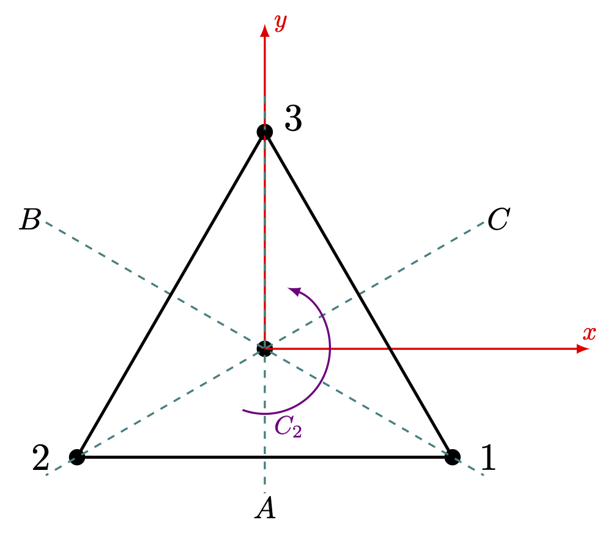

---
title: "군과 양자역학 I- 대칭과 슈뢰딩거 방정식군"
number-sections: true
number-depth: 3
crossref:
  chapters: true
---  



 

## 대칭과 물리

### 슈뢰딩거 방정식과 degeneracy {#sec-Group_group_of_schroedinger_equation_and_degeneracy}
해밀토니안 $\hat{H} = \hat{T}+\hat{V}$ 인 양자역학 시스템을 생각하자 그리고 해밀토니안 $\hat{H}$ 에 어떤 기하학적인 대칭이 존재한다고 하자. 운동 에너지 $\hat{T}$ 는 회전과 병진에 대해 자체로 불변이기 때문이기 때문에 해밀토니안 $\hat{H}$ 에 어떤 공간대칭성이 있다면 일반적으로 포텐셜 에너지 $\hat{V}$ 의 대칭성이다. 비상대론적 양자역학은 슈뢰딩거 방정식에 의해 기술된다.

$$
i\hbar \dfrac{\partial \Psi}{\partial t} = \hat{H}\Psi. 
$$ {#eq-Group_schroedinger_equation}

양자역학에서 변환은 유니타리 연산자에 의해 표현되는 유니타리 변환이며 유니타리 변환 $\hat{S}$ 에 대해 $\hat{H}$ 가 불변이라는 것은 $\hat{S}\hat{H}=\hat{H}\hat{S}$ 임을 의미한다. 그리고 이런 변환의 집합은 군을 이룬다는 것을 쉽게 보일 수 있다. 

::: {.callout-note appearance="simple" icon="false"}
::: {#def-Group_schoroedinger_equation_group}
#### 슈뢰딩거 방정식 군

해밀토니안 $\hat{H}$ 와 commute 한 유니타리 변환의 집합을 **슈뢰딩거 방정식 군(the group of Schrödinger equation)**$^\ast$[$^\ast$ [슈뢰딩거 군(Schrödinger group)](https://en.wikipedia.org/wiki/Schrödinger_group) 과는 다르다.]{.aside} 이라고 한다(@tinkham2012group)

:::
:::

$|\Psi_n\rangle$ 이 슈뢰딩거 방정식의 고유상태로 $E_n$ 의 고유값을 갖는다고 하자. $R$ 이 슈뢰딩거 방정식군에 포함된다면

$$
\hat{H}\hat{R}|\Psi_n \rangle = \hat{R}\hat{H} |\Psi_n \rangle = E_n \hat{R}|\Psi_n\rangle
$$

이므로 $\hat{R}|\Psi_n\rangle$ 역시 $E_n$ 의 고유값을 갖는 슈뢰딩거 방정식의 고유상태이다. 즉 어떤 대칭성이 있을 때 degeneracy 가 발생한다. 

::: {.callout-note appearance="simple" icon="false"}
::: {#def-Group_normal_degeneracy}
#### Normal degeneracy

어떤 양자 시스템의 degeneracy 를 대칭성을 통해 이해 할 수 있을 때 이 degeneracy 를 **normal degeneracy** 라고 한다. 그렇지 않을 때는 **accidental degeneracy** 혹은 **dynamical degeneracy** 라고 한다.

:::
:::

예를 들어 수소 원자 스펙트럼에서 $2s$ 와 $2p$ 오비탈은 같은 에너지를 갖는 것으로 알려졌지만 이후 운동량 공간에서의 해밀토니안의 4차원 회전 대칭 때문임이 알려졌다$^\dagger$[$^\dagger$ Fock. *Z. Physik, **98** 145 (1935)]{.aside}. Accidental degeneracy 는 대칭성을 이용하여 이해 할 수 없기 때문에 앞으로 특별한 언급이 없는 한 모든 degeneracy 는 normal degeneracy 를 의미한다.

 

### 슈뢰딩거 방정식 군의 표현 {#sec-Group_representation_of_schroedinger_equation_group}

여기서는 해밀토니안 $\hat{H}$ 와 이 해밀토니안에 대한 슈뢰딩거 방정식 군 $G_S$ 을 알 때 $G_S$ 의 기약표현으로부터 해밀토니안의 가능한 degeneracy 를 알 수 있다는 것을 보이고자 한다. 

우선 해밀토니안 $\hat{H}$ 의 고유값 $E_n$ 에 대해 $d_n$-fold normal degeneracy 가 존재한다고 하자. 이 $d_n$ 차원 고유공간을 $\mathcal{H}_n$ 이라고 하자. 그렇다면 $d$ 개의 정규직교 고유상태 $\{|\Gamma_n1\rangle,\ldots,|\Gamma_n d_n\rangle\}$ 가 존재한다. 여기서 $\Gamma_n$ 은 $\mathcal{H}_n$ 에 속한다는 것을 의미하며 그 뒤의 인덱스는 $\mathcal{H}_n$ 내의 고유상태의 순서를 의미한다. $\mathcal{H}_n$ 은$G_S$ 군에 속하는 모든 변환에 대한 불변 공간이므로 임의의 $S\in G_S$ 에 대해

$$
\hat{S}|\Gamma_n i\rangle = \sum_{j=1}^{d_n} D^{(\Gamma_n)}(S)_{ji} |\Gamma_n j\rangle
$$ {#eq-Group_transformation_by_schroedinger_equation_group}

인 $d_n\times d_n$ 행렬 $D^{(\Gamma_n)}(S)$ 가 존재한다.

 

::: {#lem-Group_transformation_by_schroedinger_equation_group_1}

@eq-Group_transformation_by_schroedinger_equation_group 의 $D^{(\Gamma_n)}$ 는 $G_S$ 에 대한 $d_n$ 차원 유니타리 기약표현이다.
:::

 

::: {.proof}

우선 $D^{(\Gamma_n)}$ 이 표현임을 보이자. 표기의 편의를 위해 잠시 $D=D^{(\Gamma_n)}$ 이라고 놓자. $R,\,S\in G_S$ 에 대해

$$
\begin{aligned}
\hat{R}\hat{S}|\Gamma_n i\rangle &= \hat{R}\sum_j^{d_n} D(S)_{ji}|\Gamma_nj\rangle = \sum_k^{d_n}\sum_j^{d_n} D(S)_{ji}D(R)_{kj}|\Gamma_n k\rangle \\[0.3em] 
&= \sum_k^{d_n}\left[D(R)D(S)\right]_{ki}|\Gamma_nk\rangle
\end{aligned}
$$

이다. 즉 $D(RS) = D(R)D(S)$ 이므로 $D$ 은 $G_S$ 에 대한 $d_n$ 차원 표현이다. 

이제 $D$ 가 기약표현이 아님을 가정하자. $D$ 가 모든 $G_S$ 에 대해 블럭대각행렬이라면 어떤 $|\Gamma_ni\rangle,\, |\Gamma_nj\rangle$ 이 존재하여 모든 $R\in G_S$ 에 대해 $\hat{R}|\Gamma_ni\rangle \ne |\Gamma_nj\rangle$ 이어야 한다. 그렇다면 여기에 accidental degeneracy 가 있는 것이며 normal degeneracy 라는 가정에 모순된다. 즉 $D$ 는 기약표현이다.

이제 $D$ 이 유니타리 임을 보이자. 임의의 $R\in G_S$ 에 대해

$$
\begin{aligned}
\delta_{ij} &= \langle \Gamma_n j|\Gamma_n i\rangle = \langle \Gamma_nj|\hat{R}^\dagger \hat{R}|\Gamma_ni\rangle = \sum_{k,m} \left(D(R)_{kj}\right)^\ast D(R)_{mi}\langle \Gamma_n k|\Gamma_n m\rangle \\[0.3em]
&= \sum_{k,m} \left(D(R)_{kj}\right)^\ast D(R)_{mi}\delta_{km} = \sum_k (D(R))^\dagger_{jk}D(R)_{ki} = [D(R)^\dagger D(R)]_{ji}
\end{aligned}
$$

이므로 $\left(D(R)\right)^{-1}=D(R)^\dagger$ 이다. 즉 $D=D^{(\Gamma_n)}$ 은 $d_n$ 차원 유니타리 기약표현이다. $\square$

:::

 

이제 우리는 해밀토니안에 $d_n$-fold degeneracy 가 존재하면 슈뢰딩거 방정식 군에 대해 $d_n$ 차원 기약표현이 존재한다는 것을 안다. 이제 반대로 슈뢰딩거 방정식 군에 $d_n$ 차원 기약표현이 존재한다면 해밀토니안에 $d_n$-fold degeneracy 가 존재할까? 답은 그렇다 이다.

 

::: {#lem-Group_transformation_by_schroedinger_equation_group_2}

슈뢰딩거 방정식 군 $G_S$ 의 기약표현 $\Gamma_n$ 과 그 차원 $d_n$ 에 대해  $d_n$-fold degeneracy 가 존재한다. 

:::

 

::: {.proof}

$D$ 가 $G_S$ 에 대한 $d_n$ 차원 기약표현이라고 하자. 모든 $R\in G_S$ 에 대해 $\hat{R}\hat{H}=\hat{H}\hat{R}$ 이며 따라서 $\hat{H}D(T)= D(T)\hat{H}$ 이다. 슈어 보조정리(@lem-Group_schur_lemma) 에 의해 $\hat{H}$ 는 항등행렬의 상수배이므로 해밀토니안에는 $d_n$-fold degeneracy 가 존재한다. $\square$

:::

 

우리는 @lem-Group_transformation_by_schroedinger_equation_group_1 과 @lem-Group_transformation_by_schroedinger_equation_group_2 로부터 다음의 결론을 내릴 수 있다.

::: {#thm-Group_uniqueness_of_representation_of_schroedinger_group}

해밀토니안 $\hat{H}$ 와 슈뢰딩거 방정식 군 $G_S$ 를 생각하자. $G_S$ 의 모든 기약표현의 차원을 알면 이 해밀토니안에서 가능한 degeneracy 를 알 수 있으며 그 역도 성립한다.

:::

 

$\mathcal{H}_n$ 에서 앞서 주어진 $\{|\Gamma_n i\rangle: i=1,\ldots,\,n\}$ 기저와는 다른 기저 $\{|\psi_j\rangle : j=1,\ldots,\,d_n\}$ 를 선택했다고 하자. 그렇다면 $d_n \times d_n$ 유니타리 행렬 $U$ 에 대해

$$
|\psi_j\rangle  = \sum_{i=1}^{d_n} U_{ij} |\Gamma_n i\rangle,\qquad |\Gamma_n i\rangle = \sum_{j=1}^{d_n} U^{-1}_{ji} |\psi_j\rangle
$$

의 관계를 만족한다. 이 때

$$
\begin{aligned}
\hat{R}|\psi_j\rangle &= \sum_{k=1}^{d_n}U_{ij} \hat{R}|\Gamma_n i\rangle = \sum_{k=1}^{d_n}U_{ij}D^{(\Gamma_n)}(R)_{ki}|\Gamma_n k\rangle  \\
&=\sum_{k=1}^{d_n}\sum_{k=1}^{d_n} \sum_{l=1}^{d_n}U_{ij} D^{(\Gamma_n)}(R)_{ki} U^{-1}_{lk} |\psi_l\rangle \\[0.3em]
&= \sum_{l=1}^{d_n} \left(U^\dagger D^{(\Gamma_n)}(R)U\right)_{lj}|\psi_l\rangle
\end{aligned}
$$

이다. 즉 기저의 유니타리 변환은 슈뢰딩거 방정식군에 대한 표현의 유니타리 변환이라는 것을 알 수 있다. 즉 다음과 같은 결론을 내릴 수 있다.

::: {#thm-Group_uniqueness_of_representation_of_schroedinger_group_2}

해밀토니안의 각각의 고유값에 대해 슈뢰딩거 방정식 군의 기약표현은 (동등한 기약표현의 범위 내애서) 유일하다.

:::

 

슈뢰딩거 방정식의 기저벡터를 에너지 고유값 $E_n$ 에 대해 $|E_n,\, j\rangle$ 로 기술하는 경우를 생각하자. 여기서 $E_n$ 은 해밀토니안 연산자의 고유값이며 $j$ 는 이 고유값에 의한 고유공간의 $j$ 번째 기저벡터라는 의미이다. 여기서 @thm-Group_uniqueness_of_representation_of_schroedinger_group 는 해밀토니안의 고유값에 대해 슈뢰딩거 방정식 군의 특정 기약표현이 1-1 대응한다는 것을 말한다. 따라서 $E_n$ 에 해당하는 기약표현 $\Gamma_n$ 에 대해 $|\Gamma_nj\rangle$ 로 쓸 수 있으며, 또한 $\Gamma_n$ 은 이 고유값에대한 degeneracy 정보도 포함하기 때문에 더 좋은 표현 방법이다. 즉 $E_n$ 보다 $\Gamma_n$ 이 **좋은 양자수 (good quantum number)** 이다. 

 

### Character Table 과 기저 함수

예를 들어 정삼각 형의 각 꼭지점에 동일한 이온이 존재할 때 여기서 움직이는 전자를 슈뢰딩거 방정식으로 기술한다고 하자. 이 대칭 구조는 $D_{3} =\{E,\,A,\,B,\,C,\,D,\,F\}$ 군으로 표현 할 수 있으며(@exm-Group_d3_multiplication_table) $D_{3}$ 는 3개의 conjugate class 를 가지므로 3개의 기약표현을 가진다(@exm-Group_character_table_of_D3). $1^2+1^2+2^2=6$ 이므로(@prp-Group_regular_representation_is_not_irreducible_3) 1차원 기약표현 2개와 2차원 기약표현 1개를 가진다는 것을 알 수 있으며 더 고도의 대칭은 군론의 입장에서 배재된다. 이제 해밀토니안에 대한 고유함수는 1 차원의 경우는 기약표현에 대한 기호로, 2차원 이상의 경우는 기약표현에 대한 기호와 그 안에서의 인덱스로 표현하자. 즉 $|A_1\rangle,\, |A_2\rangle,\, |E1\rangle,\, |E2\rangle$ 로 표기 될 수 있다. 각각의 기약표현에 대해 우리는 다음을 안다.

- 모든 $R\in D_3$ 에 대해 $\hat{R}|A_1\rangle = |A_1\rangle$ 이다.
- $R=E,\,D,\,F$ 일 경우 $\hat{R}|A_2\rangle = |A_2\rangle$ 이며 $R=A,\,B,\,C$ 일 경우 $\hat{R}|A_2\rangle = -|A_2\rangle$ 이다.
- 2차원 기약표현인 $E$ 에 대해 

{#fig-Group_D3_operation_and_axis width=300}

많은 경우 기저함수를 $x,\,y,\,z$ 와 그 2차항까지 사용하여 기술하거나, $R_x,\,R_y,\,R_z$ 를 사용하여 표현하는 경우가 있다. 이 때 $x,\,y,\,z$ 는 주축을 $\hat{z}$ 축으로 잡고 $\hat{x},\,\hat{y}$ 축을 그에 수직하게 위의 그림과 같이 잡았을 때의 각 축의 단위벡터이며, $R_x,\,R_y,\,R_z$ 는 각각의 축으로의 각운동량 성분이다. 즉 $R_z=xp_y-yp_x$ 를 말한다. 이 때 $D_3$ 에 포함되는 변환에 대해 $x,\,y,\,z,\,x^2,\,y^2,\,z^2$ 이 어떻게 변하는 지 확인해보자.

<!-- \renewcommand{\arraystretch}{1.5} \begin{tabular}{ c|cccccc} 
\hline  
$D_3$ & $x$ & $y$ & $z$ & $x^2$ & $y^2$ & $z^2$ \\ 
\hline 
$E$ & $x$ & $y$ & $z$ & $x^2$ & $y^2$ & $z^2$  \\ 
$A$ & $-x$ & $y$ & $-z$ & $x^2$ & $y^2$ & $z^2$  \\[0.3em]
$B$ & $\dfrac{1}{2}(x-\sqrt{3}y)$ & $\dfrac{1}{2}(-\sqrt{3}x-y)$ & $-z$ &  $\dfrac{1}{4}(x^2 - 2\sqrt{3}xy +3y^2)$ & $\dfrac{1}{4}(3x^2+2\sqrt{3}xy+y^2)$ & $z^2$ \\[1em]
$C$ & $\dfrac{1}{2}(x+\sqrt{3}y)$ & $\dfrac{1}{2}(\sqrt{3}x-y)$ & $-z$ & $\dfrac{1}{4}(x^2+2\sqrt{3}xy+3y^2)$ & $\dfrac{1}{4}(3x^2-2\sqrt{3} xy +y^2)$ & $z^2$\\[1em]
$D$ & $\dfrac{1}{2}(-x + \sqrt{3}y)$ & $\dfrac{1}{2}(-\sqrt{3}x -y)$ & $z$ & $\dfrac{1}{4}(x^2-2\sqrt{3}xy +3y^2)$ & $\dfrac{1}{4}(3x^2+2\sqrt{3}xy +y^2)$ & $z^2$ \\[1em]
$F$ & $\dfrac{1}{2}(-x-\sqrt{3}y)$ & $\dfrac{1}{2}(\sqrt{3}x-y)$ & $z$ & $\dfrac{1}{4}(x^2+2\sqrt{3}xy+3y^2)$ & $\dfrac{1}{4}(3x^2-2\sqrt{3}xy + y^2)$ & $z^2$\\[1em]
\hline
\end{tabular} -->

{#tbl-Group_D3_coords1 width=600}

- $|A_2\rangle$ 은 $|z\rangle$ 과 같이 변한다. 따라서 $|A_2\rangle = |z\rangle$ 로 놓을 수 있다. 

- $B|x\rangle = \dfrac{1}{2}|x\rangle - \dfrac{\sqrt{3}}{2}|y\rangle$, $B|y\rangle = -\dfrac{\sqrt{3}}{2}|x\rangle -\dfrac{1}{2}|y\rangle$ 이므로 $\{|x\rangle,\, |y\rangle\}$ 기저에서의 $D^{(E)}(B) = \dfrac{1}{2}\begin{bmatrix} 1 & -\sqrt{3}\\ -\sqrt{3}& -1 \end{bmatrix}$ 이다. (@exm-Group_d3_multiplication_table 를 통해 확인할 수 있다.) 이와 같은 방법으로 모든 $R\in D_3$ 에 대해 $D^{(E)}(R)$ 을 구할 수 있다.

 <!--  \renewcommand{\arraystretch}{1.5} \begin{tabular}{c|ccccc} 
\hline  
$D_3$ & $x^2+y^2$ & $x^2-y^2$ & $xy$ & $yz$ & $xz$ \\ 
\hline 
$E$ & $x^2+y^2$ & $x^2-y^2$ & $xy$ & $yz$ & $xz$ \\ 
$A$ & $x^2+y^2$ & $x^2-y^2$ & $-xy$ & $-yz$ & $xz$ \\[0.3em]
$B$ & $x^2+y^2$ & $\dfrac{1}{2}[-(x^2 - y^2)-\sqrt{3}xy]$ & $\dfrac{1}{4}[-\sqrt{3}(x^2-y^2)+2xy]$ & $\dfrac{z(\sqrt{3}x+y)}{2}$ & $\dfrac{-z(x-\sqrt{3}y)}{2}$ \\[1em]
$C$ & $x^2+y^2$ & $\dfrac{1}{2}[-(x^2-y^2)+\sqrt{3}xy]$ & $\dfrac{1}{4}[\sqrt{3}(x^2-y^2)+2xy]$ & $\dfrac{-z(\sqrt{3}x-y)}{2}$ &  $\dfrac{-z(x+\sqrt{3}y)}{2}$\\[1em]
$D$ & $x^2+y^2$ & $\dfrac{1}{2}[(x^2-y^2)-2\sqrt{3}xy]$ & $\dfrac{1}{4}[\sqrt{3}(x^2-y^2)-2xy]$ & $\dfrac{-z(\sqrt{3}x+y)}{2}$ &  $\dfrac{-z(x-\sqrt{3}y)}{2}$\\[1em]
$F$ & $x^2+y^2$ & $\dfrac{1}{2}[-(x^2-y^2)+2\sqrt{3}xy]$ & $\dfrac{1}{4}[-\sqrt{3}(x^2-y^2) -2xy]$ & $\dfrac{z(\sqrt{3}x-y)}{2}$ & $\dfrac{-z(x+\sqrt{3}y)}{2}$  \\[1em]
\hline
\end{tabular}
 -->

{#tbl-Group_D3_coords2 width=650}

- $x^2+y^2$ 와 $z^2$ 는 모든 변환에 대해 불변이다. 즉 $|A_1\rangle$ 처럼 변한다. 
- 따라서 $z(x^2+y^2)$ 는 $|A_2\rangle$ 과 같이 변한다.
- $(x^2-y^2,\, xy)$ 와 $(xz,\,yz)$ 는 각각 $E$ 표현과 같이 변환된다. 

<!-- \renewcommand{\arraystretch}{1.5} \begin{tabular}{c|ccc} 
\hline  
$D_3$ & $R_x$ & $R_y$ & $R_z$ \\ 
\hline 
$E$ & $R_x$ & $R_y$ & $R_z$ \\ 
$A$ & $-R_x$ & $R_y$ & $-R_z$ \\[0.3em]
$B$ & $\dfrac{1}{2}(R_x - \sqrt{3}R_y)$ & $\dfrac{1}{2}(-\sqrt{3}R_x -R_y)$ & $-R_z$  \\[1em]
$C$ & $\dfrac{1}{2}(R_x+\sqrt{3}R_y)$ & $\dfrac{1}{2}(\sqrt{3}R_x-R_y)$ & $-R_z$ \\[1em]
$D$ & $\dfrac{1}{2}(-R_x+\sqrt{3}R_y)$ & $\dfrac{1}{2}(-\sqrt{3}R_x - R_y)$ & $R_z$ \\[1em]
$F$ & $\dfrac{1}{2}(-R_x-\sqrt{3}R_y)$ & $\dfrac{1}{2}(\sqrt{3}R_x-R_y)$ & $R_z$ \\[1em]
\hline
\end{tabular} -->

{#tbl-Group_D3_coords3 width=250}

- $R_x,\,R_y,\,R_z$ 는 각각 $x,\,y,\,z$ 와 같이 변화한다. 

 

기약표현과, 캐릭터, 그리고 기저함수를 테이블로 표현하면 아래와 같다.

<!-- \renewcommand{\arraystretch}{1.5} \begin{tabular}{c|c|c|cccc} 
\hline  
\multicolumn{3}{c|}{$D_3$} & $E$ & $2C_3$ & $3C'_2$ \\ 
\hline 
$x^2+y^2$, $z^2$ &  & $A_1$ & $1$ & $\;\;\,1$ & $\;\;\,1$ \\ 
 & $R_z,\,z$ & $A_2$ & $1$ & $\;\;\,1$ & $-1$ \\[0.3em]
$\left.\begin{array}{l}(xz,\, yz) \\ (x^2-y^2,\, xz)\end{array}\right\}$ & $\left.\begin{array}{l}(x,\, y) \\ (R_x,\,R_y)\end{array}\right\}$ & $E$ & $2$ & $-1$ & $\;\;\,0$  \\[1em]
\hline -->

{#tbl-Group_D3_coords3 width=350}

### 아벨군의 표현 {#sec-Group_representation_of_abelian_group}

아벨군은 군의 특성상 각각의 성분이 하나의 class 를 구성한다. 따라서 모든 기약표현은 1차원이며, 복소수이다. 해밀토니안의 슈뢰딩거 방정식군이 아벨군이라면 degeneracy 가 존재하지 않는다. 

 

::: {#exm-Group_abelian_schroedinger_equation_group}

#### 순환군

계수가 $n$ 인 순환군 $G=\langle g\rangle$ 을 생각하자. 표현 $D$ 에 대해 $D(g) = r$ 이라고 하자. $1=D(g^n)= \left(D(g)\right)^n = r^n$ 이므로 $r=e^{2\pi n i},\, (n=1,\ldots,\, n)$ 이다.   

원주 상의 $n$ 개의 등간격 점에 의한 포텐셜이나 periodic boundary condition 을 적용할 경우 슈뢰딩거 방정식 군이 이런 순환군이 된다. 

:::

 

::: {#exm-Group_bloch_theorem}

#### 블로흐 정리

1차원의 경우를 생각하자. $V(x+a)=V(x)$ 라고 하자. $-a$ 만큼의 translation $T$ 에 대해 $\hat{T}|x\rangle = \hat{T}|x-a\rangle$ 이며, 

$$
\hat{T}\psi(x) = \langle x|\hat{T}|\psi\rangle = \psi(x+a)
$$

이다. 슈뢰딩거 방정식 군은 $\hat{T}$ 에 의해 생성되는 무한군이다. $p$ 번째 기약표현에 의한 해를 $\psi_p$ 라고 하자.

$$
\psi_p(x+a) = \hat{T}\psi(p)(x) = D^{(p)}(T)\psi_p(x) = e^{2\pi p/n}\psi_p(x)
$$

$L = an$ 으로 놓고, $k=2\pi n/L = 2\pi/a$ 로 놓으면

$$
\psi_p(x+a) = e^{2\pi p a/L}\psi_p(x) = e^{ika} \psi_p(x)
$$

이다.

$$
\psi_k (x+a) = e^{ika}\psi_k(x)
$$

이며 이런 형태의 $\psi_k(x)$ 는 다음과 어떤  $a$ 를 주기로 갖는 주기 함수 $u_k(x)$ 에 대해

$$
\psi_k(x) = u_k(x) e^{ika}
$$

로 쓸 수 있음을 안다. 

:::

 

::: {#exm-Group_2d_rotational_group}

#### 2차원 회전군

정해진 축으로의 회전은 아벨군이다. $\varphi$ 만큼의 회전 연산을 $R(\varphi)$ 라고하면 

$$
D(R(\varphi_1))D(R(\varphi_2)) = D(R(\varphi_1+\varphi_2))
$$

임을 안다. 또한 이것을 만족시키는 표현은 정수 $n$ 에 대해 

$$
D^{(m)}(\pm \varphi) = e^{im\varphi}
$$

라는 것도 안다. 

:::

 

### 기약표현의 기저함수 {#sec-Group_basis_functions_for_irreducible_representations}

지금까지는 우리가 힐베르트 공간의 기저함수를 모두 안다고 가정하였다. 그러나 많은 경우 우리가 아는 것은 슈뢰딩거 방정식 군의 기약표현에 대한 것 뿐이며 각각의 기약표현에 대한 기저함수는 알지 못하는 경우가 많다. 여기서는 우리가 기약 표현을 알 때 이로부터 어떻게 각 기약표현에서의 기저함수를 얻을 수 있는지를 보기로 한다. 

기약표현 $\Gamma_n$ 에 속하는(즉 $\Gamma_n$ 에 의해 표현되는 degeneratcy 에 포함되는) 기저의 한 상태 $|\Gamma_n k\rangle$ 을 생각하자. 이 기저에서 $|\Gamma_n k\rangle$ 을 제외한 기저의 상태들을 $|\Gamma_nk\rangle$ 의 **파트너(partner)** 라고 한다.

@eq-Group_transformation_by_schroedinger_equation_group 를 생각하자. 슈뢰딩거 방정식군 $G_S$ 와 $R\in G_S$ 인 연산자. 그리고 기약표현 $\Gamma_n$ 에 속한 벡터에 대해 아래와 같이 놓을 수 있다.
$$
\hat{R}|\Gamma_n k\rangle  = \sum_{j=1}^{d_n} D^{(\Gamma_n)}(R)_{jk} |\Gamma_n j\rangle
$$

여기에 $D^{(\Gamma_m)}(R)^\ast_{j'k'}$ 를 곱하고 $\sum_{R\in G_S}$ 로 더하자. 위대한 직교정리(@thm-Group_great_orthogonality_theorem) 에 의해 다음이 성립한다.

$$
\begin{aligned}
\sum_{R\in G_S} D^{(\Gamma_m)}(R)^\ast_{j'k'} \hat{R}|\Gamma_n k\rangle &= \sum_{j=1}^{d_n} \sum_{R\in G_S}D^{(\Gamma_n)}(R)_{jk} D^{(\Gamma_m)}(R)^\ast_{j'k'} |\Gamma_n j\rangle \\[0.3em]
&= \sum_{j=1}^{d_n} \dfrac{|G_S|}{d_n}\delta_{mn}\delta_{jj'}\delta_{kk'} |\Gamma_n j\rangle
\end{aligned}
$$

즉

$$
\sum_{R\in G_S} D^{(\Gamma_n)}(R)^\ast_{jk} \hat{R}|\Gamma_n k\rangle = \dfrac{|G_S|}{d_n} |\Gamma_nj\rangle
$${#eq-Group_projection_operator_from_k_to_j_0}

이다. 이제 유용한 연산자를 정의하자.

::: {.callout-note appearance="simple" icon="false"}
::: {#def-Group_projection_operator}
#### Projection 연산자 1

Projection 연산자 $\hat{\Pi}^{(\Gamma_n)}_{jk}$ 를 아래와 같이 정의한다. 

$$
\hat{\Pi}^{(\Gamma_n)}_{jk} := \left(\dfrac{d_n}{|G_S|}\sum_{R\in G_S} D^{(\Gamma_n)}(R)^\ast_{jk} \hat{R}\right).
$$ {#eq-Group_projection_operator_from_k_to_j}

:::
:::

그렇다면 @eq-Group_projection_operator_from_k_to_j_0 로부터

$$
\hat{\Pi}^{(\Gamma_n)}_{jk}|\Gamma_{n'} k'\rangle  = \delta_{nn'}\delta_{kk'}|\Gamma_n j\rangle
$$ {#eq-Group_group_projection_operator}

이다. 즉 projection 연산자 $\hat{\Pi}^{(\Gamma_n)}_{jk}$ 는 $\Gamma_n$ 기약표현의 $k$ 기저상태 를 $j$ 기저상태로 변환시켜주는 연산자이다. 당연하게도 아래가 성립한다.

$$
\begin{aligned}
\hat{\Pi}^{(\Gamma_n)}_{jj}|\Gamma_{n'} {j'}\rangle &=  \delta_{nn'}\delta_{jj'}|\Gamma_n j\rangle.
\end{aligned}
$${#eq-Group_group_projection_operator_and_vector_projection_operator}

즉 $\hat{\Pi}^{(\Gamma_n)}_{jj}$ 는 양자역학과 선형대수학에서의 projection 연산자이며 $\hat{\Pi}^{(\Gamma_n)}_{jk}$ 는 projection 연산자의 확장판이라고 볼 수 있다. 

 

::: {#thm-Group_expansion_of_state_by_irreducible_representation}

힐베르트 공간 $\mathcal{H}$ 에서 정의된 슈뢰딩거 방정식 군 $G_S$ 와 $G_S$ 의 기약표현 $\Gamma_1,\ldots,\,\Gamma_m$ 을 생각하자. 

$$
|\Psi \rangle = \sum_{j=1}^m \sum_{k=1}^{d_j} a_k^j |\Gamma_j k\rangle
$$ {#eq-Group_representation_of_state_with_irreducible_representation_eigenvectors}

이다. 

:::

 

::: {.proof}

$|\Psi\rangle \in \mathcal{H}$ 에 대해 $\{\hat{R}|\Psi\rangle: R\in G_S\}$ 에서 그람-슈미트 과정을 통해 서로 정규직교벡터인 $\{|\Psi_1\rangle,\ldots,\, |\Psi_n\rangle\}$ 를 구성 할 수 있다. 

$$
\hat{R}|\Psi_j\rangle = \sum_{i=1}^n D(R)_{ik}|\Psi_i\rangle
$$

이다. 이 때의 $D$ 는 기약표현일 수도 있고 아닐 수도 있다. $D$ 가 기약표현이라면 $|\Psi\rangle$ 과 $\{|\Psi_i\rangle\}$ 은 모두 이 기약표현 $D$ 에 대한 상태공간의 벡터이므로 @eq-Group_representation_of_state_with_irreducible_representation_eigenvectors 가 성립한다. $D$ 가 기약표현이 아니라면 어떤 유니타리 행렬 $U$ 에 대해 $U^\dagger D(R) U$ 가 고정된 형태의 블럭대각행렬로 표현되며, 

$$
|\Phi_{i}\rangle = \sum_{j=1}^nU_{ji}|\Psi_j\rangle
$$

의 유니타리 변환에 대해

$$
\hat{R}|\Phi_i\rangle = \sum_{j=1}^n (U^\dagger D(R)U)_{ji}|\Phi_j\rangle
$$

이다. $|\Phi_j\rangle$ 은 기약표현과, 각 기약 표현 내의 degeneracy 로 $|\Gamma_jk\rangle$ 로 표현 할 수 있으므로 @eq-Group_representation_of_state_with_irreducible_representation_eigenvectors 와 같이 쓸 수 있다. $\square$

:::

 

@thm-Group_uniqueness_of_representation_of_schroedinger_group 가 의미하는 바는 자명하다. 만약 우리가 슈뢰딩거 방정식 군 $G_S$ 를 알고, 어떤 상태 $|\Psi\rangle$ 을 안다면 $\{\hat{R}|\Psi\rangle,\, R\in G_S\}$ 로 부터 구성되는 정규직교 기저는 $|\Psi\rangle$ 과 직접 연관되는 모든 기약표현에 대한 기저이다.

 

::: {#thm-Group_orthogonality_of_different_irreducible_representation_and_row}

다음이 성립한다.

$$
\langle \Gamma_{n'}j'|\Gamma_nj\rangle \propto \delta_{nn'}\delta_{jj'}.
$${#eq-Group_orthogonality_of_different_irreducible_representation_and_row}

:::

 

::: {.proof}

위대한 직교정리(@thm-Group_great_orthogonality_theorem) 를 사용한다. 
$$
\begin{aligned}
\langle \Gamma_{n'}j'|\Gamma_nj\rangle &= \sum_{R\in G_S}\dfrac{1}{|G_S|}\langle \Gamma_n'j'|\hat{R}^\dagger \hat{R}|\Gamma_nj\rangle \\[0.3em]
&= \dfrac{1}{|G_S|} \sum_R \sum_{k,k'}D^{(\Gamma_{n'})}(R)^\ast_{k'j'}D^{(\Gamma_n)}(R)_{kj}\langle \Gamma_{n'}k'|\Gamma_n k\rangle \\[0.3em]
&= \dfrac{1}{|G_S|} \sum_{k,k'}\delta_{nn'}\delta_{kk'}\delta_{jj'} \dfrac{|G_S|}{d_n}\langle \Gamma_{n'}k'|\Gamma_n k\rangle \\[0.3em]
&= \dfrac{1}{d_n} \delta_{nn'}\delta_{jj'}\sum_k \langle \Gamma_n k|\Gamma_n k\rangle \qquad \square
\end{aligned}
$$

:::

 

::: {.callout-note appearance="simple" icon="false"}
::: {#def-Group_projection_operator2}
#### Projection 연산자 2

Projection 연산자 $\hat{\Pi}^{(\Gamma_n)}$ 를 아래와 같이 정의한다. 

$$
\hat{\Pi}^{(\Gamma_n)} := \sum_j \hat{P}^{(\Gamma_n)}_{jj} = \dfrac{d_{n}}{|G_s|} \sum_{R\in G_S} \left(\chi^{(\Gamma_n)}(R)\right)^\ast \hat{R}
$$ {#eq-Group_projection_operator_2}

:::
:::

 

$$
\hat{\Pi}^{(\Gamma_n)} |\Gamma_{n'}j'\rangle = \delta_{nn'}|\Gamma_n j'\rangle
$$

 

::: {#exm-Group_application_of_projection_operator}

간단한 예를 들어 보자. 항등 연산과 $x=0$ 평면에 대한 반사 연산 $\sigma_x$ 로 이루어진 군을 생각하자. 이 군은 두개의 클래스로 이루어졌으며, 따라서 2개의 1차원 기약표현 $\Gamma_1,\, \Gamma_2$ 가 존재한다. 

{width=100}

따라서 두 기약표현에 대한 Projection 연산자는 다음과 같다.

$$
\hat{\Pi}^{(\Gamma_1)} = \dfrac{1}{2} \left(\hat{E} + \hat{\sigma}\right) ,\qquad \hat{\Pi}^{\Gamma_2} = \dfrac{1}{2} \left(\hat{E}-\hat{\sigma}\right).
$$

임의의 파동함수 $\psi(x)$ 에 대해

$$
\hat{\Pi}^{(\Gamma_1)} \psi(x) = \dfrac{1}{2} (\psi(x)+\psi(-x)),\qquad \hat{\Pi}^{(\Gamma_2)}\psi(x) = \dfrac{1}{2} \left(\psi(x) - \psi(-x)\right)
$$

이며 각각은 $\sigma$ 에 대해 대칭/반대칭이다. 

:::

 

## Direct Product Group

### Direct Product Group {#sec-Group_direct_product_group}

::: {.callout-note appearance="simple" icon="false"}
::: {#def-Group_direct_product_group}
#### Direct product group

군 $G$ 의 두 부분군 $G_a,\,G_b$ 에 대해

&emsp;($1$) $G_a \cap G_b = \{1_G\}$, 

&emsp;($2$) $\forall x\in G_a,\, y\in G_b,\, xy = yx$

일 때 아래와 같이 정의되는 $G_a\otimes  G_b$ 를 **direct product group** 이라고 한다.

$$
G_a \otimes G_b := \{xy: x\in G_a,\, y\in G_b\}
$$

:::
:::

 

::: {#prp-Group_direct_product_is_sugbroup}

@def-Group_direct_product_group 의 조건에서 $G_a \otimes G_b$ 는 $G$ 의 부분군이며 $|G_a \otimes G_b| = |G_a||G_b|$ 이다.

:::

 

::: {.proof}

@prp-Group_how_to_be_subgroup 의 ($c$) 조건을 통해 증명한다.  $x,\,y\in G_a,\, p,\,q \in G_b$ 에 대해 

$$
(ap)^{-1}(bq)= p^{-1}a^{-1}bq = a^{-1}bp^{-1}q \in G_a\times G_b
$$ 

이므로 $G_a \otimes G_b \le G$ 이다. $|G_a \otimes G_b| = |G_a||G_b|$ 임은 쉽게 보일 수 있다. $\square$

:::

 

[직합표현과 직곱표현](group_representation1.qmd#sec-Group_direct_sum_representation_and_direct_product_representation) 을 참고하라. 군 $G$ 의 두 부분군 $G_a,\,G_b$ 에 대한 direct product group $G_a \times G_b$ 가 존재한다고 하자. 그리고 $G_a$ 에 대한 표현 $D^{(a)}$ 과 $G_b$ 에 대한 표현 $D^{(b)}$ 에 대해 $D^{(a\otimes b)}$ 를 $D^{(a)}$ 과 $D^{(b)}$ 의 직곱표현으로 정의하자. 즉, $x\in G_a,\, y\in G_b$ 에 대해

$$
D^{(a\otimes b)} (xy):= D^{(a)}(x)\otimes D^{(b)}(y)
$$ {#eq-Group_representation_of_direct_product_group}

로 정의한다.

 

::: {#prp-Group_direct_product_representation}

@eq-Group_representation_of_direct_product_group 은 $G_a \otimes G_b$ 의 표현이다.

:::

 

::: {.proof}
@exr-Group_proof_of_direct_product_mutiplication 를 사용한다. $x,\,y\in G_a,\, p,\,q\in G_b$ 에 대해

$$
\begin{aligned}
D^{(a \otimes b)}(xp)D^{(a\otimes b)}(yq)  &= [D^{(a)}(x)\otimes D^{(b)}(p)][D^{(a)}(y)\otimes D^{(b)}(q)] \\[0.3em]
&=D^{(a)}(xy)\otimes D^{(b)}(pq) \\[0.3em]
&=D^{(a \otimes b)}(xypq) =D^{(a \otimes b)}(xpyq) \qquad \qquad \square
\end{aligned}
$$

:::

 

증명을 하지는 않지만 다음 결과는 매우 유용하다.

::: {#thm-Group_direct_product_representation_irreducibility}

@eq-Group_representation_of_direct_product_group 의 $\Gamma^{(a)}$ 과 $\Gamma^{(b)}$ 가 각각 $G_a,\,G_b$ 에 대한 기약표현이라면 $D^{(\Gamma^{(a)} \otimes \Gamma^{(b)})}$ 는 $H_1\otimes H_2$ 의 기약표현이다.

:::

 

::: {.proof}

슈어 보조정리(@lem-Group_schur_lemma) 를 이용해 증명 할 수 있으며, Wigner 책 16장 에 나와 있다고 하더라.(@tinkham2012group)
:::

 

::: {#prp-Group_irreducible_representation_of_direct_product_group}

$G_a,\,G_b$ 가 direct product group  $G_a \otimes G_b$ 를 이룬다고 하자. $G_a$ 의 기약표현 $\Gamma^{(a)}_1,\ldots$ 와 $G_b$ 의 기약표현 $\Gamma^{(b)}_1,\ldots$ 에 대해 $\Gamma^{(a)}_i \otimes \Gamma^{(b)}_j$ 의 집합에 포함되는 기약 표현 이외의 $G_a\otimes G_b$ 의 기약표현은 존재하지 않는다.

:::

 

::: {.proof}
@prp-Group_regular_representation_is_not_irreducible_3 를 이용한다. $\Gamma^{(a)}_i$ 의 차원을 $d^{(a)}_i$ 라고 하고 $\Gamma^{(b)}_j$ 의 차원을 $d^{(b)}_j$ 라고 하면 $\sum_i \left(d^{(a)}_i\right)^2 = |G_a|$, $\sum_j \left(d_{j}^{(b)}\right)^2=|G_b|$ 이다. $\Gamma_i^{(a)}\otimes \Gamma_j^{(b)}$ 의 차원을 $d_{ij}$ 라고 하면 행렬의 직곱 표현에 의해 그 차원 $d_{ij}=d^{(a)}_i d^{(b)}_j$ 이다. @prp-Group_direct_product_is_sugbroup 에 의해 $|G_a\otimes G_b| = |G_a||G_b|$ 이며

$$
\sum_{i,j} \left(d_{ij}\right)^2 = \left(\sum_i (d_i^{(a)})^2\right)\left(\sum_j (d_j^{(b)})^2\right) = |G_a||G_b| = |G_a \otimes G_b|
$$

이므로 명제가 증명되었다. $\square$

:::

 

### Character 특성 {#sec-Group_character_properties_of_direct_product_group}

::: {#prp-Group_classes_of_direct_product_group}

$G_a,\,G_b$ 가 direct product group  $G_a \otimes G_b$ 를 이룬다고 하자. $\mathcal{K}_a = \{K^{(a)}_1,\ldots,\,K^{(a)}_m\}$ 과 $\mathcal{K}_b = \{K^{(b)}_1 ,\ldots,\, K^{(b)}_n\}$ 이 각각 $G_a,\,G_b$ 의 클래스의 집합일 때 $\{K_i^{(a)}K_j^{(b)} : i=1,\ldots,\,m,\, j=1,\ldots,n\}$ 는 $G_a \otimes G_b$ 의 클래스의 집합이다.

:::

 

::: {.proof}

Direct product group 의 성질로부터 다음을 안다.
$$
K_i^{(a)}K_j^{(b)}\cap K_{i'}^{(a)}K_{j'}^{(b)} \ne \varnothing \implies i=i',\,j=j'
$$

$\mathcal{K}=\{K_i^{(a)}K_j^{(b)} : i=1,\ldots,\,m,\, j=1,\ldots,n\}$ 라고 하고 $\mathcal{K}_{a\otimes b}$ 를 $G_a\otimes G_b$ 의 클래스의 집합이라고 하자. $x\in K_i^{(a)},\, s\in K_j^{(b)}$ 일 때 임의의 $yt \in G_a\otimes G_b$ 에 대해

$$
yt(xs)(yt)^{-1} = ytxst^{-1}y^{-1}=yxy^{-1}tst^{-1}\in K_i^{(a)}K^{(b)}_j
$$

이므로 $K_i^{(a)}K_j^{(b)} \in \mathcal{K}_{a\otimes b}$ 이다. 즉 $\mathcal{K}\subset \mathcal{K}_{a\otimes b}$ 이다. 

$G_a$ 와 $G_b$ 의 기약표현의 개수는 각각 $m,\,n$ 이며 @prp-Group_irreducible_representation_of_direct_product_group 에 의해 $G_a \otimes G_b$ 의 클래스의 개수는 $mn$ 이다. 그런데 $|\mathcal{K}|=mn$ 이므로 $\mathcal{K}=\mathcal{K}_{a \otimes b}$ 이다. $\square$

:::

 

::: {#thm-Group_character_of_direct_product_group}

Direct product group $G_a \otimes G_b$ 의 표현 $\Gamma^{(a)}\otimes \Gamma^{(b)}$ 에 대해 다음이 성립한다.

$$
\chi^{(\Gamma^{(a)}\otimes \Gamma^{(b)})}(xy) = \chi^{(\Gamma^{(a)})}(x) \chi^{(\Gamma^{(b)})}(y).
$$

:::

 

::: {.proof}
$$
\begin{aligned}
\chi^{(\Gamma^{(a)}\otimes \Gamma^{(b)})}(xy) &= \sum_{k} \left(D^{(\Gamma^{(a)}\otimes \Gamma^{(b)})}(xy) \right)_{kk} \\[0.3em]
&= \left(\sum_{i}D^{(\Gamma^{(a)})}(x)_{ii}\right) \left(\sum_j D^{(\Gamma^{(b)})}(y)_{jj}\right)  \\[0.3em]
&= \chi^{(\Gamma^{(a)})}(x) \chi^{(\Gamma^{(b)})}(y). \qquad \square
\end{aligned}
$$

:::

 

::: {#exm-Group_direct_product_representation_of_D3}

#### $D_{3h} = D_3 \otimes \sigma_h$

정삼각형에 대한 대칭 연산 $D_3$(@exm-Group_d3_multiplication_table, @exm-Group_conjugacy_class_of_D3) 와 $S=\{E,\,\sigma_h\}$ 를 생각하자.  

항등연산 $E$ 에 대해 $D_3$ 군과  가 서로 연산이 가능하다는 것은 알 수 있다. 또한 대해 $C_3 \cap S = \{E\}$ 이며 $C_3 \otimes \sigma_h$ 가 direct product group 을 이룬다는 것은 쉽게 보일 수 있다. $D_3$ 는 $S_3$ 와 같고 $D_3$ 에 대한 character table 은 @tbl-Group_character_table_of_S3 에서 보였다.

<!-- \renewcommand{\arraystretch}{1.5} \begin{tabular}{ c|ccc|ccc } 
\hline  
$D_{3h}$ & $E$ & $(A,\,B,\,C)$ & $(D,\,F)$ & $\sigma_h$ & $\sigma_h (A,\,B,\,C)$ & $\sigma_h (D,\,F)$\\ 
\hline
$\Gamma^{(1+)}$ & $1$ & $1$ & $1$ & $1$ & $1$ & $1$ \\ 
$\Gamma^{(2+)}$ & $1$ & $-1$ & $1$ & $1$ & $-1$ & $1$ \\ 
$\Gamma^{(3+)}$ & $2$ & $\,0$ & $-1$ & $2$ & $0$ & $-1$ \\ 
\hline
$\Gamma^{(1-)}$ & $1$ & $1$ & $1$ & $-1$ & $-1$ & $-1$ \\ 
$\Gamma^{(2-)}$ & $1$ & $-1$ & $1$ & $-1$ & $1$ & $-1$ \\ 
$\Gamma^{(3-)}$ & $2$ & $\,0$ & $-1$ & $-2$ & $0$ & $1$ \\ 
\end{tabular} -->

{width=400}

:::

 

