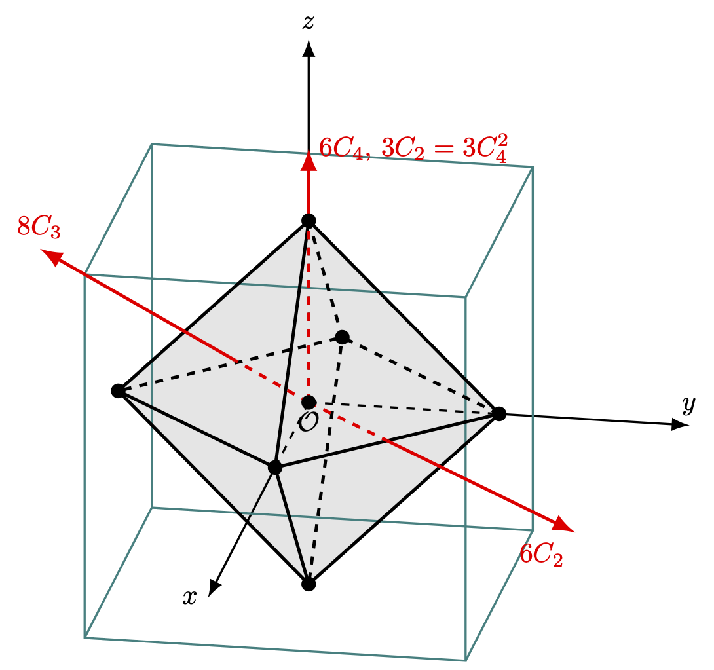

---
title: "군과 양자역학 II- 결정장 이론과 기약표현"
number-sections: true
number-depth: 3
crossref:
  chapters: true
---  



 

여기서는 원자가 결정 퍼텐셜 안에 놓였을 때 원자 에너지 준위가 갈라지는 현상, 즉 결정장 갈라짐(cryatal-field splitting) 에 대해 알아본다. 결정장 갈라짐은 군 이론의 비교적 간단한 응용일 뿐만 아니라 군 이론을 고체물리학에 적용할 때 자주 사용되는 고대칭에서 저대칭으로의 전이 과정을 잘 보여주는 좋은 사례이다. 이 장에서는 또한 3차원  회전군의 기약표현에 대해서도 결정장 이론과 함께 다룬다.

 

## 격자 대칭군의 기약표현

### 점군의 기약표현과 표준적인 character table {#sec-Group_standard_character_table}

{#tbl-Group_D3_character_table width=350}

$D_3$ 에 대한 표현을 다시 보고 표준적인 character table 작성법을 다시 정리해보자.

- 1차원 기약표현의 레이블은 $A,\,B$ 를 사용한다. 주축 회전에 대한 character 가 $+1$ 일 경우는 $A$, $-1$ 일 경우는 $B$ 를 사용한다. 2차원 기약표현의 레이블은 $E$, 3차원 기약표현의 레이블은 $T$ 를 사용한다. $A$ 타입 기약표현이 여러개 있을 경우 $A_1$ 은 trivial representation 이다. 단 하나 있을 경우는 $A$ 가 trivial representation 이다.
- 동일한 차원의 기약표현이 여러개일 경우 $1,\,2$ 와 같은 아래첨자 인덱스가 붙는다. 혹은 ${}',\, {}''$ 와 같은 기호로 구분하기도 한다. 반전대칭이 존재할경우 대칭의 even/odd 에 따라 $g,\,u$ 아래첨자가 붙는다. (*gerade*, *ungreade*)
- 다른 열에는 각 기약표현이 어떻게 변환하는지를 보이기 위해 좌표, 좌표의 2차식, $R_x,\,R_y,\,R_z$ 와 좌표축에 대한 회전을 넣는다. [Character Table 과 기저 함수 - $D_3$ 의 경우](group_quantum1_schroedinger_equation_group.qmd#sec-Group_character_table_and_basis_function_D3_case) 를 참고하라.

 

::: {#exm-Group_character_table_of_C2v}
#### $C_{2v}$ Character table

$C_{2v}$ 는 4개의 원소로 구성된 군이며 $\sigma_v,\, \sigma'_{v}$ 는 각각 $xz$, $yz$ 평면에 대한 거울상 반사이다. 각각이 아벨군이므로 1차원 기약표현만이 존재한다. 주축을 $z$ 축으로 삼으며 character 에 대한 직교정리를 사용하여 정리하면 아래 표와 같다. 여기서는 앞의 규칙 대로 $A$ 형 기약표현 2개와 $B$ 형 기약표현 2개만 존재하며 각각 아래와 같이 레이블울 붙였다. 아직 좌표에 대한 대칭은 정해지지 않았다.

{#tbl-Group_C2v_character_table width=300}

 좌표에 대한 변환은 다음과 같다.

$$
\hat{E}\begin{bmatrix} x \\ y \\ z\end{bmatrix} = \begin{bmatrix} x \\ y \\ z\end{bmatrix}, \quad \hat{C}_2\begin{bmatrix} x \\ y \\ z\end{bmatrix} = \begin{bmatrix} -x \\ -y \\ z\end{bmatrix},\quad \hat{\sigma}_v\begin{bmatrix} x \\ y \\ z\end{bmatrix} = \begin{bmatrix} x \\ -y \\ z\end{bmatrix}, \quad \hat{\sigma}'_v\begin{bmatrix} x \\ y \\ z\end{bmatrix} = \begin{bmatrix} -x \\ y \\ z\end{bmatrix}
$$

- $x$ 는 $B_1$, $y$ 는 $B_2$, $z$ 는 $A_1$ 과 같은 형태로 변환한다는 것을 안다. 따라서 $xy$ 는 $A_2$, $xz$ 는 $B_1$, $yz$ 는 $B_2$ 와 같이 변환한다.
- $x^2,\,y^2,\,z^2$ 은 모두 $A_1$ 과 같이 변환한다. 
- $R_z = xp_y-yp_x$ 는 $A_2$ 와 같이 변화한다. $R_x,\,R_y$ 에 대해서도 각각 $B_2,\,B_1$ 과 같이 변환된다는 것을 확인 할 수 있다.

:::

 

### 3차원 회전군의 기약표현 {#sec-Group_representation_of_3d_rotation_group}

자유 원자나 자유 이온은 완전한 회전 대칭성을 가지며, 해밀토니안과 교환 가능한 대칭 연산의 수는 무한하다. 즉, 임의의 축에 대한 모든 각도로의 회전은 전체 회전 군의 대칭 연산이다. 결정은 그 대칭 변환이 제한되지만 많은 경우 자유원자나 이온에 대해 결정의 효과를 perturbation 으로 간주할 수 있다. 즉 결정에서의 에너지 변화를 볼 때 그 시작점으로서 자유상태의 원자나 이온을 알아보아야 한다. 여기서는 무한하거나 연속적인 군에 대해 자세히 논의하지는 않을 것이지만, 양자역학에서 자주 사용하는 결과들을 엄밀한 증명 없이 받아들일 것이다. 

 

::: {#prp-Group_same_class_of_same_rotation_around_any_axis_id_3d_rotation_Group}

3차원에서의 회전군에 대해 정해진 각 $\alpha$ 만큼 회전시키는 모든 연산은 같은 클래스에 속한다. 

:::

  

::: {.proof}
*Accept without proof*
:::

따라서 3차원 회전군에는 무한개의 기약표현이 존재한다. 여기서 사용할 구면조화 함수(Spherical harmonic functions) $Y_l^m( \theta,\, \varphi)$ 는 르장드르 연관 함수(associated Legendre function) $P_l^m$ 과 음이 아닌 정수 $l$ 그리고 $|m|\le l$ 인 정수 $m$ 에 대해 아래와 같이 정의된다. (구면조화함수에 대해 자세한 것은 @arfken2013mathematical 을 참고하라.)

$$
Y_l^m (\theta,\, \varphi) = \sqrt{\dfrac{2l+1}{4\pi}\dfrac{(l-|m|)!}{(l+|m|)!}} P_l^m(\cos\theta) e^{im\varphi}.
$$ {#eq-Group_definition_of_spherical_harmomics}

즉 정해진 $l$ 값에 대해 $m$ 값은 $2l+1$ 가지가 될 수 있다. 또한 다음의 성질을 갖는다는 것이 잘 알려져 있다.

&emsp;($1$) $\displaystyle \hat{L}^2 Y_{l}^m (\theta,\, \varphi) = l(l+1)\hbar^2 Y_l^m (\theta,\, \varphi)$,

&emsp;($2$) $\displaystyle \hat{L}_z Y_l^m = m\hbar Y_l^m$,

&emsp;($3$) $\displaystyle \int Y_l^m (Y_{l'}^{m'})^\ast \, d\Omega = \delta_{ll'}\delta_{mm'}$.

 

구면조화함수와 3차원 회전군에 대해 아래 명제도 증명 없이 사용하기로 한다.

 

::: {#prp-Group_spherical_harmonics_are_basis_of_3d_rotation_group}

구면조화함수에서 $\theta,\, \varphi$ 를 정하는 기준이 되는 축(이를 polar axis 라고 하며 보통 $z$ 축으로 정한다.) 을 회전연산 $R$ 을 통해 바꾸어 $\theta',\, \varphi'$ 이 되었다고 하자. 이 때 다음이 성랍한다.

$$
\hat{R}Y_l^m (\theta',\, \varphi') = \sum_{m'} D^{(l)} (R)_{m'm} Y_{l}^m (\theta,\, \varphi).
$$ {#eq-Group_represestation_of_3d_rotation_by_spherical_harmonic_functions}

여기서 $D^{(l)}(R)$ 은 회전 연산 $R$ 에 대한 $(2l+1)$ 차원 기약표현이다. 즉 $2l+1$ 개의 함수 $\{Y_l^m\}$ 은 3차원 회전군의 $2l+1$ 차원 표현의 기저가 된다.

:::

 

::: {.proof}
*Accept without proof*
:::

 

::: {#exm-Group_character_of_rotation_group_in_3d}

#### 3차원 회전변환의 character
$z$ 축으로 $-\alpha$ 만큼의 회전 변환을 $R_\alpha$ 라고 하자. 그렇다면

$$
\hat{R}_\alpha Y_l^m(\theta,\, \varphi) = Y_l^m(\theta,\, \varphi - \alpha) = e^{-im\alpha} Y_{l}^m (\theta,\, \varphi)
$$

이며 이에대한 표현은 대각행렬로

$$
D^{(l)}(R_\alpha) = \begin{bmatrix} e^{-il\alpha} & 0 & \cdots & 0 \\ 0 & e^{-(l-1)\alpha} & \cdots & 0 \\ \vdots & \ddots & \cdots & \cdots \\ 0 & 0 & \cdots & e^{il\alpha}\end{bmatrix}
$$ {#eq-Group_representation_of_rotation_group_in_3d}

이며, character 는

$$
\chi^{(l)}(R_\alpha) = e^{-il\alpha}(1+e^{i\alpha} + \cdots + e^{2il\alpha}) = \dfrac{\sin (l+\frac{1}{2})\alpha}{\sin (\alpha/2)}
$$ {#eq-Group_character_of_3d_rotation_by_alpha}

이다. 앞서 언급했듯이 임의의 각 $\alpha$ 만큼의 모든 회전은 같은 클래스에 속하기 때문에 이 클래스의 character 는 @eq-Group_character_of_3d_rotation_by_alpha 와 같다.

:::

 

::: {#exm-Group_character_table_of_D3}

#### inversion 의 character

이제 반전 $i$ 에 대한 charcter 를 알아보자. 구면조화함수의 성질에 의해

$$
\hat{i}Y_l^m(\theta,\, \varphi) = Y_l^m(\pi -\theta,\, \varphi+\pi) = (-1)^l Y_l^m(\theta,\, \varphi)
$$

이다. 따라서, $D^{l}(i)$ 도 대각행렬이며

$$
\chi^{(l)}(i) = \sum_{m=-l}^l (-1)^l = (-1)^l(2l+1)
$$ {#eq-Group_character_of_3d_inversion}

이다. 

::: 

 

아래의 정리 역시 증명 없이 받으들이기로 하자.

::: {#thm-Group_uniqueness_of_irreducible_representation_of_3d_rotation_group}

3차원에서의 회전군에 대해 @eq-Group_represestation_of_3d_rotation_by_spherical_harmonic_functions 에 주어진 기약표현 이외의 홀수 차원의 기약표현은 존재하지 않는다.

:::

 

::: {.proof}
*Accept without proof*
:::

 

3차원 회전에 대한 홀수차원 기약표현은 구면조화함수를 기저로 하는 그것이다. 만약 각운동량이 반정수(음이 아닌 정수 $s$ 에 대해 $(2s+1)/2$) 라면 짝수차원의 기약표현이 존재한다. 여기에 대해서는 다음에 다루기로 하자.

 

## 원자 에너지의 결정장 갈라짐

결정 내의 원자나 이온은 자유 상태일 때와는 다르게 등방적이지 않은 포텐셜의 영향을 받게 된다. 자유상태의 입자나 이온은 모든 3차원 회전군과 반전에 대해 대칭이지만 이 비등방 포텐셜의 영향으로 원래 군에 대한 유한 부분군에 대해서만 대칭이다. 이 때 3차원 회전군에서는 기약표현이었던 것이 이 유한 부분군의 표현에서는 이 기약성(irreducibility) 가 깨져버리며, 따라서 degeneracy 가 축소된다. 즉 에너지 레벨이 갈라지게 되며 이것을 **결정장 갈라짐(Crystall field splitting)** 이라고 한다. 순전히 결정장에 의한 에너지 갈라짐을 **zero-field splitting** 이라고 하며 외부 자기장 등을 가했을 때는 대칭이 더 깨지게 된다. 결정장 갈라짐의 크기는 관련된 이온과 결정장의 특성에 따라 $1\, \mu\text{eV}$ 에서 $6\, \text{eV}$ 정도로 그 크기 차이가 매우 크다. 고체에서 이 에너지 영역의 기여는 궤도-스핀 

&emsp;($1$) 희

{#fig-Group_regular_octahedron_in_cube width=350}

위의 그림과 같이 정육면체 내의 정팔면체의 각 꼭지점에 전하 $q$ 를 띄는 같은 이온들이 위치한다고 하자. $\mathcal{O}$ 에서 한 꼭지점까지의 거리가 $a$ 일 때 중앙 $\mathcal{O}$ 근처의 $\bf{r} = (x,\,y,\,z)$ 에서 느끼는 전기포텐셜 $V_C(\bf{r})$ 은 $r/a \ll 1$ 조건에서 아래와 같이 근사된다.(@exr-electric_potential_by_neareast_ions_in-octaheron)

$$
V_C(\bf{r})=\dfrac{35}{16 \pi \epsilon_0}\dfrac{q}{a^5}\left(x^4+y^4+z^4-\dfrac{3}{5}r^4\right).
$$ {#eq-Group_potential_around_origin_by_octahedron_nearest_neighbor}

위 식은 $O$ 의 모든 대칭 연산에 대해 불변이며 **cubic-field term** 이라고 불린다. 우리는 원점 $\mathcal{O}$ 근처의 전기장에 관심이 있고, 전기 포텐셜은 이 영역 바깥의 전하에 대한 포텐셜이므로 라플라스 방정식을 만족해야 한다. 3차원 라플라스 방정식 $\nabla^2 \phi (\bf{r})$ 의 해는 $r^l Y_l^m (\theta,\, \varphi)$ 의 선형결합이라는 것이 알려져 있다. 예를 들어 $z$ 축에 대한 회전 대칭이 존재한다면 전기 포텐셜 $V_a$ 의 상수항을 제외한 가장 낮은 차수의 항은 

$$
V_a \sim r^2 Y_2^0 (\theta) \sim 3z^2 - r^2
$$

이다. 사방정계(orthorhombic) 대칭만을 가지고 있다면 전기포텐셜 $V_r$ 의 가장 낮은 차수의 항은

$$
V_r \sim (ax^2+by^2) - (a+b)z^2
$$

이다(@exr-tinkham_4_2). 이 때 $V_r$ 은 $Y_2^0$ 와 $(Y_2^2 + Y_2^{-2}) \sim (x^2-y^2)$ 의 선형결합으로 둘 다 $D_2$ 대칭에 대해 불변이다.

위의 방법으로 결정장의 크기를 추정하는 것은 실제 값에 대한 대략적인 추정이지만 엄밀한 것과는 거리가 멀다. 실제로는 전자 파동함수의 겹침, 구형이 아닌 전하 분포, 그리고 exchange 상호작용에 의한 효과로 인해 꽤 차이가 난다. 물론 위의 효과들은 대칭에 영향을 주지 않는다. 

 

## 연습문제 {.unnumbered}

 

::: {#exr-electric_potential_by_neareast_ions_in-octaheron}

@eq-Group_potential_around_origin_by_octahedron_nearest_neighbor 를 유도하라.

:::

 

::: {.solution}

$1/\sqrt{1-x},\, 1/\sqrt{1+x}$ 의 테일러 전개는 다음과 같다.
$$
\begin{aligned}
\dfrac{1}{\sqrt{1-x}} &= 1 + \dfrac{1}{2}x + \dfrac{3}{8}x^2 + \dfrac{5}{16}x^3 + \dfrac{35}{128}x^4 + \cdots \\[0.3em]
\dfrac{1}{\sqrt{1+x}} &= 1 - \dfrac{1}{2}x + \dfrac{3}{4}x^2 - \dfrac{5}{16}x^3 + \dfrac{35}{128}x^4 + \cdots
\end{aligned}
$$
$r/a \ll 1$ 조건에서 테일러 전개하면

$$
\begin{aligned}
\dfrac{1}{\sqrt{(x-a)^2+y^2+z^2}} &=  \dfrac{1}{\sqrt{a^2 -2ax + r^2}} = \dfrac{1}{a} \dfrac{1}{\sqrt{1-(2x/a - r^2/a^2)}} \\[0.3em]
&= \dfrac{1}{a} \left[1 + \dfrac{1}{2}\left(\dfrac{2x}{a} - \dfrac{r^2}{a^2}\right) + \dfrac{3}{8}\left(\dfrac{2x}{a} - \dfrac{r^2}{a^2}\right)^2 \right . \\[0.3em]
&\qquad \left. + \dfrac{5}{16}\left(\dfrac{2x}{a} - \dfrac{r^2}{a^2}\right)^3 + \dfrac{35}{128}\left(\dfrac{2x}{a} - \dfrac{r^2}{a^2}\right)^4 + \cdots \right] \\[0.3em]
&=\dfrac{1}{a} \left[1 + \dfrac{x}{a} + \dfrac{3x^2-r^2}{2a^2} + \dfrac{5x^3-3xr^2}{2a^3} + \dfrac{3r^4-30x^2r^2 + 35x^4}{8a^4} + \cdots \right] \\[0.3em]
\dfrac{1}{\sqrt{(x+a)^2+y^2+z^2}} &= \dfrac{1}{a}\left[1 - \dfrac{x}{a} + \dfrac{3x^2-r^2}{2a^2} - \dfrac{5x^3-3xr^2}{2a^3} + \dfrac{3r^4-30x^2r^2 + 35x^4}{8a^4} + \cdots\right] 
\end{aligned}
$$

이것을 $(0,\,\pm a,\, 0),\, (0,\,0,\, \pm a)$ 에도 계산하고 더하면

$$
V_C(\bf{r}) = \dfrac{q}{4\pi\epsilon_0 a}\left[6 + \dfrac{35}{4a^4}\left(x^4+y^4+z^4-\dfrac{3}{5}r^4\right) + \cdots \right]
$$

이다. 여기서 물리적으로 의미 없는 상수항을 빼고 나면 @eq-Group_potential_around_origin_by_octahedron_nearest_neighbor 이다.

:::

  

::: {#exr-tinkham_4_2}

#### Tinkham 4.2
($a$) Orthorhombic 격자는 $a\ne b \ne c,\, \alpha =\beta= \gamma = \pi/2$ 이다(@tbl-Group_crystall_system). Orthorhombic 에서의 8면체 에 대한 전기 포텐셜 $V_O$ 를 4차항 까지 구하라.

($b$) ($a$) 의 결과는 상수항, 2개의 homogeneous 한 2차 다항식 항, 3개의 homogeneous 한 4차 다항식항으로 이루어졌으며 각각이 라플라스 방정식 $\nabla^2 \phi= 0$ 을 만족함을 보이고, $D_{2h}$ 군의 대칭 연산에 대해 불변임을 보여라. 각각의 계수를 $a,\,b,\,c$ 로 표현하여라.

($c$) $a=b\ne c$ 인 경우(tetragonal field) 와 $a=b=c$ 인 경우(cubic field) 에 대해서도 고려하라.
:::

 

::: {.solution}

($a$) @exr-electric_potential_by_neareast_ions_in-octaheron 의 답을 이용하자. $a_1=a,\,a_2=b,\,a_3=c,\, x_1=x,\, x_2=y,\,x_3=z$ 라고 놓으면,
$$
\begin{aligned}
V_O(\bf{r}) &= \dfrac{q}{4\pi\epsilon_0} \left[ \dfrac{6}{a} + \left( \sum_{i=1}^3 \dfrac{3x_i^2-r^2}{a_i^3}  + \dfrac{3r^4-30x_i^2r^2 + 35x_i^4}{8a_i^4}  \right)+\cdots\right]
\end{aligned}\tag{1}
$$ 

($b$) 식 ($1$) 을 보면 상수항, 2개의 homogeneous 한 2차 다항식 항, 3개의 homogeneous 한 4차 다항식항으로 이루어졌다는 것을 알 수 있다. 이것을 각각 풀어 보면 아래와같다.

$$
\begin{aligned}
V_O(\bf{r}) &= \dfrac{q}{4\pi\epsilon_0}\left[ \dfrac{6}{a}  \right.\\
&+ \left.\left(\dfrac{2}{a^3}-\dfrac{1}{b^3}-\dfrac{1}{c^3}\right)x^2 + \left(-\dfrac{1}{a^3}+\dfrac{2}{b^3}-\dfrac{1}{c^3}\right)y^2 + \left(-\dfrac{1}{a^3}-\dfrac{1}{b^3}+\dfrac{2}{c^3}\right)z^2\right] \\[0.3em]
&+ (\text{linear combination of } x^2y^2,\, x^2z^2,\, y^2z^2,\, x^4,\, y^4,\,z^4) 
\end{aligned}
$$

2차 다항식에 대해 라플라스 방정식이 성립하며 삼차 다항식의 경우

$$
\begin{aligned}
&\nabla^2 \left(\sum_{i=1}^3 \dfrac{3r^4-30x_i^2r^2 + 35x_i^4}{8a_i^4}  \right) \\
&= \nabla^2 \dfrac{1}{8a^2}(8x^4+3y^4+3z^4 -24x^2y^2 -24 x^2z^2 + 6 y^2z^2) \\
&\qquad + \nabla^2 \dfrac{1}{8b^2}(3x^4+8y^4+3z^4 -24x^2y^2 -24 y^2z^2 + 6 x^2z^2) \\
&\qquad + \nabla^2 \dfrac{1}{8c^2}(3x^4+3y^4+8z^4  + 6x^2y^2 -24 y^2z^2 -24 x^2z^2) \\
\end{aligned}
$$

이다. 우선 첫번째의 $\nabla^2(\cdots)$ 를 계산하면

$$
= 96x^2 +36 y^2 + 36 z^2 - 48y^2 - 48 x^2 - 48 x^2 - 48 z^2 + 12 z^2 + 12 y^2 = 0
$$

이며 마찬가지로 두번째, 새변째의 $\nabla^2(\cdots) = 0$ 이다. 즉 라플라스 방정식이 $0$ 이다. 

($3$) 시간이 철철 나면..

:::