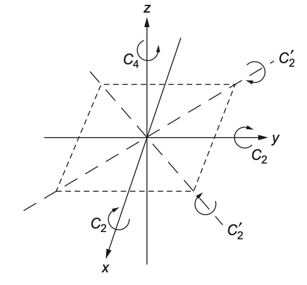

---
title: "군과 표현"
number-sections: true
number-depth: 3
crossref:
  chapters: true
---  



 

## 군의 표현

### 군의 표현과 유니터리 표현 {#sec-Group_representation}

::: {.callout-note icon="false"}

#### **군의 표현**

::: {#def-Group_representation}

군 $G$ 와 일반 선형군 $GL_n(\F)$ 에 대해 $D\in \text{Hom} (G,\, GL_n(\F))$ 일 때 $D$ 를 $G$ 의 표현이라고 한다. $D(G)$ 가 유니터리 행렬의 집합일 때 $D$ 를 $G$ 의 **유니터리 표현(unitary representation)** 이라고 한다. $D$ 가 단사일 때 **신뢰할만한 표현(faithful representation)** 하다고 한다. 군의 원소에 대한 어떤 두 행렬 표현도 동일하지 않기 때문에 faithful 이라는 이름이 붙을 만 하다. 군이 $n \times n$ 행렬로 표현되었을 때 $n$ 을 이 표현 $D$ 의 **차원(dimension)** 이라고 한다.

:::
:::

 

여기서 군에 대한 행렬 표현이 항상 유니터리 표현일 필요는 없지만 유니타리 표현은 매우 유용하다. 또한 $GL_n$ 은 정의상 가역행렬의 집합이므로 군의 표현이 가역행렬이 아닐 경우를 생각하지 않는다.

 

::: {#prp-Group_basic_properties_of_representation}

$D$ 가 군 $G$ 의 표현일 때 다음이 성립한다.

&emsp;($1$) $D(1_G) = I$,

&emsp;($2$) $D(g^{-1}) = (D(g))^{-1}$

:::

::: {.proof}

$D$ 가 두 군 $G,\, GL_n(\F)$ 사이의 준동형사상이므로 자명하다. $\square$

:::

 

::: {#exm-Group_trivial_representation}

#### Trivial representation

임의의 군 $G$ 에 대해 $D^{(1)}: G \to GL_1$ 을 $D^{(1)}(g) = [1]$ 로 정의하면 $D^{(1)}$ 은 $G$ 에 대한 표현이다. 가장 단순한 표현이므로 **trivial representation** (@Tinkham2012Group 는 identical representation 이라고 한다.)

:::

 

즉 모든 군에 대해 최소한 하나의 표현은 존재한다. 

 

이제 몇가지 질문이 자연스럽게 생겨난다. (1) 모든 군은 표현 가능한가? (2) 군의 표현은 몇가지나 (최소한 trivial representation 을 제외하고라도) 가능한가? (3) 다수의 표현이 존재한다면 이것을 어떤 특징에 따라 분류 할 수 있는가? (4) 표현에 대한 어떤 일반적인 성질이 존재하는가?

일부분은 이미 대답 할 수 있다. Caylay 정리 (@thm-Group-caylay_theorem) 모든 유한군은 대칭군 $S_n$ 의 어떤 부분군과 동형이라는 것을 알려준다. 그리고 대칭군은 항상 행렬로 표현 할 수 있으며(@exm-Group_representation_for_Sn), 따라서 유한군은 행렬로 표현 가능하다는 것을 알 수 있다. 연속군은? 우리는 이미 회전을 행렬로 다루었다. 또한 유명한 로런츠군도 있다. 덧셈 연산에 대해 실수도 군이다. 이것도 행렬로 나타 낼 수 있을까?

 

::: {#exm-Group_matrix_representation_of_Rplus}

#### $\R^+$ 의 표현

덧셈연산이 정의된 실수의 집합은 $0$ 을 항등원으로 하고 $a\in\R^+$ 에 대해 $-a$ 를 역원으로 갖는 연속군이다. $D\in \text{Hom}(\R^+, GL(2))$ 를 다음과 같이 정의하자.

$$
D(u):= \begin{bmatrix} 1 & 0 \\ u & 1 \end{bmatrix}
$$

$D$ 는 단사함수이며 동형사상인 것과 $D(u)D(v) = D(u+v)$ 임을 보일 수 있다.

:::

 

이제 유니터리 표현의 예를 보자. 

 

::: {#exm-Group_unitray_representation_of_D3}

#### $D_3$ 에 대한 유니터리 표현
 

@fig-Group_d3_2 에서 보인 $D_3$ 군에 대한 유니터리 표현은 다음과 같다.

$$
\begin{aligned}
U(I)&= \begin{bmatrix} 1 & 0 \\ 0 & 1 \end{bmatrix},  & 
U(C_3) &= \begin{bmatrix} -\frac{1}{2} & \frac{\sqrt{3}}{2} \\ -\frac{\sqrt{3}}{2} & -\frac{1}{2}\end{bmatrix},  &
U(C_3^2) &= \begin{bmatrix} -\frac{1}{2} & -\frac{\sqrt{3}}{2} \\ \frac{\sqrt{3}}{2} & -\frac{1}{2}\end{bmatrix}\\
U(C_2) &= \begin{bmatrix} 1 & 0 \\ 0 & -1 \end{bmatrix},  & 
U(C_2') &= \begin{bmatrix} -\frac{1}{2} & \frac{\sqrt{3}}{2} \\ \frac{\sqrt{3}}{2} & \frac{1}{2}\end{bmatrix},&
U(C_2''') &= \begin{bmatrix} -\frac{1}{2} & \frac{-\sqrt{3}}{2} \\ -\frac{\sqrt{3}}{2} & \frac{1}{2}\end{bmatrix}
\end{aligned}
$${#eq-Group_unitray_representation_of_D3_1}

이 $U$ 가 준동형사상이라는 것은 쉽게 보일 수 있다. 준동형사상의 성질로부터 자연스럽게 알 수 있는 것이기도 하지만 위의 행렬 표현은 다음과 같은 특징을 가진다.

- 항등 연산은 항등행렬로 표현된다. 즉 $U(e) = I$.
- 연산의 역원은 역행렬로 표현된다. 즉 $U(a^{-1}) = (U(a))^{-1}$.

어떤 군의 표현은 faithful 하지 않은데 $D_3$ 에 대해

- $\forall g\in D_3,\quad U(g)=I$,
- $U(I)=U(C_3)=U(C_3^2)=I$, $U(C_2)=U(C_2')= U(C_2')= -I$ 

인 두가지 경우가 그러하다.

:::

 

::: {#exm-Group_representation_for_Sn}

#### 대칭군 $S_X$ 의 표현
 

우선 대칭군 $S_n$ 은 $n \times n$ 행렬로 표현 할 수 있다. $\bf{e}_j \in \R^n$ 을 $j$ 번째 성분만 $1$ 이며 나머지 성분은 $0$ 인 열벡터(즉 단위벡터)라고 하자. $\sigma\in S_n$ 에 대해 $D(\sigma)$ 를

$$
D(\sigma) = \begin{bmatrix} \bf{e}_{\sigma^{-1}(1)}^T \\ \vdots \\ \bf{e}_{\sigma^{-1}(n)}^T \end{bmatrix}
$$

로 정의하자. 여기서 $\bf{e}^T_k$ 는 $\bf{e}_k$ 가 transpose 된 행벡터이다. 그렇다면 $D(\sigma)\bf{e}_j$ 는 $\sigma^{-1}(k)=j$ 인 $k$ 번째 성분이 $1$ 이며 나머지는 $0$ 이므로 $D(\sigma)\bf{e}_j = \bf{e}_{\sigma(j)}$ 이다. 또한 $\pi,\, \sigma\in S_n$ 에 대해

$$
D(\pi)D(\sigma)\bf{e}_j = D(\pi)\bf{e}_{\sigma(j)}= \bf{e}_{(\pi\circ \sigma)(j)}
$$

이므로 $D(\pi)D(\sigma)= D(\pi \circ \sigma)$ 라고 할 수 있다. 즉 $D$ 는 $S_n$ 에 대한 표현이다. 

임의의 유한집합 $X$ 에 대해서는 $X=\{x_1,\ldots,\,x_n\}$ 을 $\{1,\,\ldots,\,n\}$ 으로 놓고 위를 적용하면 된다. 즉 $S_X$ 는 $|X| \times |X|$ 행렬로 표현 할 수 있다.

:::

 

### 켤레류 의 지표 {#sec-Group_character_of_conjugacy_class}

::: {.callout-warning icon="false"}

#### 표현의 표기와 class 호칭에 대해

- 우리는 군의 표현이 여러 종류가 가능하다는 것을 안다. 따라서 그 표현을 구분하기 위해 $D^{(r)}(g)$ 와 같이 표기하기로 한다. $r$ 이 여러 표현을 구분하는 인덱스이다.

- @def-Group_conjugacy_class 에서 우리는 켤레류(conjugacy class) 에 대해 정의하였다. 앞으로 특별한 언급이 없는 한 class 는 켤레류를 의미한다.

:::

 

::: {#prp-Group_character_of_class}

군 $G$ 와 행렬표현 $D^{(r)}$ 에 대해 $K$ 가 $G$ 의 class 일 때 모든 $x\in K$ 에 대해 $\text{tr}(D^{(r)}(x))$ 는 같다. 

:::

 

::: {.proof}

$K=[k]$ 라고 하자. 즉 $x\in K$ 는 어떤 $g\in G$ 에 대해 $x=gkg^{-1}$ 이다. $\tr (AB)= \tr (BA)$ 임을 이용한다.  
$$
\text{tr}\left(D\left(gkg^{-1}\right)\right)=\text{tr}(D(g^{-1})D(k)D(g)) = \text{tr}\left(D(g^{-1})D(g)D(k)\right) = \text{tr}(D(k)). \square
$$

:::

 

우리는 위의 @prp-Group_character_of_class 로부터 어떤 행렬 표현에서의 클래스 원소의 trace 는 클래스의 특징이 될 수 있다는 것을 알 수 있었다. 따라서 아래의 정의가 가능하다.

 

::: {.callout-note appearance="simple" icon="false"}
::: {#def-Group_character_of_class}
#### Character

군 $G$ 에 주어진 행렬표현 $D^{(r)}$ 에 대해 $g\in G$ 일 때 $\text{tr}(D^{(r)}(g))$ 를 $g$ 에 대한 표현 $r$ 에서의 **character** 라고 하고 $\chi^{(r)}(g)$ 라고 표기한다. 클래스 $K$ 에 대한 행렬의 trace 를 이 클래스의 **character** 라고 하고 $\chi^{(r)}(K)$ 라고 표기한다.

:::
:::

 

::: {#exm-Group_character_of_identity}

$E=\{i_G\}$ 는 자체로 conjugacy class 이다. $d\times d$ 행렬 표현 $D$ 에 대한 character $\chi$ 에 대해 $\chi(i_G)= \chi(E)=d$ 이다.

:::

 

#### **동등한 표현** {#sec-Group_equivalent_representation}

::: {#thm-Group_equivalent_representation}

군 $G$ 의 표현 $D\in \text{Hom}(G,\,GL_n(\F))$ 를 생각하자. $V\in GL_n(\F)$ 에 대해

$$
D'(g):= VD(g)V^{-1}
$$

역시 $G$ 의 표현이다.

:::

 

::: {.proof}

$D'\in \text{Hom}(G,\, GL_n(\F))$ 임을 보이면 된다. 

$$
D'(g_1g_2) = VD(g_1)D(g_2)V^{-1} = (VD(g_1)V^{-1}) (VD(g_2)V^{-1}) =D'(g_1)D'(g_2)
$$

이므로 증명 끝. $\square$

:::

 

선형대수에서 행렬 $M$ 을 어떤 가역행렬 $S$ 에 대해 $SMS^{-1}$ 로 변환시키는 것을 **닮음 변환(similarity transform)** 이라고 하며 동일한 선형사상을 다른 기저에서 표현하는 것이라고 볼 수 있다. 마찬가지로 어떤 표현에 대한 닮음 변환은 두 변환이 본질적으로 같다는 의미이다. 따라서 두 표현에 동등하다는 이름을 붙일 수 있다.

 

::: {.callout-note appearance="simple" icon="false"}
::: {#def-Group_equivalent_representation}
#### 동등한 표현

@thm-Group_equivalent_representation 에서의 $D$ 와 $D'$ 의 관계가 성립한다면 이 두 표현은 **동등하다(be equivalent)** 라고 한다.

:::
:::

 

::: {#prp-Group_equivalent_representation_and_character}

군 $G$ 의 두 표현이 동등하면 두 표현에 의한 클래스의 character 는 같다. 즉, 두 표현에 의한 클래스의 character 가 다르면 두 표현은 동등하지 않다.

:::

  

::: {.proof}
trivial
:::

 

### 기약 표현과 유니터리 표현 {#sec-Group-irreducible_representation_and_unitary_representation}

::: {.callout-note appearance="simple" icon="false"}
::: {#def-Group_irreducible_representation}
#### 기약 표현

군의 전체 성분에 대한 행렬 표현 각각이 어떤 유니터리 변환에 의해 더 작은 크기의 같은 형태의 블록 대각행렬로 분해된다면 이 군은 **reducible** 하다고 한다. reducible 하지 않은 표현을 **기약표현 (irreducible representation)** 이라고 한다.

:::
:::

 

아래 명제는 기약 표현의 정의상 자명하다.

::: {#prp-Group_equivalent_representation_conserves_reduciblity}

군 $G$ 에 대한 두 표현 $D^{(1)},\,D^{(2)}$ 가 동등하며 $D^{(1)}$ 이 기약표현이면 $D^{(2)}$ 도 기약표현이다.

:::

 

군 $G$ 의 어떤 표현 $D^{(r)}\in \text{Hom}(G,\, GL_n(\F))$ 를 생각하자. 어떤 유니터리 변환에 의해 군의 모든 성분에 대한 행렬 표현이 동시에 같은 형태, 즉 같은 크기의 부분행렬들로 분해된다면 이 행렬표현은 reducible 하다. 

이 블록 대각 행렬이 각각 $n_1 \times n_1, \ldots,\, n_m \times n_m$ 형태의 정사각 행렬이라고 하자. 그리고 $D^{(r_i)}(g)$ 가 $U^{(r)} (g)$ 의 $i$ 번째 블록대각행렬 즉 $n_i \times n_i$ 행렬을 취한다고 하자. 

 

::: {#prp-Group_equivalent_representation}

위의 $D^{(r_i)}$ 역시 $G$ 의 표현이다.  

:::

 

::: {.proof}

$D^{(r_i)}(g_1)D^{(r_i)}(g_2) = D^{(r_i)}(g_1g_2)$ 이다.  $\square$

:::

 

이 때 행렬의 direct sum $\oplus$ 를 이용하면 모든 $g\in G$ 에 대해

$$
D^{(r)}(g) = D^{(r_1)}(g) \oplus \cdots \oplus U^{(r_n)}(g) = \bigoplus_{i=1}^m D^{(r_i)}(g)
$$ {#eq-Group-direct_sum_of_representation}

임을 알 수 있다. 

 

#### **부분군과 표현**

군의 표현에서 중요한 것은 군에 대한 어떤 표현이 irreducible 인지 확인한 후 reducible 이면 분해하여 irreducible representation 을 찾는 것이다. 여기서 한가지 짚고 넘어가야 할 것은 $H\le G$ 이고 $D$ 가 $G$ 에 대한 기약표현이라고 하더라도 $H$ 에 대한 기약표현인지는 확인해야 한다. 즉 $H$ 에 대한 reducible representation 일 수 있다.

 

#### **유니터리 표현 정리**

유니터리 행렬은 $U^\dagger U = UU^\dagger = I$, 즉 $U^{-1}=U^\dagger$ 라는 아주 좋은 성질을 가지고 있다. 그리고 유한군의 표현은 어떤 유니터리 표현과 동등하다. 

 

::: {#thm-Group_unitary_representation_theorem}
#### 유니터리 표현 정리
유한군에 대한 표현은 어떤 유니터리 표현과 동등하다.

:::

 

::: {.proof}

@thm-Group_rearrangement_theorem 생각하자. $G$ 의 표현 $D$ 에 대해 다음이 성립한다는 것을 알 수 있다.

$$
\sum_{g\in G}D(g) = \sum_{g\in G} D(g'g) = \sum_{g\in G}D(gg').
$$ {#eq-Group_unitary_theorem_0}

이제 $D$ 가 $G$ 에 대한 unitary 표현이 아닌 표현이라고 하자. 이 때 

$$
H:=\sum_{g\in G} (D(g))^\dagger D(g)
$$ {#eq-Group_unitary_theorem_1}

라고 하면 임의의 $g'\in G$ 에 대해

$$
\begin{aligned}
D(g')^\dagger HD(g') &= \sum_{g\in G} D(g')^\dagger (D(g))^\dagger D(g) D(g') \\
&=\sum_{g\in G} (D(g)D(g'))^\dagger D(g)D(g')= \sum_{g\in G} D(gg')^\dagger D(gg') = H
\end{aligned}
$$

이다. 또한 @eq-Group_unitary_theorem_1 으로부터 $H$ 가 에르미트 행렬임을 안다. 따라서 어떤 유니터리 행렬 $V$ 를 이용한 닮음변환에 의해 대각 성분이 실수인 대각행렬이 된다. 이 대각행렬을 $B=V^\dagger HV$ 라고 하자. 

$$
B=V^\dagger HV = \sum_{g\in G} V^\dagger D(g)^\dagger D(g) V = \sum_{g\in G} \left( V^\dagger D(g)V\right)^\dagger \left(V^\dagger D(g)V\right)
$$

이다. 

$$
\begin{aligned}
B_{jj} &= \sum_{g\in G} \left( V^\dagger D(g)V\right)^\dagger_{jk} \left(V^\dagger D(g)V\right)_{kj} \\[0.3em]
&= \sum_{g\in G} \left( V^\dagger D(g)V\right)_{kj} ^\ast \left(V^\dagger D(g)V\right)_{kj}  \ge 0\\[0.3em]
\end{aligned}
$$

이므로 $B$ 는 대각성분이 음수가 아닌 대각행렬이다. $M=\sqrt{B}$ 를 정의 할 수 있으며 $M$ 역시 대각성분이 음수가 아닌 대각행렬이다. $M$ 은 가역행렬이므로 $U:G \to GL_n(\F)$ 를 아래와 같이 정의한다.

$$
U(g): = MV^\dagger D(g)VM^{-1}.
$$

여기서 $U$ 는 $D$ 와 동등한 표현이다. 이로부터 

$$
(U(g))^\dagger = M^{-1}V^\dagger D(g)^\dagger V M
$$

이므로,

$$
\begin{aligned}
U(g)^\dagger U(g) &= M^{-1}V^\dagger D(g)^\dagger VM^2 V^\dagger D(g)VM^{-1} \\[0.3em]
&=M^{-1}V^\dagger D(g)^\dagger VV^\dagger HVV^\dagger D(g)VM^{-1} \\[0.3em]
&=M^{-1}V^\dagger D(g)^\dagger H D(g)VM^{-1} \\[0.3em]
&= M^{-1}V^\dagger HVM^{-1} = M^{-1}M^2M^{-1} = I
\end{aligned}
$$

이다. 즉 $U$ 는 $D$ 와 동등한 유니터리 표현이다. $\square$

:::

 

유한군에 대해서 중요한 것을 증명했다. 당연한 질문 연속군에 대해서는? 예를 들어 $SO(n)$ 은 자체로서 유니터리 표현이다. 그렇다면 로렌츠 군이나 @exm-Group_matrix_representation_of_Rplus 에서 보인 $\R^+$ 에 대한 $2\times 2$ 표현은 어떠한가? 나중에 보이겠지만 유니터리 표현이 존재하는 것은 연속 매개변수의 컴팩트성과 관련이 있다. 결론적으로 로렌츠 군이나 $\R^+$ 에 대한 표현에 대한 유니터리 표현은 존재하지 않는다.

 

### 직합표현과 직곱표현 {#sec-Group_direct_sum_representation_and_direct_product_representation}

$G$ 에 대한 두 표현 $D^{(1)}$ 과 $D^{(2)}$ 가 각각 $n_1$, $n_2$ 차원을 갖는다고 하자. 이 때 새로운 표현 $D^{(s)}$ 를

$$
D^{(s)}(g) := D^{(1)}(g) \oplus D^{(2)}(g)
$$ {#eq-Group-direct_sum_of_representation}

로 표현 할 수 있다. 즉 $D^{(1)}$ 표현과 $D^{(2)}$ 표현의 행렬이 블록대각성분이 되는 $(n_1+n_2)\times (n_1+n_2)$ 행렬 표현이며 이것이 행렬 $G$ 의 표현인 것은 쉽게 알 수 있다. 이를 **직합 표현(direct sum representation)** 이라고 한다. 이보다 더 복잡하게

$$
D^{(p)}(g) := D^{(1)}(g) \otimes D^{(2)}(g) 
$$ {#eq-Group-direct_product_of_representation}

와 같은 표현을 생각 할 수 있다. 이 때 $D^{(p)}$ 를 **직곱 표현(direct product representation)** 이라고 하며 $n_1n_2 \times n_1n_2$ 행렬이다. 

 

::: {#exm-Group_direct_product_of_matrix}

#### 행렬의 직곱

두 행렬 $A\in \F^{m \times m},\,B \in \F^{n \times n}$ 의 직곱은 다음과 같다.

$$
\begin{aligned}
A\otimes B :=& \begin{bmatrix} A_{11}[B] &  \cdots &A_{1m} [B] \\ \vdots & \ddots & \vdots \\ A_{m1}[B] & \cdots & A_{mm}[B] \end{bmatrix} \\
=&\begin{bmatrix} A_{11}B_{11} & A_{11}B_{12} & \cdots & A_{1m}B_{1(n-1)} & A_{1m}B_{1n} \\
A_{11}B_{21} & A_{11}B_{22} &\cdots & A_{1m}B_{2(n-1)} & A_{1m}B_{2n} \\
\vdots & \vdots &\ddots & \vdots & \vdots \\
A_{m1}B_{n1} & A_{m1}B_{n2} & \cdots & A_{mm}B_{n(n-1)} & A_{mm}B_{nn}
\end{bmatrix} 
\end{aligned}.
$$

이다. 
:::

 

우리는 아직 이 직곱 표현이 군에 대한 표현이라는 것을 보이지 않았다. 

::: {#thm-Group_direct_product_representatin_is_a_group_representation}

@eq-Group-direct_product_of_representation 에서와 같이 정의된 직곱표현은 군의 표현이다.

:::

 

::: {.proof}

아래 식을 보이면 된다.
$$
D^{(p)}(g)D^{(p)}(g') =  D^{(p)}(gg') = \left(D^{(1)}(g) D^{(1)}(g')\right)\otimes \left(D^{(2)}(g) D^{(2)}(g')\right)
$$

여기에 대한 증명은 연습문제 (@exr-Group_proof_of_direct_product_mutiplication) 로 넘긴다. $\square$
:::

 

우리는 이후 이 직곱표현이 기약 표현의 직합표현으로 변환될 수 있음을 보일 것이다.

 

::: {#prp-Group_character_of_direct_product_representatin}

군 $G$ 의 두 표현 $D^{(1)},\, D^{(2)}$ 에 대해 $g\in G$ 의 character 를 $\chi^{(1)}(g),\, \chi^{(2)}(g)$ 라고 하자. $D=D^{(1)}\otimes D^{(2)}$ 에 대한 $g$ 의 character $\chi(g)=\chi^{(1)}(g)\chi^{(2)}(g)$ 이다.

:::

 

::: {.proof}

$$
\chi(g) = \sum_j \left(D(g)\right)_{jj} = \sum_i \left(D^{(1)}(g)\right)_{ii} \left(\sum_k \left(D^{(2)}(g)\right)_{kk}\right) =\chi^{(1)}(g) \chi^{(2)}(g). \; \square
$$

:::

 

::: {#exm-Group_unitray_representation_of_D3_2}

#### $D_3$ 에 대안 reducible representation
 

$D_3$ 를 아래와 같이 $3\times 3$ 행렬로 표현 할 수 있다.

$$
\begin{aligned}
U(I)&= \begin{bmatrix} 1 & 0 & 0 \\ 0 & 1 & 0 \\ 0 & 0 & 1 \end{bmatrix}, \qquad & 
U(C_3) &= \begin{bmatrix} 0 & 1 & 0 \\ 0 & 0 & 1 \\ 1 & 0 & 0 \end{bmatrix}, \quad &
U(C_3^2) &=  \begin{bmatrix} 0 & 0 & 1 \\ 1 & 0 & 0 \\ 0 & 1 & 0 \end{bmatrix}\\
U(C_2) &= \begin{bmatrix} 0 & 0 & 1 \\ 0 & 1 & 0 \\ 1 & 0 & 0 \end{bmatrix}, \qquad & 
U(C_2') &= \begin{bmatrix} 1 & 0 & 0 \\ 0 & 0 & 1 \\ 0 & 1 & 0 \end{bmatrix},&
U(C_2''') &= \begin{bmatrix} 0 & 1 & 0 \\ 1 & 0 & 0 \\ 0 & 0 & 1 \end{bmatrix}.
\end{aligned}
$$ {#eq-Group_unitray_representation_of_D3_2}

유니터리 행렬 $V$ 를 아래와 같이 정하자.

$$
V = \begin{bmatrix} \frac{1}{\sqrt{3}} &  \frac{1}{\sqrt{3}} &  \frac{1}{\sqrt{3}} \\  \frac{1}{\sqrt{6}} &  -\sqrt{\frac{2}{3}} &  \frac{1}{\sqrt{6}} \\ \frac{1}{\sqrt{2}} & 0 & -\frac{1}{\sqrt{2}} \end{bmatrix}.
$$

$U'(g) = VU(g)V^{-1}$ 라고 하면,

$$
\begin{aligned}
U'('I)&= \begin{bmatrix} 1 & 0 & 0 \\ 0 & 1 & 0 \\ 0 & 0 & 1 \end{bmatrix}, & 
U'(C_3) &= \begin{bmatrix} 1 & 0 & 0 \\ 0 & -\frac{1}{2} & \frac{\sqrt{3}}{2} \\ 0 & -\frac{\sqrt{3}}{2} & -\frac{1}{2} \end{bmatrix}, \\
U(C_3^2) &=  \begin{bmatrix} 1 & 0 & 0 \\ 0 & -\frac{1}{2} & -\frac{\sqrt{3}}{2} \\ 0 & \frac{\sqrt{3}}{2} & \frac{1}{2} \end{bmatrix}, &
U'(C_2) &= \begin{bmatrix} 1 & 0 & 0 \\ 0 & 1 & 0 \\ 0 & 0 & -1 \end{bmatrix}, \\ 
U'(C_2') &=\begin{bmatrix} 1 & 0 & 0 \\ 0 & -\frac{1}{2} & \frac{\sqrt{3}}{2} \\ 0 & \frac{\sqrt{3}}{2} & \frac{1}{2} \end{bmatrix},&
U'(C_2''') &= \begin{bmatrix} 1 & 0 & 0 \\ 0 & -\frac{1}{2} & -\frac{\sqrt{3}}{2} \\ 0 & -\frac{\sqrt{3}}{2} & \frac{1}{2} \end{bmatrix}.
\end{aligned}
$${#eq-Group_block_diagonalized_unitray_representation_of_D3_2}

이며 모든 군의 성분에 대한 행렬표현이 블럭 대각화 되었다. 

:::

 

::: {#exm-Group_unitray_representation_of_D3_2}

#### 연속군에 대한 표현
 

@exm-Group_rotation_of_plane_circle 에서 차수가 1인 연속군을 보였다. 이 연속군은 

$$
U(\varphi) = \begin{bmatrix} \cos \varphi & \sin \varphi \\ - \sin \varphi & \cos \varphi \end{bmatrix}
$$

로 표현 할 수 있다. 이 군은 아벨군이므로 @cor-Group_irrep_of_abelian_is_1d 에 따라 위의 표현은 reducible 하다. 유니터리 행렬 $V$ 

$$
V= \dfrac{1}{\sqrt{2}}\begin{bmatrix} 1 & -i \\ 1 & i\end{bmatrix}
$$

에 대해 $U'(g) = VU(g)V$ 라고 하면

$$
U'(\varphi ) = \begin{bmatrix} e^{i\varphi} & 0 \\ 0 & e^{-i\varphi}\end{bmatrix}
$$

이므로 $U_1(\varphi) = e^{i\varphi},\, U_{-1} (\varphi) = e^{-i\varphi}$ 에 대해 $U = U_1 \oplus U_2$ 이다. 

:::

 

### 연습문제 {.unnumbered}

 

::: {#exr-Group_proof_of_direct_product_mutiplication}

$m \times m$ 행렬 $A,\,B$ 와 $n \times n$ 행렬 $C,\,D$ 에 대해 $(A\otimes C)(B\otimes D)=(AB)\otimes (CD)$ 임을 보여라.

:::

 

::: {.solution}

$$
\begin{aligned}
(A\otimes C)(B\otimes D) &= \begin{bmatrix} A_{11}[C] &  \cdots &A_{1m} [C] \\ \vdots & \ddots & \vdots \\ A_{m1}[C] & \cdots & A_{mm}[C] \end{bmatrix} \begin{bmatrix} B_{11}[D] &  \cdots &B_{1m} [D] \\ \vdots & \ddots & \vdots \\ B_{m1}[D] & \cdots & B_{mm}[D] \end{bmatrix} \\[0.3em]
&=\begin{bmatrix} \sum_{j} A_{1j}B_{j1}[C][D] & \cdots &\sum_j A_{1j}B_{jm}[C][D] \\
\vdots & \ddots & \vdots \\
\sum_{j}A_{mj}B_{j1}[C][D] &\cdots &\sum_{j}A_{mj}B_{jm} [C][D] \end{bmatrix} \\[0.3em]
&=\begin{bmatrix} (AB)_{11}[C][D] & \cdots & (AB)_{1n}[C][D] \\
\vdots & \ddots & \vdots \\
(AB)_{m1}[C][D] &\cdots & (AB)_{mm} [C][D] \end{bmatrix} \\
&= (AB)\otimes (CD)
\end{aligned}
$$

:::

 

::: {#exr-Arfken_17_2_2}
#### Arfken 17.2.2

아래의 행렬 $I,\,A,\, B$ 는 @exm-Group_viergrouppe 의 표현임을 보여라.

$$
I = \begin{bmatrix} 1 & 0 \\ 0 & 1\end{bmatrix},\qquad A=\left[\begin{array}{rr} -1 & 0 \\ 0 & -1\end{array}\right], \qquad B=\begin{bmatrix} 0 & 1 \\1 & 0 \end{bmatrix} 
$$
:::

 

::: {.solution}

trivial
:::

 

::: {#exr-Arfken_17_2_3}
#### Arfken 17.2.3
@exr-Arfken_17_2_2 의 viergrouppe 표현은 reducible 임을 보여라.

:::

 

::: {.solution}

$V = \dfrac{1}{\sqrt{2}}\left[\begin{array}{rr}  1 & 1 \\ 1 & -1 \end{array}\right]$ 에 대해

$$
VIV^{-1}= I,\, VAV^{-1}=A,\, VBV^{-1} = \left[\begin{array}{rr} 1 & 0 \\ 0 & -1\end{array}\right]
$$

이다. 

:::

 

::: {#exr-Arfken_17_2_4}
#### Arfken 17.2.4
 
($a$) 어떤 군에 대한 행렬표현을 얻었다면 이 행렬들에 대한 행렬식으로 1차원 표현을 구성 할 수 있다는 것을 보여라.

($b$) @eq-Group_unitray_representation_of_D3_1 과 행렬식을 이용하여  $D_3$ 의 1차원 표현을 구하라

:::

 

::: {.solution}
trivial
:::

 

::: {#exr-Arfken_17_2_5}
#### Arfken 17.2.5

$n$ 개의 성분을 가진 순환군 $C_n$ 은 $\{\exp(2\pi is/n): s=1,\ldots,\, n\}$ 으로 표현 될 수 있음을 보여라.

:::

 

::: {.solution}

tiviial
:::

 

::: {#exr-Arfken_17_2_6}
#### Arfken 17.2.6

아래 그림과 같이 정사각형을 자기 자신으로 변환시키는 아래 그림과 같은 회전 변환으로 이루어진 군($D_4$) 에 대해 $2 \times 2$ 행렬 표현을 구하라. 또한 Cayley table 을 만들라.

{#fig-Group-D4_3d width=250}

:::

 

::: {.solution}

$x$ 축에 대한 $\pi$ 회전을 $\sigma_x$ 라고 하고, $y$ 축에 대한 $\pi$ 회전을 $\sigma_y$ 라고 하면

$$
\sigma_x = \left[\begin{array}{rr} -1 & 0 \\ 0 & 1 \end{array}\right],\qquad \sigma_y = \left[\begin{array}{rr} 1 & 0 \\ 0 & -1 \end{array}\right].
$$

이며 $\sigma_x^2 = \sigma_y^2 = I,\, \sigma_x \sigma_y = \sigma_y \sigma_x -I$ 이다. 

$x=y$ 직선 에 대한 $\pi$ 회전을 $\sigma_d$,\, $x=-y$ 에 대한 $\pi$ 회전을 $\sigma_{d2}$ 라고 하면,

$$
\sigma_d = \left[\begin{array}{rr} 0 & 1 \\ 1 & 0 \end{array}\right],\qquad \sigma_{d2} = \left[\begin{array}{rr} 0 & -1 \\ -1 & 0 \end{array}\right].
$$

이며 $\sigma_d^2=\sigma_{d2}^2 = I$ 이고 $\sigma_d \sigma_{d2}= \sigma_{d2}\sigma = -I$ 이다.

$C_4$ 는 $z$ 축에 대한 반시계방향 $\pi/4$ 회전이며

$$
C_4 =\left[\begin{array}{rr} 0 & 1 \\ -1 & 0 \end{array}\right]
$$

이고, $C_4^2 = -I$ 이며, $C_4^3 = -C_4$ 이다. Cayley 테이블은 나중에.

:::

 

## 슈어 보조정리와 위대한 직교 정리
### 슈어 보조정리 {#sec-Group_Schure_lemma}

 

::: {#lem-Group_schur_lemma_for_hermitian}

$D$ 가 군 $G$ 의 기약표현이고 $H$ 가 에르미트 행렬일 때 모든 $g\in G$ 에 대해 $D(g)H = HD(g)$ 이면 $H$ 는 항등행렬의 스칼라곱이다.
:::

 

::: {.proof}

$D$ 와 동등한 유니터리 표현 $U$ 에 대해 우선 생각하자(@thm-Group_unitary_representation_theorem). $U$ 역시 당연히 기약 표현이다(@prp-Group_equivalent_representation_conserves_reduciblity). $U(g)H=HU(g)$ 이며 $H$ 는 어떤 유니터리 변환을 통해 대각성분이 모두 실수인 대각행렬이 된다. 이 대각행렬을 $X$ 라고 하고 $H=V^{-1}XV$ 이라고 하자. 

$$
\begin{aligned}
U(g)H-HU(g) = 0 &\iff U(g)V^{-1}XV - V^{-1}XVU(g) = 0 \\
&\iff V^{-1}[VU(g)V^{-1},\, X]V=0\\
&\iff [VU(g)V^{-1},\, X]=0.
\end{aligned}
$$

이제 $U'(g) = VU(g)V^{-1}$ 이라고 하자. 

$$
0=(U'(g)X-XU'(g))_{ij} = \sum_k U'(g)_{ik}X_{kj} - X_{ik}U'(g)_{kj} = U'(g)_{ij}X_{jj} - X_{ii}U'(g)_{ij}
$$

이므로 

$$
U'(g)_{ij}(X_{ii}-X_{jj}) = 0
$$

이어야 한다. 이로부터 $X_{ii} \ne X_{jj}$ 이면 $U'(g)_{ij}=0$ 이며 따라서 $U'(g)$ 는 reducible 한데 이는 $U$ 가 기약표현이라는 것에 모순이다. 따라서 $X$ 는 항등행렬의 스칼라곱이며, $H=V^{-1}XV$ 이므로 $H$ 도 항등행렬의 스칼라곱이다. 

이제 유니터리 표현이 아닌 $D$ 에 대해 생각하자. $D$ 는 어떤 닮음 변환에 대해 유니터리 표현이 되므로 $D(g)=SU(g)S^{-1}$ 이라고 하자. 

$$
0=D(g)H-HD(g) = SU(g)S^{-1}H-HSU(g)S^{-1}= S[U(g),\, S^{-1}HS]S^{-1}
$$

이므로 $[U(g),\, S^{-1}HS]=0$ 이며 따라서 $S^{-1}HS$ 는 항등행렬의 스칼라곱이고 $H$ 역시 그러하다. 즉 유니터리 표현이 아닌 일반적인 기약표현에 대해서도 성립한다. $\square$

:::

 

위의 보조정리는 슈어 보조정리로 이어지고 결국 위대한 직교정리를 거쳐 character 에 대한 두 직교정리까지 이어진다. <u>즉 본 장에서 중요한 정리들이 기약표현에서만 성립하는 것은 위의 @lem-Group_schur_lemma_for_hermitian 때문이라고 할 수 있다.</u>

 

::: {#lem-Group_schur_lemma}
#### 슈어 보조정리 (Schur's lemma)

$D$ 가 군 $G$ 에 대한 기약표현이고 어떤 행렬 $A$ 가 모든 $g\in G$ 에 대해 $D(g)A=AD(g)$ 이면 $A$ 는 항등행렬의 스칼라배이다.

:::

 

::: {.proof}

우선 $D$ 와 동등한 유니터리 표현 $U$ 에 대해 증명한다. $U(g)A = AU(g)$ 이며 양 변에 에르미트 conjugate 를 취하면 $A^\dagger U^\dagger(g) = U^\dagger (g) A^\dagger$ 이다. 이 식의 앞과 뒤에 각각 $U(g)$ 를 곱하면 

$$
U(g)A^\dagger = A^\dagger U(g)
$$

를 얻는다. 즉 $U(g)$ 가 $A$ 와 commute 하면 $A^\dagger$ 와도 commute 하다. 이제 $H_1 = (A+A^\dagger)$, $H_2 = i(A-A^\dagger)$ 라고 하면 $H_1,\, H_2$ 는 에르미트 행렬이며 $H_1 D(g)=D(g)H_1$, $H_2D(g) = D(g)H_2$ 이다. @lem-Group_schur_lemma_for_hermitian 에 의해 $H_1,\,H_2$ 는 항등행렬의 스칼라곱이며 $A=\frac{1}{2}(H_1-iH_2)$ 도 그러하다. 

$U$ 는 $D$ 와 동등한 표현이므로 $D(g)=SU(g)S^{-1}$ 인 가역행렬 $S$ 가 존재한다. 

$$
0 = D(g)A - AD(g) = S[U(g),\, S^{-1}AS]S^{-1}
$$

이므로 $[U(g),\, S^{-1}AS]=0$ 이며 따라서 $S^{-1}AS$ 는 항등행렬의 스칼라곱이고, $A$ 도 그러하다. $\square$

:::

 

### 위대한 직교 정리 {#sec-Group_great_orthogonal_theorem}

 

::: {#lem-Group_for_GOT_1}

유한군 $G$ 에 대한 두 기약표현 $D^{(1)},\, D^{(2)}$ 가 각각 $d_1,\,d_2$ 차원이라고 하자. 어떤 $d_2\times d_1$ 행렬 $M$ 에 대해

$$
\forall g\in G,\, MD^{(1)}(g) = D^{(2)}(g)M
$$ {#eq-lem_Group_for_GOT_1}

일 경우 ($1$) $d_1\ne d_2$ 이면 $M=0$ 이며, ($2$) $d_1=d_2$ 이면 $M=0$ 이거나 $M$ 은 가역행렬이다.

:::

 

::: {.proof}

일반성을 잃지 않고 $d_1\le d_2$ 라고 할 수 있다. 그리고 우선 기약 유니터리 표현 $U^{(1)},\, U^{(2)}$ 에 대해 생각하자. 즉 
$$
\forall g\in G,\, MU^{(1)}(g) = U^{(2)}(g)M
$$ {#eq-lem_Group_for_GOT_2}

일 때 @eq-lem_Group_for_GOT_2 에 hermitian conjugate 를 취하면 

$$
\forall g\in G,\, U^{(1)}(g^{-1})M^\dagger = M^\dagger U^{(2)}(g^{-1})
$${#eq-lem_Group_for_GOT_3}

이다. @eq-lem_Group_for_GOT_3 의 양변의 앞에 $M$ 을 곱하고 $g^{-1}$ 에 대해 @eq-lem_Group_for_GOT_2 를 사용하면

$$
\forall g\in G,\, U^{(2)}(g^{-1}) M M^\dagger = MM^\dagger U^{(2)} (g^{-1}) 
$$

이며, 슈어 보조정리(@lem-Group_schur_lemma) 에 의해 $MM^\dagger =cI$ 이다. $d_1 < d_2$ 이면 $MM^\dagger =cI$ 인 것은 $c=0$ 뿐이다(@exr-Group_for_lem-Group_for_GOT). $d_1=d_2$ 이고 $c\ne 0$ 이면 $\det(MM^\dagger)=|\det(M)|^2 = c$ 이므로 $\det(M)\ne 0$ 이다. 즉 $M$ 은 가역행렬이다. 

이제 일반적인 표현에 대해 생각하자. 유니터리 표현 $U^{(1)},\, U^{(2)}$ 에 대해 $D^{(1)}(g)=SU^{(1)}(g)S^{-1}$, $D^{(2)}(g) = PU^{(2)}(g)P^{-1}$ 이라고 하자. 

$$
\begin{aligned}
MD^{(1)}(g) = D^{(2)}M &\implies MSU^{(1)}(g)S^{-1} = PU^{(2)}(g)P^{-1}M \\
&\implies P^{-1}MS U^{(1)}(g) = U^{(2)}(g) P^{-1}MS
\end{aligned}
$$

이므로 $d_1\ne d_2$ 이면 $P^{-1}MS=0$ 이고 따라서 $M=0$ 이다. $d_1=d_2$ 이면 $M=0$ 이거나 $P^{-1}MS$ 가 가역행렬이므로 $M$ 도 가역행렬이다. $\square$
:::

 

이제 유한군에 대한 표현론에서 가장 중요한 위대한 직교정리를 증명한다. 위대한 직교정리는 유한군 $G$ 에 대한 서로 동등하지 않은 두 기약 표현 $D^{(i)},\ D^{(j)}$ 와 군의 성분의 개수 $|G|$ 에 대해 

$$
\sum_{g\in G} D^{(i)}(g^{-1})_{\mu \nu} D^{(j)}(g)_{\alpha\beta} = \dfrac{|G|}{d}\delta_{ij}\delta_{\mu\alpha}\delta_{\nu\delta}.
$$ 

이 항상 참임을 말한다. 증명은 우선 보조정리부터 시작한다.

 

::: {#lem-Group_for_GOT_2}

유한군 $G$ 에 대한 서로 동등하지 않은 두 기약표현 $D^{(1)},\ D^{(2)}$ 에 대해 다음이 성립한다.

$$
\sum_{g\in G} D^{(1)}(g^{-1})_{\nu\mu} D^{(2)}(g)_{\alpha\beta} = 0.
$$ {#eq-lem_Group_GTO_2}

:::

 

::: {.proof}

$D^{(1)}$ 가 $d_1$ 차원 표현이며 $D^{(2)}$ 가 $d_2$ 차원 표현이라고 하자. 이제 임의의 $d_2\times d_1$ 행렬 $X$ 에 대해

$$
M = \sum_{g\in G} D^{(2)}(g) X D^{(1)}(g^{-1})
$$

라고 할 때 $M$ 이 @eq-lem_Group_for_GOT_1 을 만족한다는 것을 보이자. 임의의 $a\in G$ 에 대해

$$
\begin{aligned}
D^{(2)}(a)M &= \sum_{g\in G} D^{(2)}(a) D^{(2)}(g) X D^{(1)}(g^{-1}) \\[0.3em]
&= \sum_{g\in G} D^{(2)}(a) D^{(2)}(g) X D^{(1)}(g^{-1}) D^{(1)}(a^{-1})D^{(1)}(a)\\[0.3em]
&= \sum_{g\in G} D^{(2)}(ag) X D^{(1)}((ag)^{-1})D^{(1)}(a)&\text{;rearrangement theorem}\\[0.3em]
&= \sum_{g\in G} D^{(2)}(g) X D^{(1)}((g)^{-1})D^{(1)}(a) = MD^{(1)}(a)\\[0.3em]
\end{aligned}
$$

이며 @lem-Group_for_GOT_1 에 따라 두 표현이 동등하지 않을 경우 $M=0$ 이다. 즉

$$
M_{\alpha\mu} = 0 = \sum_{\chi,\, \lambda}\sum_{g\in G} D^{(2)}(g)_{\alpha \chi} X_{\chi \lambda}D^{(1)}(g^{-1})_{\lambda\mu}.
$$

여기서 $X$ 가 임의의 행렬이므로 $X_{\beta \nu}=1$ 이고 나머지 성분이 $0$ 이라고 하면

$$
0 = \sum_{g\in G} D^{(2)}(g)_{\alpha \beta} D^{(1)}(g^{-1})_{\nu\mu}
$$

이다. $\square$

:::

 

::: {#thm-Group_great_orthogonality_theorem}
#### 위대한 직교 정리

유한군 $G$ 에 대한 동등하지 않은 기약 표현 $D^{(i)},\ D^{(j)}$ 와 군의 성분의 개수 $|G|$, 그리고 $D^{(i)}$ 의 차원 $d_i$ 에 대해 다음이 성립한다.

$$
\sum_{g\in G} D^{(i)}(g^{-1})_{\nu \mu} D^{(j)}(g)_{\alpha\beta} = \dfrac{|G|}{d_i}\delta_{ij}\delta_{\mu\alpha}\delta_{\nu\delta}.
$$ {#eq-Group_GTO}

:::

 

::: {.proof}

@lem-Group_for_GOT_2 에서 보았듯이 $D^{(i)} \ne D^{(j)}$ 라면 

$$
\sum_{g\in G} D^{(i)}(g^{-1})_{\nu \mu} D^{(j)}(g)_{\alpha\beta} = 0
$$ 

이다. 따라서 우리는 $i=j$ 일 경우만 생각하면 된다. 이 표현을 $D$ 라고 하고 $d$ 차원이라고 하자. 임의의 $d \times d$ 행렬 $X$ 에 대해 $M$ 을 다음과 같이 정한다.

$$
M = \sum_{g\in G} D(g) X D(g^{-1}).
$$

@lem-Group_for_GOT_2 의 증명 과정에서 보았듯이 임의의 $x\in G$ 에 대해 $D(x)M=MD(x)$ 이며 따라서 $M=cI$ 이다. 이로부터

$$
\sum_{\chi, \lambda} \sum_{g\in G} D(g)_{\alpha \lambda}X_{\lambda \chi}D(g^{-1})_{\chi \mu}= c\delta_{\alpha \mu}
$$ {#eq-thm-Group_great_orthogonality_theorem_1}

이다. 정해진 $\beta,\, \nu$ 에 대해 $X_{\beta,\, \nu}=1$ 이고 나머지 $X$ 의 성분이 $0$ 이라면 

$$
\sum_{g\in G} D(g)_{\alpha \beta} D(g^{-1})_{\nu \mu} = c_{\beta\nu} \delta_{\alpha\mu}
$$ {#eq-thm-Group_great_orthogonality_theorem_2}

이다. @eq-thm-Group_great_orthogonality_theorem_1 에서 $c$ 는 특정 $X$ 의 선택에 의해 결정되는 값이며 이때문에 @eq-thm-Group_great_orthogonality_theorem_2 에 $c_{\beta\mu}$ 라는 인덱스가 붙었다.

$\alpha=\mu$ 조건에서 $\mu$ 에 대해 더하면

$$
\sum_\mu\sum_{g\in G} D(g)_{\mu \beta} D(g^{-1})_{\nu \mu} = c_{\beta\nu}d
$$

이며 

$$
\sum_{\mu} D(g)_{\mu\beta}D(g^{-1})_{\nu\mu} = D(g^{-1}g)_{\nu\beta} = \delta_{\nu\beta}
$$

이므로,

$$
|G|\delta_{\nu\beta} = c_{\nu\beta}d
$$

이다. 따라서 @eq-thm-Group_great_orthogonality_theorem_2 는

$$
\sum_{g\in G} D(g)_{\alpha \beta} D(g^{-1})_{\nu \mu} = \dfrac{|G|}{d}\delta_{\mu\alpha}\delta_{\nu\beta}
$$

이고 @eq-Group_GTO 를 얻는다. $\square$

:::

 

이제 서로 동등하지 않은 유니터리 기약 표현 $U^{(i)}$ 에 대해 생각해 보자. $U(g^{-1})=U^{-1}(g) = [U(g)]^\dagger$ 이므로 다음이 성립한다.

 

::: {#cor-Group_great_orthogonality_theorem_for_unitary_representation}
#### 유니터리 표현에서의 위대한 직교 정리

유한군 $G$ 에 대한 모든 동등하지 않은 기약 유니터리 행렬 표현 $U^{(1)},\ U^{(2)}, \ldots$ 와 군의 성분의 개수 $|G|$, 그리고 $U^{(i)}$ 의 차원 $d_i$ 에 대해 다음이 성립한다.

$$
\sum_{g\in G} {\left[U^{(i)}(g)\right]^\ast} _{\mu \nu}U^{(j)}(g)_{\alpha\beta} = \dfrac{|G|}{d_i}\delta_{ij}\delta_{\mu\alpha}\delta_{\nu\delta}.
$$ {#eq-Group_GTO_for_unitary_representation}

:::

 

#### **위대한 직교 정리의 기하학적인 해석**

$G=\{g_1,\ldots,\,g_{|G|}\}$ 이라고 하자. $U^{(i)}$ 가 $d_i \times d_i$ 행렬로의 유니터리 기약표현이라고 하자. 정해진 $\alpha,\,\beta$ 에 대해

$$
Y_{i\alpha\beta} := \sqrt{\dfrac{d_i}{|G|}}\begin{bmatrix} U^{(i)} (g_1)_{\alpha\beta} \\ \vdots \\ U^{(i)}(g_{|G|})_{\alpha\beta}\end{bmatrix}
$$

는 $\C^{|G|}$ 의 벡터이다. @eq-Group_GTO_for_unitary_representation 에 의해 $\langle Y_{i\mu\nu}|Y_{j\alpha\beta}\rangle = \delta_{ij}\delta_{\mu\alpha}\delta_{nu\beta}$ 이다. 여기서 가능한 서로 직교하는 $Y_{i\alpha\beta}$ 의 갯수는 $\sum_{i}(d_i)^2$ 이며, 벡터공간에서 직교하는 벡터의 갯수는 벡터의 차원보다 클 수 없기 때문에 아래 부등식이 성립한다.

$$
\boxed{
  \sum_i (d_i)^2 \le |G|.
}
$${#eq-Group_inequality_from_GTO}

실제로는 등호가 성립하며 이것은 뒤에(@prp-Group_regular_representation_is_not_irreducible_3) 보일것이다.

 

## Character 에 대한 두 직교 정리

### Character 에 대한 제 1 직교정리 {#sec-Group_1st_orthogonality_theorem_of_characters}

@prp-Group_character_of_class, @prp-Group_equivalent_representation_and_character 를 다시 확인하자. 

::: {#prp-Group_basic_properties_of_character}

유한군 $G$ 의 equivalency class 의 집합 $\mathcal{K}_G$, $G$ 에 대한 표현 $D$ 와 그 character $\chi$ 에 대해 다음이 성립한다.

&emsp;($1$) $D'$ 이 $D$ 와 동등한 표현이고 $D'$ 표현에서의 character 를 $\chi'$ 이라고 할 때 $\chi(g) = \chi'(g)$, 

&emsp;($2$) $\forall g\in G,\, \chi (g^{-1}) = \chi(g)^\ast$, 

&emsp;($3$) $K\in \mathcal{K}_G$ 일 때 $\forall g_1,\, g_2\in K,\, \chi(g_1)= \chi(g_2)$, 

&emsp;($4$) $D$ 가 $d \times d$ 행렬 표현일 때 $\chi(i_G) = d$.

:::

 

::: {.proof}

($1$) 어떤 가역행렬 $P$ 에 대해 $D'(g) = P^{-1}D(g)P$ 이다.

($2$) @thm-Group_unitary_representation_theorem 과 ($1$).

($3$), ($4$) 는 trivial. $\square$

:::

 

::: {#thm-Group_orthogonality_of_character_over_element}

유한군 $G$ 의 기약표현 $D^{(i)}$ 에 대한 character $\chi^{(i)}$ 에 대해 다음이 성립한다.

$$
\sum_{g\in G} \left(\chi^{(i)}(g)\right)^\ast\chi^{(j)}(g) = |G|\delta_{ij}
$$ {#eq-Group_orthogonality_of_character_over_entries}

:::

 

::: {.proof}

닮음 변환에 대해 character 는 불변이므로 유니터리 변환만 생각하면 된다. @eq-Group_GTO_for_unitary_representation 로부터,

$$
\begin{aligned}
\sum_{g\in G} \left(\chi^{(i)}(g)\right)^\ast\chi^{(j)}(g) &= \sum_{g\in G} \sum_{\mu,\, \alpha}{\left[U^{(i)}(g)\right]^\dagger} _{\mu \mu}U^{(j)}(g)_{\alpha\alpha} = \sum_{\mu} \dfrac{|G|}{d_i}\delta_{ij}  = |G|\delta_{ij}.\qquad\square
\end{aligned}
$$

:::

 

우리는 군이 conjugacy class 로 분할된다는 것을 안다. 또한 conjugacy class 에 속하는 군의 원소는 같은 character 를 가진다는 것을 안다. 이로부터 다음을 얻는다.

 

::: {#thm-Group_first_orthogonality_of_character}

#### Character 에 대한 제1 직교 정리

유한군 $G$ 에 대해 $G$ 를 분할하는 conjugacy class $\mathcal{K}_G$ 를 생각하자. $G$ 의 표현 $D^{(i)}$ 에 대한 character $\chi^{(i)}$ 에 대해 $\chi^{(i)}(K_i)$ 를 정할 수 있다. $K_i\in \mathcal{K}_G$ 에 대해 $|K_i|$ 를 $K_i$ 에 속하는 $G$ 의 원소의 갯수라고 하자. 이 때 다음이 성립한다.

$$
\sum_{g\in G} (\chi^{(i)}(g))^\ast\chi^{(j)}(g) =\sum_{K_i\in \mathcal{K}_G} |K_i| \left(\chi^{(i)}(K_i)\right)^\ast\chi^{(j)}(K_i) = |G|\delta_{ij}
$$ {#eq-Group_first_orthogonality_of_character}

:::

 

이제 재미있는 것을 해 보자. 군 $G$ 에 서로 equivalent 하지 않은 irreducible representation 의 갯수를 $N_R$ 이라고 하고 conjugacy class 의 갯수를 $N_C$ 라고 하자. $G$ 의 conjugacy calss 를 $\{K_1,\ldots,K_{N_C}\}$ 라고 하자. 그리고 $\C^{N_C}$ 에 속하는 벡터 $X_1,\ldots,\,X_{N_R}$ 을 다음과 같이 정의한다.

$$
X_i := \sum_{j=1}^{N_C} \sqrt{\dfrac{|K_j|}{|G|}} \hat{\bf{e}}_j = \begin{bmatrix} \sqrt{\dfrac{|K_1|}{|G|}} \chi^{(i)}(K_1) \\ \vdots \\ \sqrt{\dfrac{|K_{N_C}|}{|G|}} \chi^{(i)}(K_{N_C})\end{bmatrix} ,\qquad i=1,\ldots,\,N_R
$$

복소 벡터 공간의 내적의 정의와 @thm-Group_first_orthogonality_of_character 의해 $\langle X_j|X_i\rangle = \delta_{ij}$ 이다. 즉 $X_1,\ldots,\,X_{N_R}$ 은 서로 직교하는 단위벡터이다. 그런데 우리는 $\C^{N_C}$ 에서 서로 직교하는 벡터의 갯수는 $N_C$ 보다 작거나 같아야 한다는 것을 안다. 즉

$$
\boxed{
[\text{Number of iniequvalent irreducible representation}] \le [\text{Number of class}]
}
$$ {#eq-Group_inequality_from_orthogonality_of_character_theorem}

임을 알 수 있다. 뒤에 보겠지만 실제로 두 값은 같다. 즉
$$
\boxed{
[\text{Number of iniequvalent irreducible representation}] = [\text{Number of class}]
}
$$ {#eq-Group_equality_from_orthogonality_of_character_theorem}

이다.

 

### Character 에 대한 제 2 직교정리 {#sec-Group_2nd_orthogonality_theorem_of_characters}

@Tinkham2012Group 은 @eq-Group_equality_from_orthogonality_of_character_theorem 을 증명 없이 전제하고 제 2 직교정리를 증명했다. @Zee2016Group 는 프로베니우스 대수를 도입하여 character 에 대한 제 2 직교정리를 증명하고 이로부터 @eq-Group_equality_from_orthogonality_of_character_theorem 를 증명했다. 여기서는 @Tinkham2012Group 과 같이 @eq-Group_equality_from_orthogonality_of_character_theorem 를 전제하고 character 에 대한 제 2 직교정리를 증명하겠다. @Zee2016Group 의 방법은 [Character 의 제 2 직교 정리](group_aux.qmd#sec-GroupAux-the_second_orthogonality_theorem_for_characters) 에 소개한다. 

우선 @eq-Group_equality_from_orthogonality_of_character_theorem 을 소개한다.

::: {#thm-Group_number_of_irreducible_representation_and_classes}

유한군 $G$ 에 대해 서로 동등하지 않는 기약표현의 개수와 conjugate class 의 개수는 같다.

:::

 

위의 정리를 이용하여 아벨군에 대해 다음을 보일 수 있다.

 

::: {#cor-Group_irrep_of_abelian_is_1d}

아벨리안 유한군 $G$ 에 대해 가능한 기약 표현은 $1$ 차원 뿐이다.

:::

  

::: {.proof}

$G$ 가 아벨리안이면 $xgx^{-1}=g$ 이므로 $G$ 의 모든 원소는 자체가 conjugace class 이다. $N_R=N_C=|G|$ 이다. @eq-Group_group_order_and_dimension_of_irreducible_representation_in_regular_representation 로 부터 $\sum_i (d_i)^2 = |G|$ 인데 $d_i$ 가 $|G|$ 개 있으므로 가능한 것은 모든 $d_i=1$ 뿐이다. $\square$

:::

 

이제 @thm-Group_number_of_irreducible_representation_and_classes 를 이용하여 character 에 대한 제 2 직교 정리를 증명한다.

 

::: {#thm-Group_second_orthogonality_of_character}

#### Character 에 대한 제 2 직교 정리

군 $G$ 의 기약 표현 $D^{(i)}$ 과 conjugacy class 의 집합 $\mathcal{K}_G$ 를 생각하자. $K_i,\,K_j$ 가 conjugacy class of $G$ 이고 $\chi^{(k)}$ 가 $D^{(k)}$ 에서의 character 일 때 다음이 성립한다.

$$
\sum_k \left(\chi^{(k)}(K_i)\right)^\ast\chi^{(k)}(K_j) = \dfrac{|G|}{|K_i|} \delta_{K_i,\, K_j}.
$$ {#eq-thm_Group_second_orthogonality_of_character}

:::

 

::: {.proof}

유한군 $G$ 의 class $\mathcal{K}_G=\{K_1,\ldots,\, K_N\}$ 과 기약표현 $D^{(1)},\ldots,\, D^{(N)}$ 에 대해 $N\times N$ 행렬 $Q$ 와 $Q'$ 을 다음과 같이 정의한다.

$$
Q_{ij} = \chi^{(i)}(K_j),\qquad Q'_{ij} = \dfrac{\left(\chi^{(j)}(K_i)\right)^\ast |K_i|}{|G|}.
$$

이 때 $QQ'$ 은 character 에 대한 제 1 직교정리(@thm-Group_first_orthogonality_of_character) 를 이용하면 항등행렬임을 보일 수 있다.

$$
(QQ')_{ij} = \sum_{k=1}^N \dfrac{\chi^{(i)}(K_k) \left(\chi^{(j)}(K_k)\right)^\ast|K_k|}{|G|} = \delta_{ij}.
$$

즉 $Q'=Q^{-1}$ 이다. 그렇다면 $Q'Q=I_N$ 이므로

$$
\delta_{ij}=(Q'Q)_{ij}= \sum_{k=1}^N \dfrac{\left(\chi^{(k)}(K_i)\right)^\ast|K_i| \chi^{(k)}(K_j)}{|G|}
$$

이며 이는 @eq-thm_Group_second_orthogonality_of_character 을 의미한다. $\square$

:::

 

## 정칙 표현

### Reducibility 확인 {#sec-Group_irreducibility_check}

유한군 $G$ 에 대한 어떤 표현을 얻었다고 하자. 이 표현이 기약표현인지 여부를 확인하는 것은 표현이 되는 행렬만 가지고 확인하는 것은 힘들다. 특히 행렬이 크고 군에 속한 원소가 많은 경우 그 원소마다의 행렬이 일관된 블럭 대각행렬을 이루는 지 확인하는 것은 쉽지 않은 일이다. 

일단 reducible 표현 $D$ 를 생각하자. 여기에는 어떤 기약 표현이 한번 이상 포함되어 있을 수도 있다. 

 

::: {#prp-Group_reducible_representation_and_multiplicity_1}

유한군 $G$ 의 reducible representaion $D$ 와 $G$ 를 분할하는 conjugacy class 의 집합 $\mathcal{K}_G$ 를 생각하자. $D$ 에 포함된 서로 동등하지 않은 기약 표현 $D^{(j)},\, j=1,\,2,\ldots$ 에 대해 $D^{(j)}$ 가 $m_j$ 번 포함되었다고 하자. 그렇다면 $D$ 에 대한 character $\chi$ 는 $K_i\in \mathcal{K}_G$ 에 대해 다음과 같다. 
$$
\chi(K_i) = \sum_{j} m_j \chi^{(j)}(K_i)
$$

Conjugacy class $K_i$ 에 포함되는 $G$ 의 원소의 갯수를 $|K_i|$ 라고 하자. 이 때 다음이 성립한다.
$$
\begin{aligned}
\sum_{K_i\in \mathcal{K}_G} |K_i|\chi^\ast(K_i) \chi(K_i) = |G|\sum_{j}(m_j)^2
\end{aligned}
$$ {#eq-Group_reducibility_check}
:::

 

::: {.proof}
@eq-Group_first_orthogonality_of_character 를 이용하면 다음을 얻는다.

$$
\begin{aligned}
\sum_{K_i\in \mathcal{K}_G} |K_i| \chi^\ast(K_i) \chi(K_i) &= \sum_{K_i\in \mathcal{K}_G} |K_i| \sum_{j,\,k} m_jm_k \left(\chi^{(j)}(K_i)\right)^\ast \chi^{(k)}(K_i) = |G|\sum_{j}(m_j)^2 & \square
\end{aligned}
$$ 

:::

 

즉, 주어진 군 $G$ 와 표현 $D$ 에 대해,

&emsp;($1$) 일단 군 $G$ 에 대한 conjugacy class 의 집합 $\mathcal{K}_G$ 를 구하고,

&emsp;($2$) $\sum_{K_i\in \mathcal{K}_G} |K_i|\chi^\ast(K_i)\chi(K_i)$ 를 구하면,

&emsp;($3$) 이 값은 군의 성분의 갯수에 $D$ 에 포함되는 기약 표현의 중복성 $m_j$ 의 제곱의 합과 같다.

일단 $\dfrac{1}{|G|}\sum_{K_i\in \mathcal{K}_G} |K_i|\chi^\ast(K_i)\chi(K_i) =\sum_j (m_j)^2$ 가 $1$ 이면 $D$ 는 기약표현이며 $1$ 보다 크면 $D$ 는 reducible 이다. 만약 이 값이 $3$ 이라면 $D$ 는 서로 동등하지 않은 세 irreducible representatino 의 direct sum 이다.

 

이제 우리가 $D$ 에 포함되는 기약 표현 $D^{(r)}$ 을 얻었다고 하자. 다음 명제를 이용하여 $D^{(r)}$ 의 multiplicity $m_r$ 을 얻을 수 있다.

::: {#prp-Group_reducible_representation_and_multiplicity_2}

@prp-Group_reducible_representation_and_multiplicity_1 과 같은 조건에서 $D^{(r)}$ 이 $D$ 에 포함되는 기약표현이라고 하고 $m_r$ 번 포함되었다고 하자. 이 때 다음이 성립한다.

$$
\sum_{K_i\in \mathcal{K}_G} |K_i| \left(\chi^{(r)}(K_i)\right)^\ast \chi(K_i) = |G|m_r
$$ {#eq-Group_multiplicity_check_2}
:::

 

::: {.proof}
$\chi(K_i) = \sum_{j} m_j \chi^{(j)}(K_i)$ 에 대해,

$$
\sum_{K_i\in \mathcal{K}_G} |K_i| \left(\chi^{(r)}(K_i)\right)^\ast \chi(K_i) = \sum_{K_i\in \mathcal{K}_G} |K_i| \sum_j \left(\chi^{(r)}(K_i)\right)^\ast \chi^{(j)}(K_i) = |G|m_r. \qquad \square
$$

:::

 

### 정칙 표현 {#sec-Group-regular_representation}

군에 대한 케일리 정리(@thm-Group-caylay_theorem) 는 유한군 $G$ 가 대칭군 $S_{|G|}$ 의 어떤 부분군과 동형이라는 것을 말한다. 그리고 대칭군 $S_{X}$ 는 $|X| \times |X|$ 행렬로 표현 할 수 이 있음을 안다(@exm-Group_representation_for_Sn). 즉 유한군 $G$ 는 $|G|$ 차원 표현을 가지며 이를 **정칙 표현 (regular representation)** 라고 한다.

$G=\{g_1,\ldots,\,g_{|G|}\}$ 에 대해 $\theta: G \to \{\bf{e}_1,\ldots,\, \bf{e}_{|G|}\}\subset \R^{|G|}$ 를 $\theta(g_i) := \bf{e}_i$ 로 정의하자. 그리고 $\Phi : G \to \R^{|G|\times |G|}$ 를

$$
\Phi(g) := \begin{bmatrix} \left(\theta(g^{-1}g_1)\right)^T \\ \vdots \\ \left(\theta(g^{-1} g_{|G|})\right)^T \end{bmatrix}
$$ {#eq-Group-regular_representation}

로 정의하자. $\Phi$ 는 $G \to \R^{|G| \times |G|}$ 함수이며, $\Phi(g)\bf{e}_j = \theta(gg_j)$ 이며

$$
\Phi(g)\Phi(g') \bf{e}_j = \Phi(g)\theta(g'g_j)=\theta(gg'g_j) = \Phi(gg')\bf{e}_j
$$

이므로 $\Phi$ 는 준동형사상이다. $\Phi(g)=\Phi(g')$ 일 때 $\theta$ 는 단사이므로 $g^{-1}g= g'^{-1}g$ 이어야 하며 이는 $g=g'$ 임을 의미한다. 즉 $\Phi$ 는 단사인 동형사상 이며 $G$ 에 대한 믿을수 있는 표현이다.

 

::: {.callout-note appearance="simple" icon="false"}
::: {#def-Group_regular_representation}
#### 정칙 표현

유한군 $G$ 에 대해 @eq-Group-regular_representation 로 정의된 $\Phi\in \text{Hom}(G,\, \R^{|G|\times |G|})$ 를 $G$ 에 대한 **정칙 표현 (regular representation)** 이라고 하고 $D^{(\text{reg})}$ 라고 표기한다. 정칙 표현에서의 character 는 $\chi^{(\text{reg})}$ 로 표기한다.

:::
:::

 

### 정칙표현의 character {#sec-Group_characters_of_regular_representation}

::: {#prp-Group_regular_representation_and_non_trivial_character}

유한군 $G$ 에 대한 $\chi^{(\text{reg})}(g)=0$ 는 다음과 같다.

$$
\chi^{(\text{reg})}(g)=  \left\{\begin{array}{ll} |G|,\qquad & g=i_G, \\ 0. &\text{otherwise}.\end{array}\right.
$$

:::

 

::: {.proof}

$D^{(\text{reg})}(g)$ 는 각 행, 각 열마다 하나의 $1$ 을 제외한 모든 성분이 $0$ 이다. $i$ 행의 대각성분이 $1$ 이려면 $g^{-1}g_i = g_i$ 이어야 하므로 $g=i_G$ 이어야 한다. 즉 $g\ne i_G$ 이면 $D^{(\text{reg})}(g)$ 의 어떤 대각 성분도 $1$ 이 아니다. 따라서 $g\ne i_G$ 이면 $D^{(\text{reg})}(g)$ 의 모든 대각 성분은 $0$ 이다. $\square$

:::

 

::: {#prp-Group_regular_representation_is_not_irreducible}

$|G|>1$ 인 유한군 $G$ 의 정칙표현은 기약표현이 아니다.

:::

 

::: {.proof}
@prp-Group_regular_representation_and_non_trivial_character 로 부터

$$
\sum_{K_i\in \mathcal{K}_G} |K_i| \left(\chi^{\text{(reg)}}(K_i)\right)^\ast\chi^{(\text{reg})}(K_i) = \left(\chi^{\text{(reg)}}(i_G)\right)^\ast\chi^{(\text{reg})}(i_G) =|G|^2
$$ 

이다. @eq-Group_reducibility_check 로부터 $|G|^2 = |G|\sum (m_r)^2$ 이다. 즉 $\sum(m_r)^2=|G| \ne 1$ 이므로 정칙표현은 기약표현이 아니다. $\square$

:::

 

정칙 표현은 기약표현이 아니다. 따라서 어떤 기약표현을 복수개 포함하거나, 복수개의 기약표현을 포함한다. 그렇다면 정칙 표현에 포함된, 혹은 포함되지 않은 기약표현을 알아볼 차례이다. 답은? (좀 무시무시하다.)

 

::: {#thm-Group_regular_representation}

군 $G$ 에 대한 정칙 표현 $D^{(\text{reg})}$ 은 $G$ 에 대한 모든 동등하지 않은 기약 표현을 포함하며 이 기약표현이 $d_r \times d_r$ 일 때 $D^{(\text{reg})}$ 에 $d_r$ 번 포함되어 있다.

:::

 

::: {.proof}

$D^{(r)}$ 이 $d_r \times d_r$ 행렬 이라고 하고 $G$ 의 conjugacy class 의 집합 $\mathcal{K}_G$ 에 대해

$$
\sum_{K_i\in \mathcal{K}_G} |K_i|\left(\chi^{(r)}(K_i)\right)^\ast \chi^{(\text{reg})}(K_i)
$$ {#eq-prp-Group_regular_representation_is_not_irreducible_2_1}

을 생각하자. $\chi^{(\text{reg})}(K)$ 는 $K_i=E:=\{i_G\}$ 를 제외하면 $0$ 이며 따라서,
$$
\sum_{K_i\in \mathcal{K}_G} |K_i| \left(\chi^{(r)}(K_i)\right)^\ast \chi(K_i) = \left(\chi^{(r)}(E)\right)\chi(E) = d_r |G| > 0
$$

이다. 만약 $D^{(r)}$ 과 동등한 어떤 표현도 $D^{(\text{reg})}$ 에 포함되어 있지 않다고 하자. @thm-Group_first_orthogonality_of_character 로부터 @eq-prp-Group_regular_representation_is_not_irreducible_2_1 는 $0$ 이 되어야 한다. 이로부터 우리는 정칙 표현은 모든 기약표현을 포함한다는 것을 알 수 있다. @eq-Group_multiplicity_check_2 로 부터 $d_r|G|=m_r|G|$ 이므로 $d_r =m_r$ 이다. $\square$

:::

 

이로부터 다음을 얻는다.

 

::: {#prp-Group_regular_representation_is_not_irreducible_3}

유한군 $G$ 의 서로 동등하지 않은 모든 기약 표현 $D^{(i)},\, i=1,\,2,\ldots$ 에 대해 $D^{(i)}$ 는 $d_i \times d_i$ 행렬표현이라고 하자. 이 때 다음이 성립한다.

$$
\sum_{i}(d_i)^2= |G|.
$$ {#eq-Group_group_order_and_dimension_of_irreducible_representation_in_regular_representation}

:::

</brt>

::: {.proof}

$D^{(\text{reg})}$ 는 $|G|\times |G|$ 행렬이며 @thm-Group_regular_representation 에 의해 $D^{(\text{reg})}$ 에는 모든 동등하지 않은 기약표현이 포함된다. 각각의 동등하지 않은 기약표현이 $d_i\times d_i$ 행렬로 $d_i$ 번 포함되므로 @eq-Group_group_order_and_dimension_of_irreducible_representation_in_regular_representation 가 성립한다. $\square$

:::

 

 

::: {#exr-Group_regular_expression_1}

유한군 $G$ 에 대한 정칙 표현 $D^{(\text{reg})}$ 에서의 character $\chi^{(\text{reg})}$, 정칙 표현에 포함된 기약표현 $D^{(i)},\, i=1,2,\ldots$ 와 각 기약 표현에 대한 character $\chi^{(i)}$, 그리고 $E =\{i_G\}$ 에 대해 다음이 성립함을 보여라.

$$
|G|=\chi^{(\text{reg})}(E) = \sum_i (\chi^{(i)}(E))^2
$$ {#eq-exr_Group_regular_expression_1}

:::

 

::: {.solution}

정칙 표현은 $|G| \times |G|$ 행렬 표현이며 $D^{(\text{reg})}(I)$ 는 $|G|\times |G|$ 단위행렬이므로 $|G|=\chi^{(\text{reg})}(I)$ 이다. $D^{(i)}$ 가 $d_i$ 차원 일 때 $D^{(\text{reg})}$ 에는 $D^{(i)}$ 가 $d_i$ 번 포함되어 있으므로 $\chi^{(\text{reg})}(E)= \sum_i d_i \chi^{(i)}(E)$ 이며 $d_i = \chi^{(i)}(E)$ 이므로 두번째 등식이 성립한다.

:::

 

::: {#exr-Group_irreducible_representation_of_abelian_group }

#### 유한 아벨군의 기약표현 

유한 아벨군 $G$ 에 대해 다음을 증명하라.

&emsp;($1$) 유한 아벨군의 기약표현의 개수는 $|G$| 이다.

&emsp;($2$) 유한 아벨군의 기약표현은 1차원 뿐이다.

:::

 

::: {.solution}

($1$) $G$ 가 아벨군이면 $gxg^{-1}=y$ 일 때 $x=y$ 이다. 즉 아벨군의 모든 conjugate class 는 하나의 성분으로 이루어져 있다. 따라서 아벨군의 기약표현의 갯수와 군의 차수는 같다.

($2$) @eq-Group_group_order_and_dimension_of_irreducible_representation_in_regular_representation 가 성립하는 겻은 모든 기약표현에 대해 $d_i=1$ 뿐이다.

:::

 

 

## Character Table

### Character Table 이란 {#sec-Group_character_table}

Character talbe 은 군의 특성을 아는데 매우 중요하다. 이것을 어떻게 구성하는지 $S_3$ 군에 대한 예를 통해 알아보기로 하자. 

 

::: {#exm-Group_character_table_of_D3}

#### $S_3=D_3$ 에 대한 conugate class

순열군 $S_3$ 는 $(1,\,2,\,3)$ 에 대한 순열군으로 $D_3$ 와 같다. 다 쓰기 복잡하므로 각 원소에 이름을 아래와 같이 붙인다.

$$
S_3=\{E=i_{S_3},\, A=(12),\, B=(13),\, C=(23),\, D=(123),\, F=(132)\}
$$

군의 conjugare class 가 군을 분할한다는 것을 이용하여 $S_3$ 의 conjugacy class 를 구해보자.

&emsp;($1$) 모든 $g\in S_3$ 에 대해 $gEg^{-1}=E$ 이므로 $\{E\}$ 는 conjugacy class 이다. 즉 $[E]=\{E\}$ 이다.

&emsp;($2$) $BAB^{-1}= C,\, CAC^{-1}=B,\, DAD^{-1}=C,\, FAF^{-1}=B$ 이므로 $[A]=\{A,\,B,\,C\}$ 이다.

&emsp;($3$) $ADA^{-1}=F$ 이므로 $[D]=\{D,\,F\}$ 이다. 

즉 $3$ 개의 $S_3$ 에 대해 conjugacy class 가 존재한다. 이를 각각 $\mathcal{C}_1,\, \mathcal{C}_2,\, \mathcal{C}_3$ 라고 하자. 또한 3개의 equivalent 하지 않은 기약표현이 존재한다. $S_3$ 에 대한 정칙표현은 $6 \times 6$ 행렬이며 3개의 기약 표현에 대해 $d_1^2+d_2^2+d_3^3 = 6$ 이어야 한다. Trivial representation(@exm-Group_trivial_representation) $A_1$ 에 대해 $d_1=1$ 이며 따라서 가능한 것은 $d_2=1,\, d_3=2$ 뿐이다(@prp-Group_regular_representation_is_not_irreducible_3). 이를 $A_2,\, E$ 라고 하자.(1차원 기약표현은 $A,\,B$, 2 차원 기약표현을 $E$, 3 차원 기약표현을 $T$ 로 표기하는 관례를 따른다.) 이 기약표현을 정리하면 아래와 같다. 

<!-- \renewcommand{\arraystretch}{1.5} \begin{tabular}{ c|cccccc } 
\hline  
$D_3$ & $E$ & $A$ & $B$ & $C$ & $D$ & $F$ \\ 
\hline 
$A_1$ & $[1]$ & $[1]$ & $[1]$  & $[1]$ & $[1]$ & $[1]$ \\
$A_2$ & $[1]$ & $[-1]$ & $[-1]$ & $[-1]$ & $[1]$ & $[1]$ \\[0.3em]
$E$ & $\begin{bmatrix} 1 & 0 \\ 0 & 1\end{bmatrix}$ & $\begin{bmatrix} -1 & 0 \\ 0 & 1\end{bmatrix}$ & $\begin{bmatrix} \frac{1}{2} & -\frac{\sqrt{3}}{2} \\ -\frac{\sqrt{3}}{2} & -\frac{1}{2}\end{bmatrix}$ &  $\begin{bmatrix} \frac{1}{2} & \frac{\sqrt{3}}{2} \\ \frac{\sqrt{3}}{2} & -\frac{1}{2}\end{bmatrix}$ &  $\begin{bmatrix} -\frac{1}{2} & \frac{\sqrt{3}}{2} \\ -\frac{\sqrt{3}}{2} & -\frac{1}{2}\end{bmatrix}$ &  $\begin{bmatrix} -\frac{1}{2} & -\frac{\sqrt{3}}{2} \\ \frac{\sqrt{3}}{2} & -\frac{1}{2}\end{bmatrix}$\\[1.5em]
\hline
\end{tabular} -->

{#tbl-Group_irreducible_representation_of_S3 width=600}

Character table 은 첫번째 행에 클래스를, 첫번째 열에 기약표현을 나열하고 안을 character 값으로 채우는 방식과, 첫번째 행에 기약표현을, 첫번재 열에 클래스를 열하는 표기법이 있다. @Zee2016Group 는 두번째 표기법을 사용하지만 여기서는 좀 더 많이 사용하는 첫번째 표기법을 사용하겠다.

Charater table 의 첫번째 행은 conjugacy class 를 나열한다. Class 이름 앞에 각 class 의 원소의 개수를 쓰는 경우도 있다. 특정한 이름을 붙일 수도 있고 각 클래스의 대표 원소에 $[\;]$ 를 붙여 표기할 수도 있다. 좀 재멋대로다. 첫번째 행 첫번째 열에 군의 기호를 쓰기도 한다. $D_3$ 의 경우 $\mathcal{C}_1,\, 3\mathcal{C}_2,\, 2\mathcal{C}_3$ 가 된다. character table 첫번째 열은 각각의 기약표현에 대한 정보가 들어간다. 한줄로 아래와 같이 표현할 수도 있고, 이를 분할하여 여러 정보를 넣는 경우도 있다. 역시 제멋대로다. 그리고 나머지 행과 열은 각 기약표현의 class 의 character 을 나열한다. $D_3$ 에 대한 character table 은 아래와 같다. 

<!--  \renewcommand{\arraystretch}{1.5} \begin{tabular}{ c|ccc } 
\hline  
$S_3$ & $\mathcal{C}_1$ & $3\mathcal{C}_2$ & $2\mathcal{C}_3$ \\ 
\hline 
$D^{(1)}$ & $1$ & $1$ & $1$\\
$D^{(2)}$ & $1$ & $-1$ & $1$ \\
$D^{(3)}$ & $2$ & $0$ & $-1$ \\
\hline
\end{tabular}  -->

{#tbl-Group_character_table_of_S3 width=160}

:::

 

위와 같은 character table 에는 우리가 지금껏 알아보았던 여러가지 명제들이 사용된다. 여기서 한가지를 추가하도록 하자. 

::: {#prp-Group_class_multiplication_and_character}

$c_{jkl}$ 은 @eq-Group_class_multiplication_rule 에서 정의된 대로 $K_jK_k=\sum_l c_{jkl}K_l$ 를 만족하는 상수 이다. 이 때 다음이 성립한다.

$$
|K_j|\chi^{(i)}(K_j) |K_k|\chi^{(i)}(K_k) = d_i \sum_l c_{jkl} |K_l| \chi^{(i)}(K_l)
$${#eq-prp_Group_class_multiplication_and_character}

:::

 

::: {.proof}

유한군 $G$ 와 $G$ 의 conjugate class 의 집합 $\mathcal{K}_G=\{K_1,\ldots,\,\}$ 를 생각하자. $G$ 에 대한 $d_i$ 차원 기약표현 $D^{(i)}$ 와 $g\in G$ 에 대해 $\overline{g} := D^{(i)}(g)$ 라고 하자. 그리고

$$
\overline{K}_k = \sum_{x\in K_k} D^{(i)}(x)
$$

라고 하자. 그렇다면 모든 $g\in G$ 에 대해 $\overline{g}\overline{K}_k = \overline{K}_k \overline{g}$ 이며 슈어 보조정리(@lem-Group_schur_lemma) 에 따라 $\overline{K}_k$ 는 항등행렬의 스칼라배이다. $\overline{K}_k = \eta_k I_{d_i}$ 라고 놓자.

이제 @eq-Group_class_multiplication_rule 를 생각하자. $K_jK_k = \sum_{l}c_{jkl}K_k$ 이므로

$$
\eta_j \eta_l = \sum_l c_{jkl}\eta_l
$$ {#eq-prp_Group_class_multiplication_and_character_1}

이 성립한다. $\overline{K}_k = \eta_k I_{d_i}$ 이므로 

$$
\tr(\overline{K}_k) = \eta_k d_i
$$

이며

$$
\tr(\overline{K}_k) = \sum_{x\in K_i}\tr(D(x)) = |K_k| \chi^{(i)} (K_i)
$$

이다. 따라서

$$
\eta_k = \dfrac{|K_k| \chi^{(i)}(K_i)}{d}
$$

이다. 이 식을 @eq-prp_Group_class_multiplication_and_character_1 에 대입하면 @eq-prp_Group_class_multiplication_and_character 를 얻는다. $\square$

:::

 

### Character Table 구성 규칙 {#sec-Group-character_table_construction_rules}

@exm-Group_character_table_of_D3 의 경우 원소가 6개이고 conjugate class 가 3개 이므로 비교적 쉽게 character table 을 구했다. 그러나 일반적으로는 쉽지 않으며 우리가 지금까지 알아본 것들을 이용하여 구해야 한다. 이제 여기에 중요한 것을 요약하고자 한다.

유한군 $G$ 의 모든 동등하지 않은 기약표현 $D^{(1)},\ldots,\,D^{(N_R)}$ 와 conjugace class 의 집합 $\mathcal{K}_G =\{K_1,\ldots,\,K_{N_C}\}$ 를 생각하자. 기약표현 $D^{(i)}$ 에 대한 character 를 $\chi^{(i)}$ 라고 하고, $D^{(i)}$ 의 차원을 $d_i$ 라고 하자. $D^{(i)}$ 와 동등한 유니터리 표현을 $U^{(i)}$ 라고 하자. 이 때 다음이 성립한다.

#### **(R1) 표현의 차원과 군의 크기**

$$
\displaystyle\sum_{i} {d_i}^2 = |G|,
$$ {#eq-Group_c1}

#### **(R2) Character 와 기약 표현의 개수**

$$
N_C=N_R
$$ {#eq-Group_c2}

#### **(R3) $\bf{E=\{i_G\}}$ 와 character**

$$
\chi^{(i)}(E)=d_i
$${#eq-Group_c3}

#### **(R4) 1차원 표현의 charcacter**

$D^{(i)}$ 가 1차원 표현일 때 $|\chi^{(i)}(g)|^2=1$.

#### **(R5) 위대한 직교 정리** 

$$
\displaystyle \sum_{g\in G} D^{(i)}(g^{-1})_{\nu \mu} D^{(j)}(g)_{\alpha\beta} = \dfrac{|G|}{d_i}\delta_{ij}\delta_{\mu\alpha}\delta_{\nu\delta}.
$$ {#eq-Group_c5}

#### **(R6) 유니터리 표현에 대한 위대한 직교 정리** 

$$
\displaystyle \sum_{g\in G} {\left[U^{(i)}(g)\right]^\dagger} _{\mu \nu}U^{(j)}(g)_{\alpha\beta} = \dfrac{|G|}{d_i}\delta_{ij}\delta_{\mu\alpha}\delta_{\nu\delta}.
$$ {#eq-Group_c6} 

#### **(R7) Character 에 대한 제 1 직교 정리** 

$$
\displaystyle \sum_{K_i\in \mathcal{K}_G} |K_i| \left(\chi^{(j)}(K_i)\right)^\ast\chi^{(k)}(K_i) = |G|\delta_{jk}
$$ {#eq-Group_c7}

#### **(R8) Character 에 대한 제 2 직교 정리** 

$$
\sum_k \left(\chi^{(k)}(K_i)\right)^\ast\chi^{(k)}(K_j) = \dfrac{|G|}{|K_i|} \delta_{K_i,\, K_j}
$$ {#eq-Group_c8} 

#### **(R9) Character 곱 규칙**

$K_jK_k =\sum_{l} c_{jkl} K_l$ 에 대해 
$$
|K_j|\chi^{(i)}(K_j) |K_k|\chi^{(i)}(K_k) = d_i \sum_l c_{jkl} |K_l| \chi^{(i)}(K_l)
$${#eq-Group_c9} 

 

여기서 **(R4)** 는 다른 곳에서 명제로 명시적으로 밝히지 않았지만 유용하기 때문에 여기에 넣었다. 증명은 간단하다. $D^{(i)}$ 가 1차원 표현일 이고 $G$ 가 유한군이라면 $g^{|G|}=1_G$ 이며, $D^{(i)}(g^{|G|}) = (D^{(i)}(g))^{|G|}=1$ 이고 $D^{(i)}(g) = \chi^{(i)}(g)$ 이기 때문이다. 

 

### 간단한 군의 Character table

여기서 $n$ 차원 기약표현을 $\Gamma_{n}$ 이라고 하자. $n$ 차원 기약표현이 여러개 있을 경우 $\Gamma_n',\, \Gamma_n'',\ldots$ 와 같이 표현하기로 하자. 

#### **$Z_n$ 군 과 순환군**

(정수에서의 $\Z/n\Z$ 와는 다르다). $\C$ 에서의 $z^n=1$ 의 해의 집합 $Z_n$ 은 곱셈 연산에 대해 군이다. $z^n=1$ 의 해는 $e^{2ki/n}$, $k=1,\ldots,\, n$ 이며 $\gcd(n,\,k_0)=1$ 인 $k_0\in \Z_+$ 에 대해 $Z_n = \langle e^{2 \pi k_0/n} \rangle$ 인 순환군이며 $g^n=1$ 인 $\langle g\rangle$ 과 동형이다. 순환군이므로 아벨군이다. $n$ 이 소수일 경우는 모든 $k=1,\ldots,\,n$ 이 $Z_n$ 을 생성시키지만 $n$ 이 소수가 아닐 경우는 그렇지 않다. $Z_4$ 에 대한 character table 은 아래와 같다.

{#tbl-Group_character_table_Z4 width=200}

  

#### **$A_3$ 군**

$e$ 를 항등원이라고 할 때 $A_3 =\{e,\, (123), (132)\}$ 이며 순환군으로 $A_3 \approx Z_3$ 이다. @eq-Group_c1 에 의하면 $c=1^2+1^2+1^2$ 이므로 3개의 1차원 기약표현이 존재하며 따라서 $3$ 개의 character 가 존재한다. $A_3$ 가 순환군이며, 따라서 아벨군이기 때문에 당연한 결과이다. 

<!-- \renewcommand{\arraystretch}{1.5} \begin{tabular}{ c|ccc } 
\hline  
$A_3$ & $e$ & $(123)$ & $(123)$ \\ 
\hline 
$\Gamma_1$ & $1$ & $1$ & $1$\\
$\Gamma'_1$ & $1$ & $e^{i\pi/3}$ & $e^{2i\pi/3}$ \\
$\Gamma''_1$ & $1$ & $e^{2i\pi/3}$ & $e^{i\pi/3}$ \\
\hline
\end{tabular}  -->

{#tbl-Group_character_table_A3 width=200}

 

#### **$S_3$ 군**

$S_3=\{e,\, (12), (13), (23), (123), (132)\}$ 이며 $\mathcal{C}_1=[e],\, \mathcal{C}_2=[(12)], \mathcal{C}_3=[(123)]$ 클래스를 가진다. $|S_3|=6$ 이며 3 개의 class 를 가지므로 3개의 기약표현을 가지는데 6 을 세개의 제곱수의 합으로 표현하는 방법은 $1^1+1^2+2^2$ 뿐이다. 즉 2 개의 1차원 기약표현과 1개의 2차원 기약표현을 가진다. 

$\mathcal{C}_1$ 클래스에 대항하는 character 는 각 기약표현의 차원이므로 $1,\,1,\,2$ 이다. $\Gamma_1$ 은 $1$ trivial reprentation 이므로 해당 행은 모두 $1$ 이다. 여기 까지만 하면 다음과 같다. 아직 정해지지 않은 부분은 미지수 $a,\,b,\,c,\,d$ 로 채웠다.

<!-- \renewcommand{\arraystretch}{1.5} \begin{tabular}{ c|ccc } 
\hline  
$S_3$ & $\mathcal{C}_1$ & $3\mathcal{C}_2$ & $2\mathcal{C}_3$ \\ 
\hline 
$\Gamma_1$ & $1$ & $1$ & $1$\\
$\Gamma'_{1}$ & $1$ & $-1$ & $1$ \\
$\Gamma_2$ & $2$ & $0$ & $-1$ \\
\hline
\end{tabular} -->

{#tbl-Group_character_table_S3_p1 width=150}

제 1 character 직교 정리를 통해

$$
\begin{aligned}
\sum_{K\in \mathcal{K}_G} |K|\left(\chi^{(\Gamma'_1)}(K)\right)^\ast \chi^{(\Gamma'_1)}(K) &= 1+3|a|^2+2|b|^2=6, \\
\sum_{K\in \mathcal{K}_G} |K|\left(\chi^{(\Gamma_2)}(K)\right)^\ast \chi^{(\Gamma_2)}(K) &= 4+3|c|^2+2|d|^2=6, \\
\sum_{K\in \mathcal{K}_G} |K|\left(\chi^{(\Gamma_1)}(K)\right)^\ast \chi^{(\Gamma'_1)}(K) &= 1+3a+2b=0, \\
\sum_{K\in \mathcal{K}_G} |K|\left(\chi^{(\Gamma_1)}(K)\right)^\ast \chi^{(\Gamma_2)}(K) &= 2+3c+2d=0, \\
\sum_{K\in \mathcal{K}_G} |K|\left(\chi^{(\Gamma'_1)}(K)\right)^\ast \chi^{(\Gamma_2)}(K) &= 2+3a^\ast c+2b^\ast d=0, \\
\end{aligned}
$$

을 얻는다. 또한 제 2 직교정리를 통해 $\Gamma = \{\Gamma_1,\, \Gamma'_1,\, \Gamma_2\}$ 에 대해

$$
\begin{aligned}
\sum_{\gamma \in \Gamma} \left(\chi^{(\gamma)} (\mathcal{C}_2)\right)^\ast \chi^{(\gamma)} (\mathcal{C}_2) &= 1+|a|^2+|c|^2=2, \\
\sum_{\gamma \in \Gamma} \left(\chi^{(\gamma)} (\mathcal{C}_3)\right)^\ast \chi^{(\gamma)} (\mathcal{C}_3) &= 1+|b|^2+|d|^2=3, \\
\sum_{\gamma \in \Gamma} \left(\chi^{(\gamma)} (\mathcal{C}_1)\right)^\ast \chi^{(\gamma)} (\mathcal{C}_2) &= 1+a+2c=0,\\
\sum_{\gamma \in \Gamma} \left(\chi^{(\gamma)} (\mathcal{C}_1)\right)^\ast \chi^{(\gamma)} (\mathcal{C}_3) &= 1+b +2d=0,\\
\sum_{\gamma \in \Gamma} \left(\chi^{(\gamma)} (\mathcal{C}_2)\right)^\ast \chi^{(\gamma)} (\mathcal{C}_3) &= 1+a^\ast b+c^\ast d=0,
\end{aligned}
$$

을 얻는다. $\Gamma'_1$ 은 1차원 표현이므로 $|a|^2=|b|^2=1$ 이다. 따라서 제 2 직교정리 결과의 첫번째 식에 의해 $|c|^2=0,\, |d|^2=1$ 이며, 제 2 직교정리의 세번째 식에 의해 $a=-1$, 제 1 직교정리의 네번째 식에 의해 $d=-1$, 제 1 직교정리의 세번째 식에 의해 $b=1$ 이다. 따라서 @tbl-Group_character_table_of_S3 같은 @tbl-Group_character_table_S3_p1 를 얻었다.

 

### 기약표현

$S_3$ 에 대한 $\Gamma_2$ 를 구해보자. 일단 $2 \times 2$ 단위행렬 $I_2$ 는 $D^{(\Gamma_2)}(\mathcal{C}_1)=I_2$ 라는 것을 안다. 

$$
D^{(\Gamma_2)}(123)= \begin{bmatrix} \omega & 0 \\ 0 & \omega^\ast\end{bmatrix},\qquad D^{(\Gamma_2)}(132) = \begin{bmatrix} \omega^\ast & 0 \\ 0 & \omega\end{bmatrix}
$$

## 연습문제 {.unnumbered}

 

::: {#exr-Group_for_lem-Group_for_GOT}

$m\times n$ 행렬 $M$ 이 $MM^\dagger = cI_{m}$ 이라고 하자. $m>n$ 이면 $c=0,\, M=0$ 임을 보여라. $m\le n$ 이면 그렇지 않을 수 있음을 보여라.

:::

 

::: {.solution}

$\text{rank}(M^\dagger) \le n$ 이므로 $\text{rank}(MM^\dagger)\le n$ 이다. 그런데 $c\ne 0$ 에 대해 $\text{rank}(cI_m) = m > n$ 이므로 $c=0$ 이다. $MM^\dagger = 0$ 이므로 $0=(MM^\dagger)_{ii} = \sum_k M_{ik}(M_{ik})^\ast = \sum_k |M_{ik}|^2$ 이다. 즉 $M_{ik}=0$. 

$m\le n$ 일 경우 $M=\begin{bmatrix}I_n & \bf{0}\end{bmatrix}$ 라고 놓으면 $MM^\dagger = I_n$ 이다. 

:::

 

::: {#exr-tinkham_3_1}

#### Tinkham 3.1

($a$) $D_4$ 에는 몇개의 동등하지 않은 기약표현이 존재하는가? 그 차원은 어떻게 되는가. @exr-tinkham_2_1 의 Cayley table 을 이용하라

($b$) $D_4$ 에 대한 character table 을 구하라.

:::

 

::: {.solution}

($a$) @exr-tinkham_2_1 에서 보았듯이 class 의 갯수가 $5$ 이므로 동등하지 않은 기약표현의 개수도 5 이다.

($b$) 클래스를 @exr-tinkham_2_1 의 ($2$) 에 따라 $K_1,\,K_2,\,K_3,\,K_4,\,K_5$ 로 표기하는데 클래스의 원소의 개수가 중요하므로 클래스명에 윗첨자로 클래스의 원소의 개수를 표기하자. $N_R=N_C=5$ 이며 **(R1)** 을 만족하는 경우는 $d_1=d_2=d_3=d_4=1,\, d_5=2$ 뿐이다. 1차원 기약표현이 $4$ 종류 2차원 기약표현이 $1$ 종류이다. 1차원 기약표현을 $\Gamma_{11},\ldots,\Gamma_{14}$ 라고 표기하고 2차원 기약표현을 $\Gamma_2$ 라고 하자. 아래와 같은 표를 채우면 된다.

{#fig-Group_D4_character_table_templete width=250}

- $K_1 = \{E\}$, 즉 항등원 뿐이므로 첫번째 행은 차원과 같다.
- $\Gamma_1$ 은 trivial representation 으로 한다. 즉 모든 값이 $1$ 이다.
- Character 에 대한 제 2 직교정리(@eq-Group_c8) 를 사용한다. 각각의 class 에 대해 수행하면 $\left|\chi^{(\Gamma_2)}(K_1)\right|^2=\left|\chi^{(\Gamma_2)}(K_5)\right|^2=4$, $\chi^{(\Gamma_2)}(K_2)=\chi^{(\Gamma_2)}(K_3)=\chi^{(\Gamma_2)}(K_4)=0$ 이다. 여기서 $\chi^{(\Gamma_2)}(K_1=\{E\})=2$ 이다.
- Character 에 대한 제 1 직교정리(@eq-Group_c7) 를 $i=\Gamma_{11},\, j=\Gamma_2$ 에 적용하면 $\chi^{(\Gamma_2)}(K_5)=-2$ 이다.

{#fig-Group_D4_character_table_1 width=250}

- Character 에 대한 제 2 직교정리(@eq-Group_c8) 를 $K_1$ 과 $K_5$ 에 적용하자. $K_5$ 의 빈 칸을 위서부터 차례로 $a,\,b,\,c$ 라고 하면 $1+a+b+c-4=0$ 이므로 $a+b+c=3$ 이며 $a,\,b,\,c$ 가 모두 1차원 표현의 character 이므로 $|a|=|b|=|c|=1$ 이어야 한다. 이것을 만족하는 것은 $a=b=c=1$ 뿐이다. 

{#fig-Group_D4_character_table_2 width=250}

- 이제 미지수가 $3\times 3 = 9$ 개 남았다. 이 $3\times 3$ 행렬에 대해 아는 것은 ($i$) 모두 성분이 2개인 클래스에 대한 1차원 기약표현 뿐이므로 절대값은 모두 $1$ 이고(**R4**), ($ii$) 각 행의 합은 $-1$(**R7**), ($iii$) 각 열의 합도 $-1$(**R8**), ($iii$) 서로 다른 행벡터의 내적은 $-1$, ($iv$) 서로 다른 열벡터의 내적도 $-1$ 이란 것이다. 또한 $\Gamma_{12}...\Gamma_{14}$ 를 구별하는 어떤 것도 없다. 따라서 이 조건을 만족하는 값을 구한 후 순서에 상관 없이 넣으면 된다. 이로부터,
 

{#fig-Group_D4_character_table width=250}

:::

 

 

::: {#exr-tinkham_3_2}

#### Tinkham 3.2

Trivial representation $D^{(1)}$ 을 제외하고 $\displaystyle \sum_{g\in G}\chi^{(j)}(g) = 0$ 임을 보여라. Trivial represesntation 에서 그 값은 얼마인가?

:::

 

::: {.solution}

Character 에 대한 제 1 직교정리를 이용한다. 군 $G$ 의 conjugate class 의 집합 $\mathcal{K}_G$ 를 생각하자. Trivial representatin $D^{(1)}$ 에 대해 $\chi^{(1)}(K_i)=\left(\chi^{(1)}(K_i)\right)^\ast = 1$ 이므로 
$$
\sum_{g\in G} \chi^{(j)}(g) = \sum_{K_i \in \mathcal{K}_G} |K_i| \chi^{(j)}(K_i) = \sum_{k\in K_G} |K_i| \chi^{(1)}(K_i)\chi^{(j)}(K_i) = |G|\delta_{1i}
$$

이다. 즉 $j\ne 1$ 이면 $0$ 이며 $j=1$ 이면 $|G|$ 이다.

:::

 

 

::: {#exr-tinkham_3_3}

#### Tinkham 3.4

정칙표현을 사용하여 

$$
\sum_j d_j \chi^{(j)}(g) = \left \{ \begin{array}{ll} |G|, \qquad &\text{if } g=i_G, \\ 0, & \text{otherwise},\end{array}\right.
$$

임을 보여라. $d_i$ 는 $D^{(i)}$ 의 차원이다.

:::

 

::: {.solution}

@prp-Group_regular_representation_and_non_trivial_character 과 @thm-Group_regular_representation 를 생각하자. 

:::