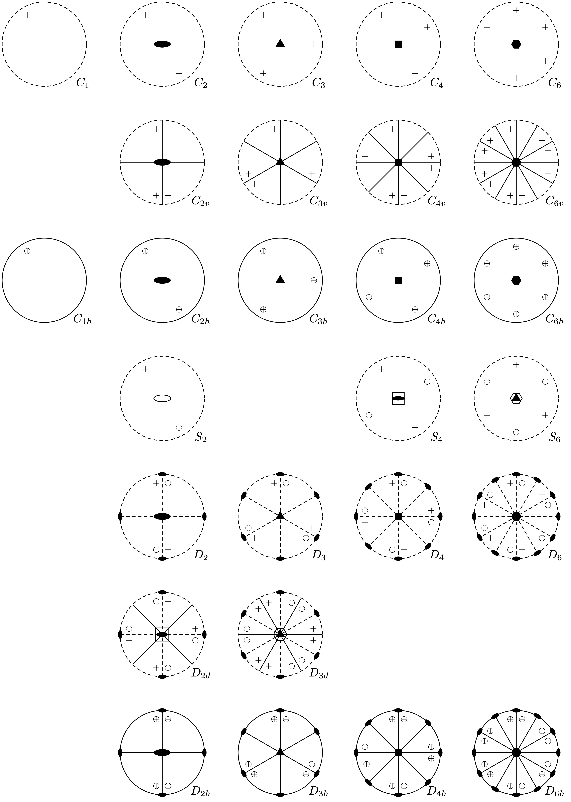
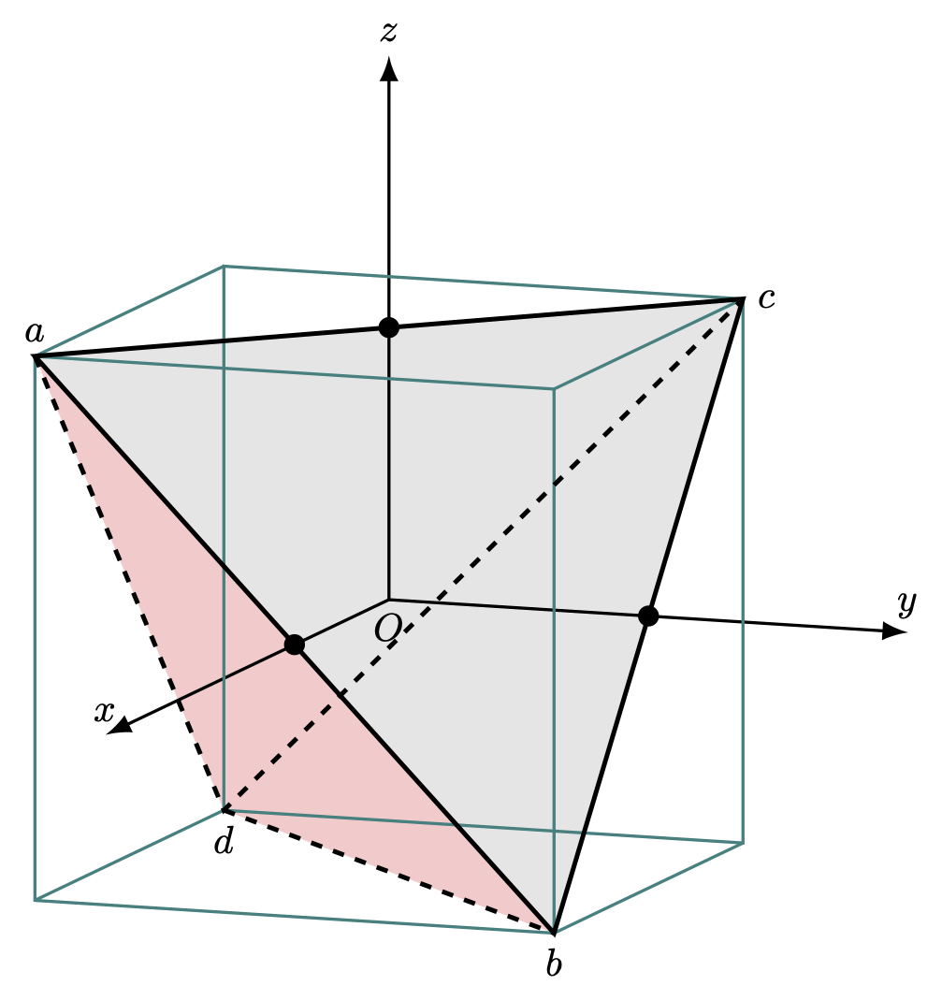

---
title: "점군과 공간군"
number-sections: true
number-depth: 3
crossref:
  chapters: true
---  



 

## 결정 대칭 연산

결정은 unit cell 을 결정하는 primitive vector $\bf{a}_1,\,\bf{a}_2,\,\bf{a}_3$ 에 대해 

$$
\bf{T}=n_1\bf{a}_1+ n_2 \bf{a}_2 + n_3 \bf{a}_3,\qquad n_1,\,n_2,\,n_3\in \Z
$$

만큼 translation 시키는 연산 $T_{n_1,n_2,n_3}$ 에 대해 불변이다. 특정한 회전 역시 결정에 대해 불변인 연산 일 수 있다. 이렇게 어떤 주어진 결정 구조에 대해 불변인 연산을 그 결정에 대한 **공간군 (space group of crystal)** 이라고 한다. 그리고 공간군중에서 translation 을 $\bf{0}$ 으로 놓았을때의 연산을 그 결정에 대한 **결정학적 점군(point symmetry of crystal)** 라고 한다. 모두 32개의 점군과 230 개의 공간군이 존재한다는 것은 잘 알려져 있다(@tinkham2012group, pp. 51 의 참고 문헌) 결정이 아닌 분자에 대해 생각하자면 여기에는 무한히 많은 점군이 있을 수 있지만 우리가 실제 대면하는 분자의 대부분은 결정학적 점군에 포함된다.

 

### 결정학적 점군 구성

주어진 결정에 대한 점군을 구성하는 것은 보통 다음의 순서로 한다.

&emsp;($1$) 원점을 지나는 축에 대한 회전 대칭(rotational symmetry)을 파악한다

&emsp;($2$) 원점을 포함하는 평면에 대한 거울상 대칭(reflection symmetry)을 파악한다.

&emsp;($3$) 반전 대칭(inversion symmetry) 을 파악한다.

반전대칭은 어떤 축에 대해 $\pi$ 만큼 회전시키고, 그 축에 수직인 평면에 대해 반사대칭을 수행한 것과 같다. 그러나 반전대칭이 많이 등장하므로 이 과정에 일단 넣었다.

 

이제 연산을 정의하자 $\bf{n}$ 을 축으로 하는 $\theta$ 만큼의 회전은 $R_\bf{n}(\theta)$ 라고 하자. $\bf{n}$ 에 수직이며 원점을 지나는 평면에 대한 반사 연산을 $\sigma_{\bf{n}}$ 이라고 하자. 반전 연산은 $i$ 라고 하자. 

모든 점군을 파악했다면 이제 Caylay table, 즉 group multiplication table 을 파악해야 한다. 여기에 대해 몇가지 사실이 있다.

::: {#prp-Group_properties_of_covering_operations_in_crystal}

#### 연속 연산 규칙
  

&emsp;($1$) $R_{\bf{n}_2}(\theta_2) R_{\bf{n}_1}(\theta_1)= R_{\bf{n}_3}(\theta_3)$,

&emsp;($2$) $\sigma_{\bf{n}_2}\sigma_{\bf{n}_1}= R_{\bf{n}_3}(\theta_3)$. $\bf{n}_3$ 는 $\bf{n}_1$ 과 $\bf{n}_2$ 에 의해 결정되는 원점을 지나는 평면에 공통되는 직선의 방향이며 $\theta_3$ 는 $\bf{n}_1$ 과 $\bf{n}_2$ 가 이루는 각의 두배이다. 

&emsp;($3$) $\sigma_{\bf{n}_2}R_{\bf{n}_1}(\theta_1) = \sigma_{\bf{n}_3}$, $\bf{n}_3$ 는 $\bf{n}_1$ 벡터를 포함하는 평면으로 $\bf{n}_2$ 와 $\theta_2/2$ 만큼의 각을 가진다.

&emsp;($4$) $R_{\bf{n}_2}(\pi)R_{\bf{n}_1}(\pi)= R_{\bf{n}_3}(\theta_3)$, $\bf{n}_3$ 는 $\bf{n}_1,\, \bf{n}_2$ 각각에 수직인 방향이며 $\theta_3$ 는 $\bf{n}_1,\, \bf{n}_2$ 가 이루는 각의 2배이다.
:::

 

::: {#prp-Group_commutating_properties_of_covering_operations_in_crystal}

#### 서로 commute 한 연산
  

&emsp;($1$) 같은 축에 대한 두 회전 연산,

&emsp;($2$) 서로 수직인 방향으로의 두 반사 연산,

&emsp;($3$) 서로 수직인 축에 대한 $\pi$ 회전,

&emsp;($4$) 회전연산과 회전축에 대해 수직인 평면으로의 반사 연산,

&emsp;($5$) 반전과 회전, 반전과 반사.

:::

 

### Schoenflies 표기법

::: {.callout-note appearance="simple" icon="false"}
::: {#def-Group_character_of_class}
#### Point group 에 대한 Schoenflies 표기법

각 변환에 대해 대칭이 있을 때 아래와 같이 표기한다. 우선 **주축 (principal axis)** 을 정한다. 주축은 회전에 대해 대칭성이 가장 회전축이다. 

- $E$ : 항등 연산.

- $C_n$ : $2\pi/n$ 회전 대칭.
- $\sigma$ : 평면에 대한 거울상 대칭.
- $\sigma_h$ : 주축에 대해 수직인 평면에 대한 거울상 대칭.
- $\sigma_v$ : 주축을 포함하는 평면에 대한 거울상 대칭 중에 원자를 포함하는 평면
- $\sigma_d$ : 주축을 포함하는 평면에 대한 거울상 대칭 중에 원자를 포함하지 않는 평면
- $S_n$ : **비정상 회전 (improper rotation)**. $2\pi/n$ 회전 대칭 후 회전축에 수직인 평면에 대한 거울상 대칭이 있을 경우.
- $i$ : 반전(invsersion). $S_2$ 와 같다.

:::
:::

 

::: {#prp-Group_interrelations_of_symmetry_elements}

#### 대칭축과 면의 성질
 

**1a** : 두 거울상 대칭면의 교점은 대칭축이며, 두 대칭면 사이의 각이 $\pi/n$ 일 때 $n$-회 대칭이다.

**1b** : 거울상 대칭면이 $n$-회 대칭축을 포함한다면 $\pi/n$ 의 각마다 다른 거울상 대울상 대칭면이 존재한다.

**2a** : 두개의 2-회 대칭축이 $\pi/n$ 의 각도를 가진다면 이 두 축에 대해 수직인 직선은 $n$-회 대칭축이다.

**2b** : 2-회 대칭축 $X_1$ 이 $n$-회 대칭축 $X_n$ 과 수직이라면 $X_n$ 과 수직인 2회 대칭축이 $n-1$ 개 추가로 존재하며 이들은 $\pi/n$ 만큼의 각을 이룬다.

**c** : 짝수회 대칭축,  이 축에 수직인 거울상 대칭면, 그리고 반전의 중심 셋중에 둘이 존재하면 나머지 하나도 반드시 존재한다. 

:::

 

## 결정학적 점군

주축이 하나만 존재하는 경우를 **단순 회전군(simple rotation group)**, 여러개인 경우를 **고대칭군 (group of the higher symmetry)**라고 한다.(@tinkham2012group 에서 사용하지만 다른곳에선 사용하지 않는 것 같다.) 주축이 없는 경우, 즉 대칭이 전혀 없는 경우는 $C_\infty$ 군이라고 표기한다.

 

### 단순 회전군

단순 회전군을 도식화 하는데 **평사 투영(streographic prjection)** 방법이 많이 쓰이며 단순회전군에 대한 streographic projection 은 아래 그림과 같다.

{#fig-Group_streographic_projection_of_simple_point}

- 단순 회전군의 주축이 평면에 대해 수직인 원점을 지나는 축이다.
- 평면의 위쪽에 있는 대상은 $+$, 평면의 아래쪽에 있는 대상은 $\small \bigcirc$ 로 표기한다. 두개가 겹칠 경우 $\oplus$ 를 사용한다.
- $n$-회 회전 대칭이 있을 때 속이 찬 $n$ 각형을 두어 회전중심을 표현한다. $n=2$ 일 경우에는 옆으로 긴 속이 찬 타원으로 표현한다.
- $\sigma_h$ 대칭이 존재할 경우 단위원을 실선으로, 그렇지 않을 경우 파선(dashed line) 을 사용한다.
- 중심을 지나는 실선은 (실선을 포함하고 평면에 수직인) 반사면을 의미한다. 
- $n$-회 비정상 회전은 속이 빈 $n$ 각형 내부에 속이 찬 $n/2$ 각형을 둔다. 
- 주축과 수직인 축으로 $n$-회 회전 대칭이 있을 경우 회전축과 단위원의 호가 만나는 점을 중심으로 속이 찬 타원과 같은 회전 대칭 기호를 넣는다.

[Wikipedia 의 Molecular Symmetry](https://en.wikipedia.org/wiki/Molecular_symmetry) 을 참고하라.

 

| 군 | 설명 |
|:-----:|:-----------------------------|
| $C_n$ | 주축에 대해 $n$ 회 대칭만 존재하는 경우이다. 순환군으로 아벨군이다. 결정에서 가능한 것은 $C_1,\,C_2,\,C_3,\,C_4,\,C_6$ 뿐이다. (@exr-Group_possible_Cn_symmetry_in_crystalline_solid)  |
| $C_{nv}$ | 주축에 대해 $C_n$ 대칭이 존재하며 $n$ 개의 $\sigma_v$ 대칭도 존재하는 군.|
| $C_{nh}$ | 주축에 대해 $C_n$ 대칭이 존재하며 $\sigma_h$ 대칭도 존재하는 군. |
| $S_n$ | 주축에 대해 $S_n$ 대칭을 가진 군. |
| $D_n$ | 주축과 수직한 $n$ 개의 $C_2$ 대칭축을 가진 군. $D_2$ 는 Viergrouppe 와 동형이다. |
| $D_{nd}$ | $D_n$ 과 함께 $n$ 개의 $C_2$ 대칭축 에서 인접하는 두 대축 사이에 $\sigma_d$ 거울상 대칭면이 존재하는 군. |
| $D_{nh}$ | $D_n$ 과 함깨 $\sigma_h$ 대칭이 존재하는 군. |
: 단순회전군 {.info .striped .bordered #tbl-Group_simple_rotational_group}

 

### 고대칭군

{#fig-Group_tetrahedron_in_cube width=300}

#### $T$

위의 @fig-Group_tetrahedron_in_cube 와 같이 정육면체 내의 정사면체 $abcd$ 를 생각하자. 정육면체의 각 면은 $x,\,y,\,z$ 축 중 하나와 수직하며, 정육면체의 중심이 좌표계의 원점이라고 하자.

정사면체의 대칭 연산은 총 12개로 아래와 같다.

- $E$ : 항등연산
- $3C2:$ $x,\,y,\,z$ 축 각각에 대한 $C_2$ 대칭  
- $8C_3$ : 정육면체의 4개의 대각선에 대한 $2\pi/3$ 및 $4\pi/3$ 회전, 즉 8개의 $C_3$ 대칭

 

#### $T_d$

 

### 연습문제 {.unnumbered}

 

::: {#exr-Group_possible_Cn_symmetry_in_crystalline_solid}

결정학적 점군에서 가능한 $C_n$ 군은 $n=1,\,2,\,3,\,4,\,6$ 뿐임을 보이자. 
:::

 

::: {.solution}
결정학에서의 병진 벡터 $\bf{T}=n_1\bf{a}_1 + n_2\bf{a}_2+n_3\bf{a}_3$ 를 생각하자. 

$C_n$ 대칭축을 $\hat{z}$ 축으로 잡자. $C_n$ 회전에 대해 $\bf{T}_1$ 이 차례로 $\bf{T}_2,\ldots,\, \bf{T}_n$ 으로 변경된다고 하자. 그렇다면 $\bf{t}_{ij}=\bf{T}_i-\bf{T}_j$ 는 $xy$ 평면상에 존재하는 병진 벡터이야 한다. $T=\{\bf{T}_{i}-\bf{T}_j : i\ne j\}$ 가운데 $0$ 이 아닌 크기가 가장 작은 벡터를 $\bf{t}$ 라고 하자. $\bf{t}$ 역시 $\bf{T}$ 로 표현되는 벡터이며 따라서 $n_3=0$ 이며 크기가 $0$ 이 아닌 벡터 가운데 가장 작은 크기의 벡터 이다. 물론 이 크기의 벡터가 여러개 존재 할 수 있으며 이중 하나만 선택한다. 

이 벡터를 $z$ 축을 중심으로 $2\pi/n$ 만큼 회전시킨 벡터도 $\bf{t}$ 와 같은 크기의 벡터여야 하며, $\|\bf{t}\|=l$ 이라고 할 때

$$
\|\bf{t}-\bf{t}'\| = 2 l \sin \frac{\pi}{n} 
$$

어야 한다. 그런데 $\bf{t}-\bf{t}'$ 역시 $T$ 에 포함되므로 $l$ 보다 크거나 같아야 한다. 즉 $\sin\left(\dfrac{\pi}{n}\right) \ge \dfrac{1}{2}$ 이어야 한다. 따라서 $n\le 6$ 이다.

이제 $\bf{t}'$ 을 $2\pi/n$ 만큼 회전시킨 것을 $\bf{t}''$ 이라고 하자. $\bf{t}'' \in T$ 이며 $\|\bf{t}''\|=l$ 이다. 또한 $\bf{t}$ 와 $\bf{t}''$ 은 $\dfrac{4\pi}{n}$ 의 사잇각을 가진다. 이로부터

$$
\|\bf{t}+\bf{t}''\| = 2l \left|\cos \frac{2\pi}{n}\right|
$$

이다. $\bf{t}+\bf{t}''$ 역시 $xy$ 평면상의 병진벡터 이므로 $l$ 보다 크거나 같아야 한다. 즉 $\left|\cos \left(\dfrac{2\pi}{n}\right)\right| \ge \dfrac{1}{2}$ 이어야 한다. $n=5$ 인 경우 $\cos(2\pi/5)\approx 0.31 < 0.5$ 이므로 $n=5$ 는 불가능하며 $n=1,\,2,\,3,\,4,\,6$ 인 경우는 가능하다.

:::