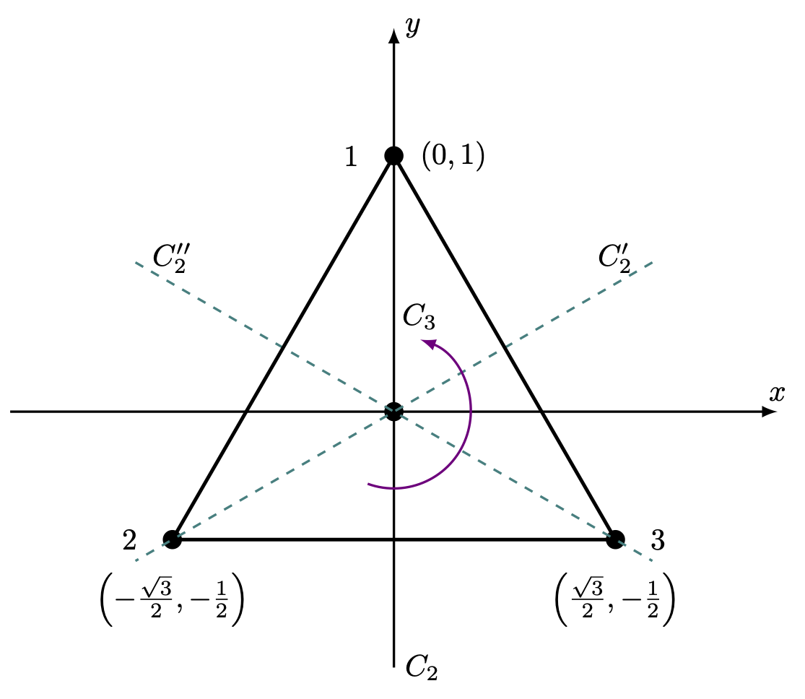
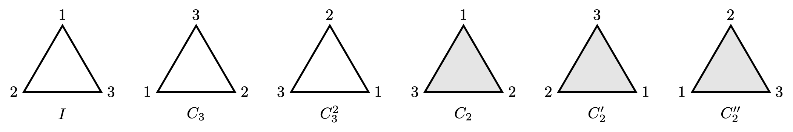

---
title: "물리학에서의 군"
number-sections: true
number-depth: 3
crossref:
  chapters: true
--- 



 

## 군 (Group)

### 군의 정의 {#sec-Group_group}

::: {.callout-note appearance="simple" icon="false"}
::: {#def-Group_groups}
#### 군 (Groups)

집합 $G$ 에 이항연산 $\cdot$ 이 정의되어 있으며, 

1. $\forall a,\,b,\,c\in G,\, a\cdot (b \cdot c)=(a\cdot b)\cdot c$, 

2. $\exists e\in G,\, \forall a\in G,\, a\cdot e=e\cdot a$, 

3. $\forall a\in G,\, \exists a'\in G,\, a\cdot a' = a'\cdot a = e$

일 때 집합 $G$ 를 **군** 이라 하고 $(G,\cdot)$ 이라고 쓴다. 이 때 2. 의 $e$ 를 $G$ 의 항등원 이라고 한다. 항등원의 표기는 $e$ 혹은 연산이 곱셈이면 $1$ 이라고 쓰거나, 소속된 군을 표현하기 위해 $1_G$ 와 같이 쓰기도 한다. 연산이 덧셈이라면 $0$ 혹은 $0_G$ 로 쓰기도 한다. $a\cdot a'=a'\cdot a=e$ 인 $a'$ 을 $a$ 의 역원 이라고 한다. $a$ 의 역원은 $a^{-1}$ 이라 쓴다.
:::
:::

  

군에서의 연산 기호는 $a\circ b$, $a \cdot b$, $ab$, $a+b$ 처럼 다양한 기호가 사용 될 수 있다. 기호를 생략하는 $ab$ 와 같은 표기법도 많이 사용된다. 군을 정의할 때 집합과 연산을 묶어 $(G,\, \circ)$ 와 같은 표기법도 흔히 사용된다. 

 

::: {.callout-note appearance="simple" icon="false"}
::: {#def-Group_properties}

$G$ 가 군이다.

1. $G$ 의 원소의 갯수가 유한개일 때 **유한군** 이라고 하고, 유한군이 아닐 때 **무한군** 이라고 한다.

2. $G$ 가 유한군일 때 원소의 갯수를 $G$ 의 **차수(order)** 라고 하며 $|G|$ 로 표기한다.

3. $G$ 의 모든 원소에 대해 $ab=ba$ 일 때 $G$ 를 **아벨군 (abellian group)** 이라고 한다.

4. $g\in G$ 에 대해 $\{g^k:k\in \Z\}=G$ 일 때 $G$ 를 **순환군 (cyclic group)** 이라고 하고 $G=\langle g \rangle$ 이라고 표기한다. 또한 $G$ 는 $g$ 에 의해 생성되는 군이라고 표현하기도 한다.
   
5. $H \subset G$ 이며 $H$ 가 $G$ 와 같은 연산에 대해 군일 때 $H$ 를 $G$ 의 **부분군(subgroup)** 이라고 하고 $H \le G$ 라고 표기한다.

:::
:::

 

::: {.callout-note appearance="simple" icon="false"}
::: {#def-Group_homomorphism}

#### 동형사상과 준동형사상

두 군 $(G,\, \cdot),\, (G',\, \cdot)$ 사이에 어떤 함수 $\phi : G \to G'$ 이 존재하여

$$
\forall a,\,b\in G,\, \phi (a)\phi(b)=\phi(ab)
$$

일 때 $\phi$ 를 $G$ 에서 $G'$ 으로의 **준동형사상(homomorphism)** 이라고 한다. $G$ 에서 $G'$ 으로의 준동형 사상의 집합을 $\text{Hom}(G,\,G')$ 이라고 쓴다. $\phi$ 가 전단사 함수 일 때 $\phi$ 를 **동형 사상(isomorphism)** 이라고 하며 $G$ 에서 $G'$ 으로의 동형사상의 집합을 $\text{Iso}(G,\,G')$ 이라고 쓴다. 두 군 사이에 동형사상이 존재할 경우 이 두 군은 **동형 (isomorphic)** 이라고 하며 $G \approx G'$ 이라고 표기한다.

:::
:::

 

### 중요한 군 {#sec-Group_important_groups}

 

::: {#exm-Group_d3}

#### $D_3$, 정삼각형에 대한 대칭 연산
 

정삼각형에 대한 대칭 연산은 6개의 원소를 가진 군을 이룬다. 항등 연산 $I$, 삼각형의 중심에 대한 $\pi/3$ 만큼의 반시계 방향 회전 $C_3$ 와 $C_3^2$($C_3$ 연산 2번 연속), 각 꼭지점과 맞은편 모서리의 중점을 잇는 직선을 회전축으로 하는 $\pi/2$ 회전 $C_2,\,C_2',\,C_2''$ (아래 그림을 참고하라.)

{#fig-Group_d3 width=350}

 

정삼각형의 꼭지점 $1$, $2$, $3$ 에 $D_3$ 의 연산을 수행했을 때의 결과는 아래 그림 @fig-Group_d3_2 과 같다. 

{#fig-Group_d3_2 width=600}

이 연산에 대한 수행 결과를 아래의 표로 정리 할 수 있다.

| | $I$ | $C_3$ | $C_3^2$ | $C_2$ | $C_2'$ | $C_2''$ |
|:----:|:----:|:----:|:----:|:----:|:----:|:----:|
| $I$ |  $I$ | $C_3$ | $C_3^2$ | $C_2$ | $C_2'$ | $C_2''$ |
| $C_3$ |  $C_3$ | $C_3^2$ | $I$ | $C_2''$ | $C_2$ | $C_2'$ |
| $C_3^2$ |  $C_3^2$ | $I$ | $C_3$ | $C_2'$ | $C_2''$ | $C_2$ |
| $C_2$ |  $C_2$ | $C_2'$ | $C_2''$ | $I$ | $C_3$ | $C_3^2$ |
| $C_2'$ |  $C_2'$ | $C_2''$ | $C_2$ | $C_3^2$ | $I$ | $C_3$ |
| $C_2''$ |  $C_2''$ | $C_2$ | $C_2'$ | $C_3$ | $C_3^2$ | $I$ |
: {#tbl-Group_d3, tbl-colwidths="[30,30,30,30,30,30,30]"}

 

이 군은 여러가지 이름으로 불리지만 대표적으로 $D_3$ 라고 불린다. $D$ 는 **dihedral** 의 두문자이며 보통 주 대칭축에 수직인 평면에 $\pi$ 회전 대칭축이 있을 때 붙인다. 여기서 주 대칭축은 원점을 우리가 보는 평면에 수직으로 통과하는 축이며, $C_2,\,C_2',\,C_2''$ 축이 주 대칭축과 수직한 $\pi$ 회전 대칭축이다. .

:::

 

::: {#exm-Group_rotation_of_plane_circle}

#### 평면상의 원의 회전
 

평면상의 원은 원의 중심에 대한 임의의 각 회전에 대해 대칭이다. 이 연산은 반시계 방향 회전각 $\varphi$ 에 대해 $R(\varphi)$ 로 표현 할 수 있으며, $\varphi \in [0,\, 2\pi)$ 이므로 무한군이다. 또한 $R(\varphi)$ 에 대한 역변환은 $R(2\pi - \varphi)$ 이다.

:::

 

::: {#exm-Group_viergrouppe}

#### Vierergrouppe
 

4 원소로 아래의 연산 규칙을 만족하는 군을 클라인 4원군(Keine 4 group) 혹은 **Vierergrouppe** 라고 한다. 아래 표현에서 $e$ 는 항등원이다.

<table align="center" style="width:50%" >
  <tr style="text-align:center ;background-color: #D8D8D8">
    <th ></th>
    <th>$e$</th text_align="center">
    <th>$a$</th>
    <th>$b$</th>
    <th>$ab$</th>
  </tr>
  <tr style="text-align:center">
    <td>$e$</td>
    <td>$e$</td>
    <td>$a$</td>
    <td>$b$</td>
    <td>$ab$</td>
  </tr>
  <tr style="text-align:center">
    <td>$a$</td>
    <td>$a$</td>
    <td>$e$</td>
    <td>$ab$</td>
    <td>$b$</td>
  </tr>
  <tr style="text-align:center">
    <td>$b$</td>
    <td>$b$</td>
    <td>$ab$</td>
    <td>$e$</td>
    <td>$a$</td>
  </tr>
  <tr style="text-align:center">
    <td>$ab$</td>
    <td>$ab$</td>
    <td>$a$</td>
    <td>$b$</td>
    <td>$e$</td>
  </tr>
</table> 

:::

 

::: {#exm-Group_C4}

#### $C_4$ 군의 동형사상과 준동형사상.
 

정사각형의 중심에 대한 $0^\circ$, $90^\circ$, $180^\circ$, $270^\circ$ 회전은 군을 이루며 각각 $I,\,C_4,\,C_2,\,C_4'$ 라고 한다. 즉 $G_1=\{I,\,C_4,\,C_2,\,C_4'\}$ 이라고 하자. 또한 $G_2=\{1,\, i,\, -1,\, -i\}$ 는 곱에 대한 군을 이룬다. 이 두 군에 대한 함수 $\phi : G \to G'$ 를

$$
\phi(I)=1,\quad \phi(C_4)=i,\quad \phi(C_2)=-1,\quad \phi(C_4')=-i
$$

로 정의하면 $\phi$ 는 동형사상이다. 즉 $\phi \in \text{Iso}(G_1,\,G_2)$ 이다. 또한 이 군은 $C_4$ 혹은 $i$ 에 의해 생성되는 순환군이다.

곱 연산으로 정외된 집합 $G_3=\{1,\,-1\}$ 은 역시 군이며 $\psi: G_1\to G_3$ 를

$$
\psi (I)= \psi(C_2)=1,\qquad \psi (C_4)=\psi (C_4')= -1
$$

로 정의하면 $\psi \in \text{Hom}(G_1,\,G_3)$ 이다. 

:::

 

### 연습문제 {.unnumbered}

::: {#exr-Arfken_17_1_1}
#### Arfken 17.1.1

@exm-Group_viergrouppe 의 vierergrouppe 가 순환군인지 아벨군인지 여부를 확인하라.

:::

 

::: {.solution}

$a^2=b^2 = (ab)^2 = e$ 이므로 순환군이 아니다.  $a(ab)=b,\, (ab)a = a$ 이므로 아벨군도 아니다. 

:::

 

::: {#exr-Arfken_17_1_3}
#### Arfken 17.1.3 (Rearrangement theorem)
 

군 $\{e,\,a,\,b,\,\ldots,\,n\}$ 에 대해 $\{ae,\, aa,\, ab,\,ac,\,\ldots,\,an\}$ 은 군의 모든 원소를 각각 한번씩마나 포함한다는 것을 보여라.

:::

 

::: {.solution}

$ax=ay$ 이면 $a$ 의 역원 $a^{-1}$ 을 각 항의 오른쪽에 연산하면 $x=y$ 이다. 즉 $x\ne y \implies ax = ay$ 이다. 

:::

 

::: {#exr-Arfken_17_1_4}
#### Arfken 17.1.4
 

$H\le G$ 이다. $x\in G,\, x\not\in H$ 일 때 

$$
xHx^{-1} := \{xhx^{-1} : h\in H\}
$$

에 대해 $xHx^{-1} \le G$ 임을 보여라. ($xHx^{-1}$ 을 **conjugate subgroup** of $G$ 라고 한다.)

:::

 

::: {.solution}

$e\in H$ 이며 $xex^{-1}=e\in xHx^{-1}$ 이다. $h_1,\,h_2\in H$ 에 대해 $(xh_1x^{-1})(xh_2x^{-1})=x(h_1h_2)x^{-1} \in xHx^{-1}$ 이다. $xHx^{-1}\subset G$ 이므로 associativity 는 당연히 성립한다. 따라서 $xHx^{-1}\le G$ 이다. 

:::

 

::: {#exr-Arfken_17_1_6}
#### Arfken 17.1.6

$\bf{r}=(la,\,ma,\,na)$ 에 동일한 원자가 위치한 정육면체 결정을 생각하자. 여기서 $l,\,m,\,n$ 은 정수이다.

($a$) 각각의 데카르트 축은 4중 대칭축(4-fold symmetric axis)임을 보여라.

($b$) 정육면 점군(point group) 은 정육면체를 유지하며 $l=m=n=0$ 에 위치한 원자를 이동시키지 않는 모든 연산(rotation, reflection, inversion)으로 이루어져 있다. 양과 음의 좌표축의 permutation 을 생각하여 정육면 점군이 얼마나 많은 원소로 이루어졌는지 알아보라.

:::

 

::: {.solution}

($a$) $0,\, \pi/2,\, \pi,\, 3\pi/2$ 회전에 대해 대칭이다.

($b$) 

:::