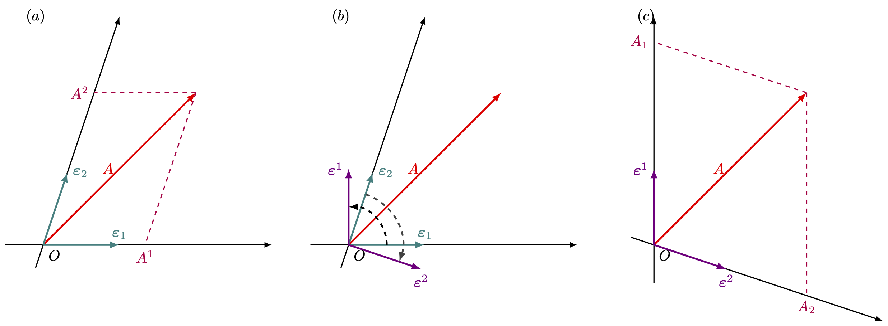

---
title: "탠서 해석"
number-sections: true
number-depth: 3
crossref:
  chapters: true
--- 



 

## 텐서의 기초

::: {.callout-note appearance="simple" icon="false"}
::: {#def-tensor_def_tensor}

#### 스칼라, 벡터, 텐서
벡터 공간 $\R^d$ 를 생각하자. 좌표의 회전 변환에 대해 불변인 양을 **스칼라(scalar)** 라고 한다. 좌표의 회전 변환에 대해 좌표와 같이 변환되는 양를 **벡터(vector)** 라고 한다. 스칼라는 $1$ 개의 수로 표현 될 수 있으며 벡터는 $d$ 개의 수로 표현 될 수 있다. 랭크 $n$ 텐서는 $d^n$ 개의 성분으로 표현 될 수 있으며, 좌표 변환에 대해 특별한 형태를 따르는 양을 말한다. 스칼라는 랭크 $0$ 텐서이며, 벡터는 랭크 $1$ 텐서이다.

:::
:::

 

### 공변벡터와 반변 벡터

{#fig-Tensor_vectors_01 width=800}

우리가 다루는 벡터공간에서 벡터는 기저에 대한 성분으로 표현 할 수 있다. 우선 2차원에서 생각해보자. $\bf{\varepsilon}_1,\, \bf{\varepsilon}_2$ 기저에서 벡터 $A$ 는

$$
A=A^1\bf{\varepsilon}_1 +A^2\bf{\varepsilon}_2
$$ {#eq-Tensor_contravariant_representation_of_vector}

로 표현 할 수 있다. $A^1,\,A^2$ 는 반변 성분(contravariant components) 이라고 하고 $\bf{\varepsilon}_1,\,\bf{\varepsilon}_2$ 를 공변 기저(covariant basis) 라고 한다. 공변 기저 $\bf{\varepsilon}_1,\, \bf{\varepsilon}_2$ 에 대해 $\bf{\varepsilon}_i \bf{\cdot \varepsilon}^j = \delta_{ij}$ 가 되도록 하는 벡터 $\bf{\varepsilon}^1,\, \bf{\varepsilon}^2$ 찾을 수 있으며 선형 독립이고, 따라서 기저가 될 수 있다. 선형대수학에서는 이를 어떤 기저에 대한 쌍대 기저(dual basis) 라고 한다. 이 기저를 반변 기저(contravariant basis) 라 하며 이 기저에 대해

$$
A=A_1 \bf{\varepsilon}^1  + A_2 \bf{\varepsilon}^2
$$ {#eq-Tensor_covariant_representation_of_vector}

로 표현 할 수 있다. 이 때 $A_1,\,A_2$ 를 공변 성분(covariant components) 라고 한다. 반변 기저에 대한 공변 성분을 $(A_1 ,\, A_2)$ 와 같이 표현한 것을 공변 벡터라고 하고 공변기저에 대한 반변 성분을 $(A^1,\, A^2)$ 와 같이 표현한 것을 반변 벡터 라고 한다. 그리고 공변/반변 벡터/성분을 각각 위첨자, 아래첨자로 위와같이 구별하는 것을 **아인슈타인 표기법 (Einstein notation)** 이라고 한다. 즉 위첨자는 반변 벡터나 반변 성분을 의미하며 아래첨자는 공변벡터나 공변 성분을 의미한다. 그리고 여기서는 2차원에서 표현했지만 실제로는 $n$ 차원으로 확장 할 수 있다.  

 

### 벡터의 변환과 아인슈타인 표기법

$\R^3$ 에서의 선형 변환 $\bf{R}$ 에 의해 변위 벡터 $\bf{x}$ 의 좌표가 $\begin{bmatrix} x_1 & x_2 & x_3\end{bmatrix}^T$ 에서 $\bf{x}'=\begin{bmatrix} x_1' & x_2' & x_3' \end{bmatrix}^T$ 로 변환된다고 하자. 즉 $\bf{x}'=\bf{Rx}$ 라고 하자. 이로부터 

$$
R_{ij}= \dfrac{\partial x'_i}{\partial x_j}
$$ {#eq-Tensor_transform_matrix_1}

이며, 따라서

$$
x'_i = \sum_{j}R_{ij}x_j = \sum_j \dfrac{\partial x'_i}{\partial x_j}x_j
$$ {#eq-Tensor_transform_of_coordinate}

이다. 이제 기저의 변환을 보자. 기저 $\bf{b}$ 가 $\bf{b'}$ 으로 변화한다면,

$$
(\bf{b}')_j = \bf{R}^{-1}\bf{b}_j 
$$ {#eq-Tensor_transform_of_basis}

이다. 기저를 $(1, 0, 0), (0, 1, 0),\, (0, 0, 1)$ 에서 $(1, 0, 0),\, (0, 2, 0),\, (0, 0, 3)$ 으로 바꾸는 변환을 생각하자. 이 변환을 나타내는 행렬 $\bf{R}_s$ 은

$$
\bf{R}_s = \begin{bmatrix} 1 & 0 & 0 \\ 0 & 1/2 & 0 \\ 0 & 0 & 1/3\end{bmatrix}
$$

이다.

벡터 $\bf{a}$ 는 좌표 변환에 대해 좌표와 같은 형태로(@eq-Tensor_transform_of_coordinate), 혹은 기저와 같은 형태로(@eq-Tensor_transform_of_coordinate) 변환한다. 벡터 $\bf{a}$ 가 좌표와 같은 형태로 

$$
(a')_i = \sum_{j}\dfrac{\partial x'_i}{\partial x_j}a_j
$$

와 같이 변화한다면 이런 벡터를 **반변 벡터(contravariant vector)** 라고 한다.

반대로 $\R^3$ 에서 정의된 스칼라 함수의 그래디언트를 생각하자.

$$
\left(\nabla' \phi\right)_i := \dfrac{\partial \phi}{\partial x'_i} = \sum_j \dfrac{\partial x_j}{\partial x'_i}\dfrac{\partial \phi}{\partial x_j}
$$

이 벡터는 기저와 같이 변환된다. 이런 벡터를 **공변 벡터(covariant vector)** 라고 한다.

데카르트 좌표계, 즉 정규직교기저를 사용하는 좌표계에서는 반변벡터와 공변벡터가 동일하지만 데카르트 좌표계가 아닌 경우는 반변벡터와 공변벡터가 다르다. 

 

#### **아인슈타인 표기법**

반변벡터와 공변벡터를 엄격하게 다루기 위해 반변벡터는 위첨자를, 공변벡터는 아래첨자를 사용하여 아래와 같이 표기한다.

$$
\begin{aligned}
(A')^i &= \sum_j \dfrac{\partial (x')^i}{\partial x^j} A^j,\qquad &&\bf{A}, \text{ a contravariant vector,}\\[0.3em]
A'_i &= \sum_j \dfrac{\partial x^j}{\partial (x')^i}A_j && \bf{A}, \text{ a covariant vector.}
\end{aligned}
$$ {#eq-Tensor_notatioin_of_contravariant_and_covariant_vector}

또한 위첨자와와 아래첨자에 같은 인덱스가 있다면 **free index** 라고 하며 $\sum$ 과 같은 표기 없이 합으로 표기한다. 즉

$$
A^iA_i := \sum_i A^iA_i
$$

이다. 이것은 아인슈타인이 최초로 사용했기 때문에 **아인슈타인 표기법(Einstein notation)** 이라고 한다.

 

### 랭크 2 텐서

좌표 변환에 대해 다음과 같이 변하는 텐서를 **랭크 2 탠서(tensor of rank 2)** 라고 한다.

$$
\begin{aligned}
(A')^{ij} &= \sum_{k, l} \dfrac{\partial (x')^i}{\partial x^k}\dfrac{\partial (x')^j}{\partial x_l}A^{kl}, \\[0.3em]
(B')^i_j &= \sum_{k,l}\dfrac{\partial (x')^i}{\partial x^k}\dfrac{\partial x^l}{\partial (x')_j}B^k_l, \\[0.3em]
(C')_{ij} &= \sum_{k,l}\dfrac{\partial x^k}{\partial (x')_i}\dfrac{\partial x^l}{\partial (x')_j}C_{kl}.
\end{aligned}
$$ {#eq-Tensor_rank_2_tensor}

$A^{kl}$ 은 두 인덱스에 대해 반변벡터와 같은 방식으로 변환되고 $C_{kl}$ 은 두 인덱스에 대해 공변벡터와 같은 방식으로 변환된다는 것을 알 수 있다. 이에 맞추어 $A^{kl}$ 과 같이 변환되는 텐서를 **반변텐서**, $C_{kl}$ 과 같이 변환되는 텐서를 **공변텐서** 라고 부른다. $B^k_l$ 은 공변벡터와 반변벡터의 변환방식이 섞여 있으며 **혼합 텐서(mixed tensor)** 라고 부른다. 

이렇게 번잡한 개념과 표기법을 도입하는 것은 좌표계와 무관한 물리량을 엄밀하게 사용하기 위해서이다. 실제로 텐서의 도입으로 이것이 어떻게 이루어지는지는 이후에 보기로 하자.

랭크 2 텐서는 자주 행렬로 아래와 같이 표기된다.
$$
\bf{A} = \begin{bmatrix} A^{11} & A^{12} & A^{13}\\ A^{21} & A^{22} & A^{23} \\ A^{31} & A^{32} & A^{33} \end{bmatrix}
$$

하지만 행렬이 모두 랭크 2 텐서는 아니다. 텐서는 @eq-Tensor_rank_2_tensor 와 같이 변환되는 양이라는 것을 다시 한번 상기하자. 

@eq-Tensor_transform_matrix_1 을 첨자 표기법에 따라 표기하면 변환행렬 $\bf{R}$ 은 다음과 같다.

$$
R_{ij}= \dfrac{\partial (x')^i}{\partial x^j}.
$${#eq-Tensor_transform_matrix_2}

그렇다면

$$
(A')^{ij} = \sum_{k, l} R_{ik} R_{jl} A^{kl} = \sum_{k, l} R_{ik} A^{kl} (R^T)_{lj}\qquad \text{or}\qquad \bf{A}' = \bf{RAR}^T.
$$

이다. 

 

#### **랭크 2 텐서의 연산**

랭크 2 반변 텐서의 합을 다음과 같이 정하는 것은 자연스럽다. 

$$
A^{ij} + B^{ij} = C^{ij}
$$

단 합이 정의가 되려면 텐서가 같은 랭크여야 하며 같은 공간에서 정의되어야 하고 같은 공변성 혹은 반변성을 가져야 한다.

 

#### **랭크 2 텐서의 대칭성**

행렬과 같은 방법으로 대칭 텐서와 반대칭 텐서를 정의한다. 즉

$$
A^{kl} = A^{lk}
$$

이면 **대칭 텐서(symmetric tensor)** 라고 하고,

$$
A^{kl} = - A^{lk}
$$

이면 **반대칭 텐서(antisymmetric tensor)** 라고 한다.

또한 텐서는 다음과 같이 대칭 텐서와 반대칭 텐서의 합으로 나타 낼 수 있다.

$$
A^{kl} = \dfrac{A^{kl} + A^{lk}}{2} + \dfrac{A^{kl}- A^{kl}}{2}.
$$

 

#### **크로네커 $\delta$**

좌표 변환에 대해 크로네커 델타 $\delta_{kl}$ 는 2차 텐서이며 공변과 반변이 섞인 혼합 텐서임을 보일 수 있다. Chain rule 에 의해 (일단 지금까지의 $\delta_{ij}$ 표기를 사용하면)

$$
\delta'_{ij} = \sum_{k,l} \dfrac{\partial (x')^i}{\partial x^k} \dfrac{\partial x^l}{\partial (x')_j} \delta_{kl}
$$

임을 안다. 이제 위의 식을 제대로 쓰면, 그리고 아인슈타인 표기법에 따라 $\sum$ 표기를 제거하면

$$
(\delta')^i_j = \dfrac{\partial (x')^i}{\partial x^k} \dfrac{\partial x^l}{\partial (x')_j} \delta^k_{l}
$$ {#eq-Tensor_croneker_delta}

이다. 또한

$$
\delta^k_l := \dfrac{\partial x^k}{\partial x^l},\qquad (\delta')^{i}_j := \dfrac{\partial (x')^i}{\partial (x')^j}
$$ {#eq-Tensor_croneker_delta_def}

로 정의 할 수 있다. 크로네커 델타는 좌표 변환에 대해서도 그 성분이 변하지 않는 **등방 텐서(isotropic tensor)** 이다. 

 

### 텐서 연산

#### **축약**

다음을 보자.

$$
(B')^{i}_i = \dfrac{\partial (x')^i}{\partial x^k}\dfrac{\partial x^l}{\partial (x')^i} B^k_{l}= \dfrac{\partial x^l}{\partial x^k}B_l^k = \delta^l_k B_{l}^k =  B_{k}^k
$$

혼합 텐서의 경우 chain rule 로 인해 식을 위와 같이 간단하게 줄일 수 있다. 이것을 **축약(contraction)** 이라고 한다. 

 

#### **텐서곱**

텐서의 랭크가 어떻든, 공변성(즉 위첨자, 아래첨자)이 어떻든 간에 두 텐서의 성분을 곱하여 새로운 텐서를 만들 수 있다. 이 때 원래 있던 두 텐서의 위첨자, 아래첨자는 그대로 유지된다. 예를 들어 

$$
A^i_k B^j_{lm} = C^{ij}_{klm},\qquad A^j B^{i}_{lk} = F^{ij}_{lk}
$$

와 같은 방식이다. 위의 식에서 왼쪽 식에 대한 좌표변환을 보면

$$
\begin{aligned}
(F')^{ij}_{lk} &= \dfrac{\partial (x')^i}{\partial x^p}\dfrac{\partial (x')^j}{\partial x^q}\dfrac{\partial x^s}{\partial (x')^l}\dfrac{\partial x^s}{\partial (x')^k}A^q B^{p}_{st} \\[0.3em]
&= \left[\dfrac{\partial (x')^j}{\partial x^q} A^p \right]\left[\dfrac{\partial (x')^i}{\partial x^p}\dfrac{\partial x^s}{\partial (x')^l}\dfrac{\partial x^s}{\partial (x')^k} B^{p}_{st}\right]\\[0.3em]
&= (A')^j (B')^{i}_{lk}
\end{aligned}
$$

이다. 

 

#### **역변환**

$$
(A')^j = \dfrac{\partial (x')^j}{\partial x_i}A^i
$$

이다. 또한 그 역변환은 

$$
A^i = \dfrac{\partial x^i}{\partial (x')^j} (A')^j
$$

이다. 여기서 당연히

$$
\left[\dfrac{\partial (x')^j}{\partial x_i}\right]^{-1} \ne \dfrac{\partial x^i}{\partial (x')^j}
$$

이 아니며, 등호가 성립하는 것은 데카르트 좌표계에서 뿐이다. 

 

#### **몫 규칙**

정해진 벡터 $A_j$, $B_i$ 에 대해

$$
K^{j}_i A_j = B_i
$$ {#eq-Tensor_quotient_rule_1}

를 만족하는 $K_i^j$ 를 구한다고 하자. $K^j_i$ 가 rank 2 혼합 텐서로 표기되어 있지만 아직까지는 위의 식이 좌표와 무관하게 성립한다는 것 이외의 성질은 모른다고 하자. 우리는 여기서 $K_i^j$ 가 혼합 텐서가 되는 것을 보일 것이다. 이 방정식이 좌표변환에 대해 불변이므로 

$$
(K')^{j}_i (A')_j = (B')_i
$$ {#eq-Tensor_quotient_rule_2}

역시 만족해야 한다. $B$ 가 공변 벡터이므로

$$
(B')_i = \dfrac{\partial x^m}{\partial x^i} B_m =\dfrac{\partial x^m}{\partial x^i} K^j_m A_j = \dfrac{\partial x^m}{\partial x^i}K^j_m \dfrac{\partial (x')^n}{\partial x^j}(A')_n
$${#eq-Tensor_quotient_rule_3}

이다. 이 식을 @eq-Tensor_quotient_rule_2 와 같이 쓰기 위해 마지막 식의 인덱스 가운데 $n$ 과 $j$ 를 교환하자.

$$
(B')_i = \dfrac{\partial x^m}{\partial x^i}K^n_m \dfrac{\partial (x')^j}{\partial x^n}(A')_j.
$${#eq-Tensor_quotient_rule_4}

위 식과 @eq-Tensor_quotient_rule_2 를 생각하면

$$
\left[(K')^j_i - \dfrac{\partial x^m}{\partial x^i}\dfrac{\partial (x')^j}{\partial x^n} K^n_m\right](A')_j = 0
$${#eq-Tensor_quotient_rule_5}

임의의 $A'$ 에 대해 성립해야 하므로

$$
(K')^j_i = \dfrac{\partial x^m}{\partial x^i}\dfrac{\partial (x')^j}{\partial x^n} K^n_m
$$

이다. 즉 우리는 $K$ 에 대해 아무 것도 모른 채로 @eq-Tensor_quotient_rule_2 가 좌표변환에 무관하게 성립한다는 가정만으로 $K$ 가 rank 2 혼합 텐서가 될 수 밖에 없다는 것을 보였다. 이것은 일반적인 텐서 방정식에 대해 모두 성립하며 예를 들어

$$
KA_{ij}=B_{kl}
$$

를 만족하는 $K$ 는 $K^{ij}_{kl}$ 의 변환을 따르는 4차 텐서 일 수 밖에 없다. 

 

### 스피너

양자역학 이전까지 스칼라, 벡터 와 랭크 $n$ 텐서로 물리량을 모두 기술 할 수 있다고 생각했다. 그러나 특히 반정수 스핀 입자의 발견으로 이것이 불가능하다는 것을 알게 되었다. 스핀 $0$ 입자는 스칼라로, 스핀 $1$ 입자는 벡터로 기술 할 수 있지만 전자, 양성자, 중성자와 같은 스핀 $1/2$ 입자는 좌표 변환에 대해 지금까지 알아온 방법으로는 기술 할 수 없었다. 스피너에 대해서는 이후 군론에서 다루기로 하자.

 

### 연습문제 {.unnumbered}

::: {#exr-Arfken_4_1_1}
#### Arfken 4.1.1

어떤 텐서가 어떤 좌표계에서 모든 성분이 $0$ 이라면 이 텐서는 모든 좌표계에서 $0$ 임을 보여라.

:::

 

::: {.solution}

$$
(A')^{ijk..}_{lmn...} = \dfrac{\partial (x')^i}{\partial x^{i'}} \cdots \dfrac{\partial x^{l'}}{\partial (x')^l}\cdots A^{i'j'k'}_{l'm'n'} = 0
$$

:::

 

::: {#exr-Arfken_4_1_2}
#### Arfken 4.1.2

두 텐서 $A_{ij}$, $B_{kl}$ 이 어떤 좌표계에서(위첨자 $0$ 으로 표시한다)

$$
A^0_{ij} = B^0_{ij}
$$

라면 이 두 텐서는 동일함을 보여라.

:::

 

::: {.solution}

$$
A_{ij}= \dfrac{\partial x^k}{\partial (x^0)^i}\dfrac{\partial x^l}{\partial (x^0)^j}A^0_{kl} = \dfrac{\partial x^k}{\partial (x^0)^i}\dfrac{\partial x^l}{\partial (x^0)^j}B^0_{kl} = B_{ij}
$$

:::

 

::: {#exr-Arfken_4_1_3}
#### Arfken 4.1.3
(문제가 이상하다..)

4 차원 벡터 가 두 관성계에서 마지막 세 성분이 $0$ 이 된다. 이중 두번째 관성계는 첫번째 관성계에서 $x_0$ 축을 중심으로 한 회전이 아니라고 하자. 즉 최소한 하나의 $\partial (x')^i/\partial x^0,\, (i=1,\,2,\,3)$ 는 $0$ 이 아니다. 이 때 $0$ 번째 성분은 모든 좌표계에서 $0$ 임을 보여라.

:::

 

::: {.solution}

4차원 벡터 $\bf{A}$ 가 첫번째 좌표계에서 $(A^0,\, A^1,\,A^2,\,A^3)$ 이며 두번째 좌표계에서 $(A'^0,\,A'^1,\,A'^2,\,A'^3)$ 이고 $A^1=A^2=A^3=A'^1=A'^2=A'^3=0$ 이다. $(A')^0$ 에 대해

$$
(A')^0 = \dfrac{\partial (x')^0}{\partial x^\alpha}A^{\alpha} =  \dfrac{\partial (x')^0}{\partial x^0}A^{0}
$$

이다. $\partial (x')^i/\partial x^0 \ne 0$ 인 $i$ 에 대해  
$$
0 = (A')^i = \dfrac{\partial x'^i}{\partial x^\alpha}A^\alpha = \dfrac{\partial x'^i}{\partial x^0}A^0
$$

이므로 $A^0=0$ 이며 따라서 $A'^0 = 0$ 이다. 

:::

 

::: {#exr-Arfken_4_1_4}
#### Arfken 4.1.4

좌표축에 대한 $90^\circ$, $180^\circ$ 회전을 생각하여 3차원 공간에서의 rank 2 텐서 가운데 등방 텐서인 것은 $\delta^i_j$ 의 스칼라 곱 밖에 없음을 보여라.
:::

 

::: {.solution}
.. to be done..

:::

 

::: {#exr-Arfken_4_1_5}
#### Arfken 4.1.5

일반상대성 이론에서 사용되는 4 차원 랭크 4 텐서 리만-크리스토펠 곡률 텐서 $R_{iklm}$ 은 다음과 같은 대칭 관계를 만족한다.

$$
R_{iklm} = - R_{ikml} =  - R_{kilm}
$$ {#eq-Tensor_Arfket_4_1_5_1}

$0$ 부터 $3$ 까지의 인덱스를 사용하여 전체 256 성분중에 독립적인 성분이 36 개임을 보이고 또한

$$
R_{iklm} = R_{lmik}
$${#eq-Tensor_Arfket_4_1_5_2}

를 사용하면 독립적인 생분의 갯수를 21 개 로 줄일 수 있음을 보여라. 마지막으로 성분이

$$
R_{iklm} + R_{ilmk} + R_{imkl} = 0
$${#eq-Tensor_Arfket_4_1_5_3}

을 만족한다면 독립적인 성분의 갯수는 20개로 줄게 됨을 보여라. 단 마지막 식은 사용된 4개의 인덱스가 모두 다를 경우에만 성립한다.

:::

 

::: {.solution}

4 차원 rank 4 텐서이므로 $4^4=256$ 개의 성분을 가진다. 

($1$) @eq-Tensor_Arfket_4_1_5_1 : 첫번째 인덱스는 두번째 인덱스와 달라야 하며, 세번째 인덱스는 네번째 인덱스와 달라야 한다. 또한 반대칭 성질이 있으므로 첫 두개의 인덱스 에서 6가지 경우, 마지막 두 인덱스의 6가지 경우, 총 36가지의 독립적인 성분이 존재한다. $R_{iklm}$ 에서 $i<k$, $l<m$ 인 경우. 

($2$) @eq-Tensor_Arfket_4_1_5_2 : 36 가지중 첫 두 인덱스와 마지막 두 인덱스가 같은 경우는 6가지 이며 이것을 제외한 30개에 대해 대칭성이 존재하므로 30/2+6=21 개의 독립적인 성분이 존재한다.

($3$) @eq-Tensor_Arfket_4_1_5_3 : 4개의 인덱스가 모두 다른 경우에 하나의 제한조건이 포함되므로 하나의 독립 변수를 줄인다. 따라서 총 20개의 독립 성분이존재한다.

:::

 

::: {#exr-Arfken_4_1_6}
#### Arfken 4.1.6

3차원 반대칭 랭크 4 텐서 $T_{iklm}$ 는 몇개의 독립적인 성분을 가지는가?

:::

 

::: {.solution}

$i,\,k,\,l,\,m$ 가운데 최소한 2개는 같으므로 성분이 모두 $0$ 이다. 

:::

 

::: {#exr-Arfken_4_1_7}
#### Arfken 4.1.7

$T_{...i}$ 는 랭크 $n$ 텐서이다. $\partial T_{...i}/\partial x^j$ 는 랭크 $n+1$ 텐서 임을 보여라.
:::

 

::: {.solution}

$$
T'_{...k} = [n \text{ 개의 좌표 편미분의 곱}] T'_{...i}
$$
이므로

$$
\dfrac{\partial T'_{...i}}{\partial x'^j} = \dfrac{\partial x_k}{\partial x'^j}[n \text{ 개의 좌표 편미분의 곱}]\dfrac{\partial T_{...i} }{\partial x_k}
$$

이다. 따라서 랭크 $n+1$ 텐서이다.

:::

 

::: {#exr-Arfken_4_1_8}
#### Arfken 4.1.8

$T_{ijk...}$ 는 랭크 $n$ 텐서이다. $\sum_j \partial T_{ijk...}/\partial x^j$ 는 랭크 $n-1$ 텐서 임을 보여라.

:::

 

::: {.solution}

contraction 에 의해 랭크 $n-1$ 텐서가 된다.

:::

 

::: {#exr-Arfken_4_1_9}
#### Arfken 4.1.9

이중 합 $K_{ij}A^iB^j$ 가 어떤 벡터 $A^i,\,B^j$ 에 대해서도 불변이라면 $K_{ij}$ 가 랭크 2 텐서 임을 보여라.

:::

 

::: {.solution}

몫 규칙에 의해 자명하지만 일단 연습삼아...
$$
K_{ij}A^iB^j = K'_{lm}A'^lB'^m = K'_{lm}\left[\dfrac{\partial x'^l}{\partial x^i}A^i\right] \left[\dfrac{\partial x'^m}{\partial x^j}B^j\right]
$$

이므로 

$$
\left[K_{ij} -\dfrac{\partial x'^l}{\partial x^i} \dfrac{\partial x'^m}{\partial x^j}K'_{lm} \right] A^iB^j=0
$$

이다. 임의의 $A^iB^j$ 에 대해 성립해야 하므로 $[\cdots ]=0$ 이어야 한다. 따라서 $K_{ij}$ 는 랭크 2 텐서이다.

:::

 

## Pseudotensor 와 Dual Tensor

### Pseudovector 와 pseudotensor {#sec-Tensor_}

지금까지 우리는 좌표의 회전에 대해서만 양의 변화를 보았다. 이제 반사(reflection) 이나 반전(inversion) 과 같은 변화를 살펴보자(이를 improper rotation 이라고 한다)

벡터 $A$ 는 회전, 혹은 그 행렬식이 $1$ 인 변환 $R$ 에 대해 $A'=RA$ 와 같이 변환된다. 반전과 같이 행렬식이 $-1$ 인 변환 $R^-$ 에 대해서는 상황이 다르다. 반전(Inversion) 을 생각하자. 위치나 속도와 같은 벡터들은 반전에 대해 $A'=R^- A$ 와 같이 변환된다. 그러나 각운동량, 토크, 각속도와 같은 벡터 물리량은 $A'=\det (R^-) R^- A$ 와 같이 변환된다. 이렇게 좌표와 다른 방식의 대칭성을 가지고 변화하는 벡터를 **pseudovectors**(의사 벡터, 혹은 axial vectors) 라고 한다. 

이런 pseudovector 의 개념은 임의의 rank 를 가진 텐서로 확장 될 수 있다. 어떤 직교 변환 $R$ 에 대해 일반적인 텐서 변환식에 $\det(R)$ 을 곱한 것으로 변화하는 텐서를 pseudotensor 라고 한다.

 

::: {#exm-Tensor_levi_civita}

#### 레비-시비타(Levi-Civita) 기호

인덱스가 3개인 레비-시비타 기호 $\varepsilon_{ijk}$ 의 정의는 다음과 같다.

$$
\begin{aligned}
\varepsilon_{123}=\varepsilon_{231}=\varepsilon_{312} &= +1, \\
\varepsilon_{132} = \varepsilon_{213} = \varepsilon_{321} &= -1,\\
\text{모든 다른 }\varepsilon_{ijk}&= 0.
\end{aligned}
$$ {#eq-Tensor_levi-civita}

 

$3\times 3$ 행렬 $A$ 에 대해
$$
\sum_{i,j,k}\varepsilon_{ijk} A_{1i}A_{2j}A_{3k} = \det (A)
$$

임을 알 수 있다. 

랭크 3 pseudotensor $\eta_{ijk}$ 가 어떤 데카르트 좌표계에서 $\varepsilon_{ijk}$ 와 같다고 하자. 그리고 $S$ 를 $\R^3$ 에서의 어떤 직교변환 행렬이라고 하자. Pseudotensor 의 정의에 의해

$$
\eta'_{ijk} = \det(S) \sum_{p,q,r} a_{ip}a_{jq}a_{kr} \varepsilon_{pqr}
$$

이다. 행렬식을 생각하면

$$
\eta'_{ijk} = \left(\det{S}\right)^2 \varepsilon_{ijk}
$$

임을 알 수 있다. 직교변환 행렬 $S$ 에 대해 $\det (S)= \pm 1$ 이므로 $\eta'_{ijk}= \varepsilon_{ijk}$ 이다. 

이로부터 우리는 $\varepsilon_{ijk}$ 가 rank 3 pseudotensor 이며 isotropic 함을 알 수 있다. 즉 회전 변환에 대해 불변이며, improper rotation 에 대해 서는 $-1$ 을 곱한 것과 같다.

:::

 

### 쌍대 텐서 {#sec-Tensor_dual_tensor}

3차원 공간에서의 임의의 2차 반대칭 텐서 $C$ 는 다음과 같이 표현 할 수 있다.

$$
C=\begin{bmatrix} 0 & C^{12}& -C^{31} \\ - C^{12} & 0 & C^{23} \\ C^{31} & -C^{23} & 0\end{bmatrix}
$$

$C$ 에 대해 아래와 같은 벡터 $\overline{C}$ 를 $C$ 에 대한 **쌍대 텐서(dual tensor)** 라고 한다.

$$
\overline{C} := (C_1,\,C_2,\,C_3) = (C^{23},\, C^{31},\, C^{12}).
$$

즉

$$
\overline{C}_i = \dfrac{1}{2} \varepsilon_{ijk} C^{jk}
$$

이다. 

 

### 연습문제 {.unnumbered}

::: {#exr-Arfken_4_2_2}
#### Arfken 4.2.2

반대칭 랭크 2 텐서와 벡터와의 1-1 대응은 3차원 공간에서만 가능하다는 것을 보여라.

:::

 

::: {.solution}

$n$ 차원 공간에서의 반대칭 랭크 $2$ 텐서 $A$ 의 독립적인 성분의 갯수는 $\dfrac{n^2-n}{2}$ 이며 $n$ 차원 공간의 벡터의 성분의 갯수는 $n$ 개이므로 1-1 대응이 성립하려면

$$
\dfrac{n^2-n}{2}=n
$$

이어야 한다. 즉 $n=3$ 뿐이다. ($n=0$ 은 무의미하다.)

:::

 

::: {#exr-Arfken_4_2_3}
#### Arfken 4.2.3

$\nabla \bf{\cdot}\nabla \times \bf{A}$ 와 $\nabla \times \nabla \phi$ 를 $\R^3$ 에서의 텐서 표기법으로 쓰고 각각 $0$ 임을 보여라.

:::

 

::: {.solution}

$$
\begin{aligned}
\nabla \bf{\cdot}\nabla \times \bf{A} &= \varepsilon_{ijk}\dfrac{\partial }{\partial x^i}\dfrac{\partial A_k}{\partial x^j} = 0 \\[0.3em]
\left(\nabla \times \nabla \phi\right)_k &= \epsilon_{ijk}\dfrac{\partial^2 \phi}{\partial x^i\partial x^j}=0
\end{aligned}
$$

:::

 

::: {#exr-Arfken_4_2_4}
#### Arfken 4.2.4

아래의 랭크 4 텐서는 등방임을 보여라. 즉 좌표의 회전에 독립적인 값이다.

($a$) $A^{ik}_{jl} = \delta^i_j \delta^k_l$,

($b$) $B^{ij}_{kl} = \delta^{i}_k \delta^j_l + \delta^i_l \delta^j_k$,

($c$) $C^{ij}_{kl} = \delta^{i}_k \delta^j_l - \delta^i_l \delta^j_k$.
:::

 

::: {.solution}
($a$)

$$
\begin{aligned}
A'^{pq}_{rs} &= \dfrac{\partial x'^p}{\partial x_i}\dfrac{\partial x'^q}{\partial x^k}\dfrac{\partial x^j}{\partial x'^r}\dfrac{\partial x^l}{\partial x'^s}A^{ik}_{jl} = \dfrac{\partial x'^p}{\partial x_i}\dfrac{\partial x'^q}{\partial x^k}\dfrac{\partial x^j}{\partial x'^r}\dfrac{\partial x^l}{\partial x'^s}  \delta^i_j \delta^k_l \\[0.3em]
&= \dfrac{\partial x'^p}{\partial x_i}\dfrac{\partial x'^q}{\partial x^k}\dfrac{\partial x^i}{\partial x'^r}\dfrac{\partial x^k}{\partial x'^s} = \dfrac{\partial x'^p}{\partial x'^r}\dfrac{\partial x'^q}{\partial x'^s} = \delta^p_r \delta^q_s = A^{pq}_{rs}
\end{aligned}
$$

($b$)
$$
\begin{aligned}
B'^{pq}_{rs} &= \dfrac{\partial x'^p}{\partial x^i}\dfrac{\partial x'^q}{\partial x^j}\dfrac{\partial x^k}{\partial x'^r}\dfrac{\partial x^l}{\partial x'^s}B^{ij}_{kl} = \dfrac{\partial x'^p}{\partial x^i}\dfrac{\partial x'^q}{\partial x^j}\dfrac{\partial x^k}{\partial x'^r}\dfrac{\partial x^l}{\partial x'^s}\left( \delta^{i}_k \delta^j_l + \delta^i_l \delta^j_k\right) \\[0.3em]
&=  \dfrac{\partial x'^p}{\partial x^i}\dfrac{\partial x'^q}{\partial x^j}\dfrac{\partial x^i}{\partial x'^r}\dfrac{\partial x^j}{\partial x'^s} +  \dfrac{\partial x'^p}{\partial x^i}\dfrac{\partial x'^q}{\partial x^j}\dfrac{\partial x^j}{\partial x'^r}\dfrac{\partial x^i}{\partial x'^s} \\[0.3em]
&= \delta^p_q \delta^q_s + \delta^p_s \delta^q_r = B^{pq}_{rs}
\end{aligned}
$$

($c$) ($b$) 로부터 $C'^{pq}_{rs} = \delta^{p}_r \delta^q_s - \delta^p_s \delta^q_r=C^{pq}_{rs}$.

:::

 

::: {#exr-Arfken_4_2_5}
#### Arfken 4.2.5

두개의 인덱스를 가진 레비-시비타 기호 $\varepsilon_{ij}$ 는 2차원에서 랭크 2 슈도텐서임을 보여라. 이것은 @exr-Arfken_4_1_4 에서 보인 $\delta^i_j$ 의 유일성에 위배되는가?

:::

 

::: {.solution}
@exm-Tensor_levi_civita 의 2차원 버젼이다. $\delta^{i}_j$ 는 3차원서 등방 텐서이며 $\epsilon_{ij}$ 는 2차원에서 등방 텐서이다. 

:::

 

::: {#exr-Arfken_4_2_7}
#### Arfken 4.2.7

반대칭 2차 텐서 $B^{ij}$ 에 대해 $A_k = \dfrac{1}{2}\varepsilon_{ijk}B^{ij}$ 라고 하자. 다음이 성립함을 보여라.

$$
B^{mn} = \varepsilon^{mnk}A_k.
$$

:::

 

::: {.solution}

$\varepsilon^{mnk}\varepsilon_{ijk} =\delta^m_i \delta^n_j - \delta^m_j\delta^n_i$ 임을 이용한다. 
$$
\begin{aligned}
\varepsilon^{mnk}A_k = \dfrac{1}{2}\varepsilon^{mnk}\varepsilon_{ijk}B^{ij} = \dfrac{1}{2}(\delta^m_i \delta^n_j - \delta^m_j\delta^n_i)B^{ij} =\dfrac{1}{2} (B^{mn} -B^{nm}) = B^{mn}
\end{aligned}
$$

:::

 

## 일반화된 좌표계에서의 텐서

### 메트릭 텐서 {#sec-Tensor_metric_tensor}

이제 일반적인 거리 공간(metric space) 에서 생각하자. 일단은 3차원 공간에 한정한다. 일반화된 좌표를 $q^i$ 라고 표기하기로 하자. 공변 기저 벡터(covariant basis vector) $\bf{\varepsilon}_i$ 를 다음과 같이 정의한다.

$$
\bf{\varepsilon}_i := \dfrac{\partial x}{\partial q^i} \hat{\bf{e}}_x + \dfrac{\partial y}{\partial q^i}\hat{\bf{e}}_y + \dfrac{\partial z}{\partial q^i}\hat{\bf{e}}_z
$$ {#eq-Tensor_covariaint_basis_vector}

3차원 공간에서는 $\bf{\varepsilon}_1,\,\bf{\varepsilon}_2, \, \bf{\varepsilon}_3$ 로 기저를 구성 할 수 있다. 이 세 벡터는 서로 단위 벡터가 아닐 수도 있으며, 서로 직교하지 않을 수도 있다. 이제 임의의 벡터 $\bf{A}$ 는 공변 기저 벡터에 대해 다음과 같이 쓸 수 있다.

$$
\bf{A} := A^1 \bf{\varepsilon}_1 + A^2 \bf{\varepsilon}_2 + A^3 \bf{\varepsilon}_3.
$$ {#eq-Tensor_representation_of_vector_using_covariant_basis}

여기서 주의해야 할 것인 벡터 $\bf{A}$ 는 좌표 변환에 대해 고정되어 있으며 변하는 것은 기저와 좌표값 $A^1,\,A^2,\,A^3$ 라는 것, 그리고 기저와 좌표값은 서로 반대 방향으로 변환된다는 것이다. 또한 공변 기저 벡터는 위치에 따라 달라진다는 것이다. 이제 미소 변위 $(ds)^2$ 를 생각하면

$$
(ds)^2 = \sum_{i, j} (\bf{\varepsilon}_i dq^i) \bf{\cdot} (\bf{\varepsilon}_j dq^j)  = \left(\bf{\varepsilon}_i \bf{\cdot \varepsilon}_j \right) dq^i dq^j 
$$

와 같이 쓸 수 있다. **공변 메트릭 텐서(covariant metric tensor)** $g_{ij}$ 를 아래와 같이 정의한다.

$$
g_{ij}:= \left(\bf{\varepsilon}_i \bf{\cdot \varepsilon}_j \right) .
$$ {#eq-Tensor_covariant_metric_tensor}

그렇다면 

$$
(ds)^2 = g_{ij}dq^i dq^j
$${#eq-Tensor_dispacement_and_metric_tensor}

이다. $(ds)^2$ 은 회전 및 반사에 대해 불변이며 몫 규칙에 다라 $g_{ij}$ 는 공변 랭크 2 텐서이다. 또한 @eq-Tensor_covariant_metric_tensor 로부터 $g_{ij}$ 가 대칭 텐서라는 것을 알 수 있다. 

공변 메트릭 텐서 $g_{ij}$ 에 대해 반변 메트릭 텐서 $g^{ij}$ 가

$$
g^{ik}g_{kj}= g_{jk}g^{ki} = \delta^i_j
$$ {#eq-Tensor_covariant_and_contravariant_metric_tensor}

가 되도록 정한다. 또한 메트릭 텐서는 공변벡터와 반변벡터간의 변환을 위해 사용 될 수 있다. 즉

$$
g_{ij}F^j = F_i, \qquad \text{and}\qquad g^{ij}F_j = F^i
$$ {#eq-Tensor_conversion_using_metric_tensor}

이제 @eq-Tensor_representation_of_vector_using_covariant_basis 과 @eq-Tensor_conversion_using_metric_tensor 로부터 다음을 알 수 있다.

$$
\bf{A} = A^i\bf{\varepsilon}_i = A^i \delta^{k}_i \bf{\varepsilon}_k = \left(A^i g_{ij}\right)\left(g^{jk} \bf{\varepsilon}_k\right) = A_j \bf{\varepsilon}^j
$$ {#eq-Tensor_two_representation_of_a_vector}

즉 벡터는 반변기저에 대해 공변 성분으로, 혹은 공변 기저에 대해 반변 성분으로 표현 할 수 있다.

 

### 공변기저와 반변기저 {#sec-Tensor_covariant_and_contravariant_basis}

공변 기저 벡터 $\bf{\varepsilon}_i$ (@eq-Tensor_covariaint_basis_vector) 에 대해 반변 기저 벡터는 다음과 같이 정의된다.

$$
\bf{\varepsilon}^i :=\dfrac{\partial q^i}{\partial x}\hat{\bf{e}}_x + \dfrac{\partial q^i}{\partial y}\hat{\bf{e}}_y + \dfrac{\partial q^i}{\partial z}\hat{\bf{e}}_z.
$$ {#eq-Tensor_contravariant_basis_vector}

그렇다면

$$
\bf{\varepsilon}^i \bf{\cdot \varepsilon}_j = \dfrac{\partial q^i}{\partial x}\dfrac{\partial x}{\partial q^j} + \dfrac{\partial q^i}{\partial y}\dfrac{\partial y}{\partial q^j} + \dfrac{\partial q^i}{\partial z}\dfrac{\partial z}{\partial q^j} = \dfrac{\partial q^i}{\partial q^j} = \delta^i_j
$$ {#eq-Tensor_inner_product_of_two_basis_vector}

이다. 또한 다음이 성립함을 보일 수 있다.(@exr-Arfken_4_3_3)

$$
(\bf{\varepsilon}^i\bf{\cdot \varepsilon}^j)(\bf{\varepsilon}_j\bf{\cdot \varepsilon}_k) = \delta^i_k
$$ {#eq-Tensor_equality_of_product_of_two_innerproduct_of_basis}

@eq-Tensor_covariant_metric_tensor, @eq-Tensor_covariant_and_contravariant_metric_tensor 와 위 식으로부터 반변 메트릭 텐서를 알 수 있다. 

$$
g^{ij} = \bf{\varepsilon}^i\bf{\cdot \varepsilon}^j.
$${#eq-Tensor_contravariant_metric_tensor}

 

::: {#exm-Tensor_some_metric_tensor}

#### 구면좌표계에서의 메트릭 텐서
 

$(r,\,\theta,\, \varphi)$ 로 기술되는 원통좌표계를 생각하자. @eq-Tensor_covariaint_basis_vector 로부터

$$
\begin{aligned}
\bf{\varepsilon}_r &= \sin \theta \cos \varphi \hat{\bf{e}}_x + \sin \theta \sin \varphi \hat{\bf{e}}_y + \cos\theta \hat{\bf{e}}_z, \\[0.3em] 
\bf{\varepsilon}_\theta &= r \cos \theta \cos \varphi  \hat{\bf{e}}_x + r \cos \theta \sin \varphi  \hat{\bf{e}}_y - r \sin \theta  \hat{\bf{e}}_z, \\[0.3em]
\bf{\varepsilon}_\varphi &= - r\sin \theta \sin \varphi \hat{\bf{e}}_x + r \sin \theta \cos \varphi \hat{\bf{e}}_y.
\end{aligned}
$$

이며 @eq-Tensor_contravariant_basis_vector 로부터

$$
\begin{aligned}
\bf{\varepsilon}^r &= \sin \theta \cos \varphi \hat{\bf{e}}_x + \sin \theta \sin \varphi \hat{\bf{e}}_y + \cos\theta \hat{\bf{e}}_z, \\[0.3em] 
\bf{\varepsilon}^\theta &= \dfrac{\cos \theta \cos \varphi}{r}  \hat{\bf{e}}_x + \dfrac{\cos \theta \sin \varphi}{r}  \hat{\bf{e}}_y - \dfrac{\sin \theta}{r}  \hat{\bf{e}}_z, \\[0.3em]
\bf{\varepsilon}_\varphi &= - \dfrac{\sin \varphi}{r\sin \theta} \hat{\bf{e}}_x + \dfrac{\cos \varphi}{r \sin \theta} \hat{\bf{e}}_y.
\end{aligned}
$$

이다. 즉

$$
\begin{aligned}
g_{11} &= \bf{\varepsilon}_r \bf{\cdot \varepsilon}_r = 1, \\[0.3em]
g_{22} &=  \bf{\varepsilon}_\theta \bf{\cdot \varepsilon}_\theta = r^2, \\[0.3em]
g_{33} &=  \bf{\varepsilon}_\varphi \bf{\cdot \varepsilon}_\varphi = r^2 \sin^2 \theta.
\end{aligned}
$$

이며 다른 $g_{ij}=0$ 이다. 이를 행렬로 표현하면 아래와 같다. 

$$
[g_{ij}] = \begin{bmatrix} 1 & 0 & 0 \\ 0 & r^2 & 0 \\ 0 & 0 & r^2 \sin^2\theta\end{bmatrix},\qquad [g^{ij}] = \begin{bmatrix} 1 & 0 & 0 \\ 0 & r^{-2} & 0 \\ 0 & 0 & (r \sin\theta)^{-2}\end{bmatrix}
$$

:::

 

### 그래디언트의 공변 표현 {#sec-Tensor_covariant_representation_of_gradient}

일반화된 좌표 $\{q^i\}$ 에 대한 스칼라 함수 $\psi$ 의 그래디언트는

$$
(\nabla \psi)_j = \dfrac{\partial \psi}{\partial q^i}\dfrac{\partial q^i}{\partial x^j}
$$

이다. @eq-Tensor_contravariant_basis_vector 을 이용하면

$$
\nabla \psi = \dfrac{\partial \psi}{\partial q^i}\dfrac{\partial q^i}{\partial x^j}\hat{\bf{e}}_j = \dfrac{\partial \psi }{\partial q^i}\bf{\varepsilon}^i
$$ {#eq-Tensor_grandient_in_general_coordinate}

이다.

 

### 공변 미분 {#sec-Tensor_covariant_derivatives}

데카르트 좌표계의 표준 기저 벡터와는 다르게 공변/반변 기저 벡터 $\bf{\varepsilon}_i$/$\bf{\varepsilon}^j$ 는 모든곳에서 일정한 양이 아니다. 일단 반변 벡터의 변환에서 시작하자. 

$$
(V')^i = \dfrac{\partial x^i}{\partial q^k} V^k
$$

이며, 양변을 $q^j$ 로 미분해주면

$$
\dfrac{\partial (V')^i}{\partial q^j} = \dfrac{\partial x^i}{\partial q^k} \dfrac{\partial V^k}{\partial q^j} + \dfrac{\partial^2 x^i}{\partial q^j \partial q^k} V^k
$$

이다. @eq-Tensor_covariaint_basis_vector 로 부터

$$
\dfrac{\partial (\bf{V}')^i}{\partial q^j} = \dfrac{\partial V^k}{\partial q^j}\bf{\varepsilon}_k + V^k \dfrac{\partial \bf{\varepsilon}_k}{\partial q^j}
$$ {#eq-Tensor_covariant_derivative_1}

임을 안다.

여기서 $\partial \bf{\varepsilon}_k/\partial q^j$ 를 $\{\bf{e}_{\mu}\}$ 기저에 대해 전개한다면 **2종 크리스토펠 기호(Christoffel symbols of the second kind)** $\Gamma^\mu_{jl}$ 를 도입하여 
$$
\boxed{
\dfrac{\partial \bf{\varepsilon}_k}{\partial q^j} = \Gamma^\mu_{jk}\bf{\varepsilon}_{\mu}
}
$$ {#eq-Tensor_christoffel_symbol_of_2nd_kind}

와 같이 쓸 수 있다. 공변기저와 반변기저의 직교성(@eq-Tensor_inner_product_of_two_basis_vector) 을 생각하면

$$
\boxed{
    \Gamma^m_{jk} := \bf{\varepsilon}^m \bf{\cdot} \dfrac{\partial \bf{\varepsilon}_k}{\partial q^j}
}
$$ {#eq-Tensor_christoffel_symbol_of_2nd_kind_2}

임을 안다. 또한

$$
\boxed{
\Gamma^m_{jk} = \Gamma^m_{kj}}
$$ {#eq-Tensor_christoffel_symbol_of_2nd_kind_3}

임을 보일 수 있다. (@exr-Arfken_4_3_4)

@eq-Tensor_covariant_derivative_1 에 @eq-Tensor_christoffel_symbol_of_2nd_kind 를 대입하면

$$
\dfrac{\partial \bf{V}'}{\partial q^j} = \dfrac{\partial V^k}{\partial q^j}\bf{\varepsilon}_k + V^k \Gamma^m_{jk}\bf{\varepsilon}_m 
$$

이며 우변의 두번째 항의 더미 인덱스 $k,\, m$ 을 서로 바꾸면

$$
\dfrac{\partial \bf{V}'}{\partial q^j} = \left(\dfrac{\partial V^k}{\partial q^j} + V^m \Gamma^k_{jm}\right) \bf{\varepsilon}_k
$$ {#eq-Tensor_covariant_derivative_2}

위 식 @eq-Tensor_covariant_derivative_2 의 $(\cdots)$ 을 $\bf{V}$ 에 대한 **공변 미분(covariant derivative)** 이라고 한다. 공변 미분에 대해 아래와 같은(아프켄의 표현을 빌자면 어색한(awkward)) 표기법이 표준적으로 널리 사용된다고 한다.

$$
V^k_{;j} := \dfrac{\partial V^k}{\partial q^j} + V^m \Gamma^k_{jm},\qquad \text{so }\quad \dfrac{\partial \bf{V}'}{\partial q^j} = V^k_{;j}\bf{\varepsilon}_k.
$$ {#eq-Tensor_covariant_derivative_3}

위의 표현은 반변 벡터에 대한 공변 미분이다. 공변 벡터에 대한 공변 미분은 연습문제(@exr-Arfken_4_3_6) 로 넘긴다.

 

::: {.callout-note icon="false"}

#### 주의

@eq-Tensor_covariant_derivative_3 에서 $\dfrac{\partial V^k}{\partial q^j}$ 와 $\Gamma^k_{jm}$ 의 인덱스 모양을 보면 텐서 같지만 텐서가 가져야 할 변환 규칙을 따르지 않기 때문에 텐서가 아니다. 오직 @eq-Tensor_covariant_derivative_3 형태의 값만이 탠서이다. 

:::

 

### 크리스토펠 기호의 계산

메트릭 텐서를 이용해 크리스토펠 기호 값을 편하게 계산할 수 있다. 우선 1종 크리스토펠 기호를 다음과 같이 정의한다.

$$
\boxed{
[ij,\,k] := g_{mk}\Gamma^m_{ij}
}
$$ {#eq-Tensor_definition_of_christoffel_symbol_of_first_kind}

@eq-Tensor_christoffel_symbol_of_2nd_kind_3 로부터 $[ij,k] = [ji,k]$ 임을 안다. <u>참고로 2종 크리소토펠 기호와 마찬가지로 1종 크리스토펠 기호도 텐서가 아니다.</u>

우선
$$
[ij, k]  = g_{mk}\Gamma^{m}_{ij} = g_{mk} \bf{\varepsilon}^m \bf\cdot \dfrac{\partial \bf{\varepsilon}_i}{\partial q^j} = \bf{\varepsilon}_k \bf{\cdot}  \dfrac{\partial \bf{\varepsilon}_i}{\partial q^j}
$$ {#eq-Tensor_1st_kind_christoffel_symbol}

임을 안다. 또한 $g_{ij}= \bf{\varepsilon}_i \bf{\cdot \varepsilon}_j$ 이므로

$$
\dfrac{\partial g_{ij}}{\partial q^k} = \dfrac{\partial \bf{\varepsilon}_i}{\partial q^k} \bf{\cdot \varepsilon}_j + \bf\varepsilon_i \bf{\cdot}\dfrac{\partial \bf{\varepsilon}_j}{\partial q^k} = [ik, j] + [jk, i]
$$ {#eq-Tensor_derivative_of_metric_tensor_and_1st_kind_christoffel_symbol}

임을 안다. 이로부터

$$
\begin{aligned}
\dfrac{1}{2}\left[\dfrac{\partial g_{ik}}{\partial q^j} + \dfrac{\partial g_{jk}}{\partial q^i} - \dfrac{\partial g_{ij}}{\partial q^k}\right] = [ij, k]
\end{aligned}
$$ {#eq-Tensor_derivative_of_metric_tensor_and_1st_kind_christoffel_symbol_2}

을 얻는다. 이제 @eq-Tensor_definition_of_christoffel_symbol_of_first_kind 의 양 변에 $g^{nk}$ 를 곱하고 $k$ 에 대해 더해보자. 좌변에 대해서는 $\sum_k [ij, k]g^{nk}$ 이며 우변에 대해서는

$$
g^{nk}g_{mk}\Gamma^m_{ij} = \delta^n_m \Gamma^m_{ij} =  \Gamma^n_{ij}
$$

이므로 $\Gamma^n_{ij} = \sum_k g^{nk}[ij,k]$ 을 얻는다. @eq-Tensor_derivative_of_metric_tensor_and_1st_kind_christoffel_symbol_2 를 사용하고, 아인슈타인 합 규칙을 사용해 $\sum_k$ 를 제거하면

$$
\boxed{
\Gamma^n_{ij} = \dfrac{1}{2}g^{nk}\left[\dfrac{\partial g_{ik}}{\partial q^j} + \dfrac{\partial g_{jk}}{\partial q^i} - \dfrac{\partial g_{ij}}{\partial q^k}\right] }
$$ {#eq-Tensor_1st_and_2nd_christoffel_symbol}

이다. 이제 우리는 메트릭 텐서와 메트릭 텐서의 미분으로 부터 크리스토펠 기호의 값을 구할 수 있게 되었다. 

 

### 텐서 미분 연산자 {#sec-Tensor_tensor_derivative_operator}

... to be done ...

 

### 연습문제 {.unnumbered}

::: {#exr-Arfken_4_3_1}
#### Arfken 4.3.1

3차원 공간에서 $\bf{\varepsilon}_1,\, \bf\varepsilon_2,\, \bf\varepsilon_3$ 가 right-handed 시스템을 이루며 수직이라고 하자. 

$$
\bf\varepsilon^i = \dfrac{\bf\varepsilon_j \times \bf{\varepsilon}_k}{\bf{\varepsilon}_j \times \bf\varepsilon_k \cdot \bf\varepsilon_i},\qquad i,\,j,\,k=1,\,2,\,3 \text{ and cyclic permutation}
$$

임을 보여라.

:::

 

::: {.solution}

$\bf\varepsilon_m\bf{\cdot \varepsilon}^i =\delta^i_m$ 이다. 

:::

 

::: {#exr-Arfken_4_3_2}
#### Arfken 4.3.2

공변 벡터 $\bf\varepsilon_i$ 가 서로 직교할 때 다음을 보여라

&emsp;($1$) $g_{ij}$ 는 diagonal.

&emsp;($2$) $g^{ii}=1/g_{ii}$.

&emsp;($3$) $\|\bf\varepsilon^i\| = 1/\|\bf\varepsilon_i\|$. 

:::

 

::: {.solution}

($1$) $g_{ij}=\bf\varepsilon_i \bf{\cdot \varepsilon}_j$ 이므로 $g_{i\ne j}=0$.

($2$) $g^{ij}g_{jk}=\delta^i_k$.

($3$) ($2$) 로부터 $\|\bf\varepsilon^i\|^2 = 1/\|\bf\varepsilon_i\|^2$. 

:::

 

::: {#exr-Arfken_4_3_3}
#### Arfken 4.3.3

@eq-Tensor_equality_of_product_of_two_innerproduct_of_basis 이 성립함을 보여라.

:::

 

::: {.solution}

$x,\,y,\,z$ 를 $x^1,\,x^2,\,x^3$ 로 표기하자. 
$$
\begin{aligned}
(\bf{\varepsilon}^i\bf{\cdot \varepsilon}^j)(\bf{\varepsilon}_j\bf{\cdot \varepsilon}_k) &= \sum_{j=1}^3\left[\sum_{m=1,2,3}\dfrac{\partial q^i}{\partial x^m} \dfrac{\partial q^j}{\partial x^m}\right]\left[\sum_{n=1,2,3}\dfrac{\partial x^n}{\partial q^j} \dfrac{\partial x^n}{\partial q^k}\right] \\[0.3em]
&= \sum_{m, n}\dfrac{\partial q^i}{\partial x^m} \underbrace{\left[\sum_j\dfrac{\partial q^j}{\partial x^m}\dfrac{\partial x^n}{\partial q^j} \right]}_{\large{=\delta^n_m}}\dfrac{\partial x^n}{\partial q^k} \\[0.3em]
&= \sum_m \dfrac{\partial q^i}{\partial x^m}\dfrac{\partial x^m}{\partial q^k}  = \dfrac{\partial q^i}{\partial q^k} = \delta^i_k
\end{aligned}
$$

:::

 

::: {#exr-Arfken_4_3_4}
#### Arfken 4.3.4

$\Gamma^m_{jk} = \Gamma^m_{kj}$ (@eq-Tensor_christoffel_symbol_of_2nd_kind_3) 이 성립함을 보여라.

:::

 

::: {.solution}
@eq-Tensor_covariaint_basis_vector, @eq-Tensor_contravariant_basis_vector 으로부터 
$$
\Gamma^m_{jk} = \bf{\varepsilon}^m \bf{\cdot} \dfrac{\partial \bf{\varepsilon}_k}{\partial q^j} = \dfrac{\partial^2 x^i}{\partial q^j\partial q^k}(\bf{\varepsilon}^m \cdot {\hat{\bf{e}}}_i) =\dfrac{\partial^2 x^i}{\partial q^j\partial q^k} \dfrac{\partial q^m}{\partial x^i}
$$

이며 $j,\,k$ 를 교환해도 그 값이 바뀌지 않으므로 $\Gamma^m_{jk} = \Gamma^m_{kj}$ 임을 알 수 있다. 

:::

 

::: {#exr-Arfken_4_3_5}
#### Arfken 4.3.5

원통 좌표계에서의 공변 메트릭 텐서와 반변 메트릭 텐서를 구하라.

:::

 

::: {.solution}

원통 좌표계를 $(\rho,\,\theta,\,z)$ 로 표기한다. @eq-Tensor_covariaint_basis_vector 로 부터 

$$
\begin{aligned}
\bf{\varepsilon}_\rho &= \cos\theta \hat{\bf{e}}_x + \sin \theta \hat{\bf{e}}_y, \\[0.3em]
\bf{\varepsilon}_\theta &= -\rho \sin \theta \hat{\bf{e}}_x + \rho \cos \theta \hat{\bf{e}}_y,\\[0.3em]
\bf{\varepsilon}_z &= \hat{\bf{e}}_z
\end{aligned}
$$

이다. @eq-Tensor_contravariant_basis_vector 로부터

$$
\begin{aligned}
\bf{\varepsilon}^\rho &= \cos\theta \hat{\bf{e}}_x + \sin \theta \hat{\bf{e}}_y, \\[0.3em]
\bf{\varepsilon}^\theta &= -\rho^{-1} \sin \theta \hat{\bf{e}}_x + \rho^{-1} \cos \theta \hat{\bf{e}}_y,\\[0.3em]
\bf{\varepsilon}^z &= \hat{\bf{e}}_z
\end{aligned}
$$

$$
[g_{ij}] = \begin{bmatrix} 1 & 0 & 0 \\ 0 & \rho^2 & 0 \\ 0 & 0 & 1\end{bmatrix} ,\qquad [g^{ij}] =  \begin{bmatrix} 1 & 0 & 0 \\ 0 & 1/\rho^2 & 0 \\ 0 & 0 & 1\end{bmatrix}
$$

:::

 

::: {#exr-Arfken_4_3_6}
#### Arfken 4.3.6

공변 벡터의 공변 미분은 아래와 같다는 것을 보여라.

$$
V_{i;j} := \dfrac{\partial V_i}{\partial q^j} - V_k \Gamma^k _{ij}
$$ {#eq-Tensor_covariant_derivative_4}

:::

 

::: {.solution}

우선 $\bf{\varepsilon}^i \bf{\cdot \varepsilon}_j = \delta^i_j$ 의 양변을 미분하면 다음을 얻는다.

$$
\dfrac{\partial \bf{\varepsilon}^i}{\partial q^k} \bf{\cdot \varepsilon}_j + \bf{\varepsilon}^i \bf{\cdot}\dfrac{\partial \bf{\varepsilon}_j}{\partial q^k} = 0.
$$ {#eq-exr_Arfken_4_3_6_1}

이로부터 @eq-Tensor_christoffel_symbol_of_2nd_kind_2 은

$$
\Gamma^m_{jk} =  \bf{\varepsilon}^m \bf{\cdot} \dfrac{\partial \bf{\varepsilon}_k}{\partial q^j} = - \bf{\varepsilon}_k \bf{\cdot} \dfrac{\partial \bf{\varepsilon}^m}{\partial q^j}
$$ {#eq-exr_Arfken_4_3_6_1}

임을 안다. @eq-Tensor_inner_product_of_two_basis_vector 을 이용하면 다음을 얻는다. 

$$
\dfrac{\partial \bf{\varepsilon}^m}{\partial q^j} = - \Gamma^m_{jk} \bf{\varepsilon}^k
$${#eq-exr_Arfken_4_3_6_3}
또한

$$
(V')_i = \dfrac{\partial q^k}{\partial x^i}V_k
$$

이며

$$
\dfrac{\partial (V')_i}{\partial q^j} = \dfrac{\partial q^k}{\partial x^i}\dfrac{\partial V_k}{\partial q^j} + \dfrac{\partial^2 q^k}{\partial q^j \partial x^i}V_k
$$

이므로 @eq-Tensor_contravariant_basis_vector 로부터, 그리고 @eq-exr_Arfken_4_3_6_3 을 이용하면 

$$
\begin{aligned}
\dfrac{\partial \bf{V}'}{\partial q^j} &= \dfrac{\partial V_k}{\partial q^j}\bf{\varepsilon}^k + V_k \dfrac{\partial \bf{\varepsilon}^k}{\partial q^j} =  \dfrac{\partial V_k}{\partial q^j}\bf{\varepsilon}^k - V_k \Gamma^k_{j\mu}\bf{\varepsilon}^\mu \\[0.3em]
&= \dfrac{\partial V_i}{\partial q^j}\bf{\varepsilon}^i- V_k \Gamma^k_{ji}\bf{\varepsilon}^i = \left(\dfrac{\partial V_i}{\partial q^j}- V_k \Gamma^k_{ij}\right)\bf{\varepsilon}^i
\end{aligned}
$$ {#eq-exr_Arfken_4_3_6_4}
이다. 위 식에서 $\Gamma^k_{ji}=\Gamma^k_{ij}$ 와 dummy index 부호 변경을 사용하였다.. 

:::

 

::: {#exr-Arfken_4_3_7}
#### Arfken 4.3.7

$V_{i;j}=g_{ik}V^k_{;j}$ 임을 보여라. 이를 위해

$$
\dfrac{\partial V_{i}}{\partial q^j} - V_k \Gamma^k_{ij} = g_{ik}\left[\dfrac{\partial V^k}{\partial q^j} + V^m \Gamma^k_{mj}\right]
$$ {#eq-exr-Arfken_4_3_7_1}

임을 보여라.

:::

 

::: {.solution}

@eq-Tensor_covariant_derivative_2 와 @eq-exr_Arfken_4_3_6_4 로 부터 

$$
\left[\dfrac{\partial V^k}{\partial q^j} + V^m \Gamma^k_{mj}\right]\bf\varepsilon_k = \left[\dfrac{\partial V_{k}}{\partial q^j} - V_m \Gamma^m_{kj}\right] \bf{\varepsilon}^k
$$

이며 양변에 $\bf\varepsilon_i$ 와의 내적을 취하면, 

$$
\left[\dfrac{\partial V^k}{\partial q^j} + V^m \Gamma^k_{mj}\right](\bf\varepsilon_k \bf{\cdot \varepsilon}_i) = \left[\dfrac{\partial V_{k}}{\partial q^j} - V_m \Gamma^m_{kj}\right] (\bf{\varepsilon}^k\bf{\cdot \varepsilon}_i)
$$

이다. $g_{ik}= (\bf\varepsilon_k \bf{\cdot \varepsilon}_i)$ 이며 $(\bf{\varepsilon}^k\bf{\cdot \varepsilon}_i) = \delta^k_i$ 이므로 @eq-exr-Arfken_4_3_7_1 을 얻는다. 이 식의 우변은 $V_{i;j}$ 이며 좌변은 $g_{ik}V^k_{:j}$ 이다. 

:::

 

::: {#exr-Arfken_4_3_8}
#### Arfken 4.3.8

원통 좌표계의 메트릭 텐서 $g_{ij}$ 로부터 $\Gamma^k_{ij}$ 를 구하라.

:::

 

::: {.solution}

@eq-Tensor_1st_and_2nd_christoffel_symbol, @exr-Arfken_4_3_5 를 참고한다. $g^{ij}$ 가운데 편미분이 $0$ 이 아닌 것은 $g^{22}$ 뿐이므로 @eq-Tensor_1st_and_2nd_christoffel_symbol 에서 $i,\,j$ 중 하나는 무조건 $2$ 이어야 한다. 

$$
\begin{aligned}
\Gamma^\rho_{\theta \theta}&= -\dfrac{1}{2}g^{\rho \rho} \dfrac{\partial \rho^2}{\partial \rho} = -\rho \\
\Gamma^\theta_{\rho \theta}&= \Gamma^\theta_{\theta \rho} = \dfrac{1}{2}{g^{\theta \theta}} \dfrac{\partial \rho^2}{\partial \rho} = \dfrac{1}{\rho}
\end{aligned}
$$

:::

 

::: {#exr-Arfken_4_3_9}
#### Arfken 4.3.9

@exr-Arfken_4_3_8 의 $\Gamma^k_{ij}$ 을 이용하여 벡터 $\bf{V}$ 의 원통좌표계에서의 공변 미분 $V^i_{:j}$ 를 계산하라.

:::

 

::: {.soution}

$$
V^k_{;j} := \dfrac{\partial V^k}{\partial q^j} + V^m \Gamma^k_{jm},\qquad \text{so }\quad \dfrac{\partial \bf{V}'}{\partial q^j} = V^k_{;j}\bf{\varepsilon}_k.
$$ 

$V=V^\rho\hat{\bf{e}}_\rho + V^\theta \hat{\bf{e}}_\theta +V^z \hat{\bf{e}}_z$ 이다. 
@eq-Tensor_covariant_derivative_3 을 보라.

$$
\begin{aligned}
V^\rho_{;\rho} &= \dfrac{\partial V^\rho}{\partial \rho}, \\
V^\rho_{;\theta} &= \dfrac{\partial V^\rho}{\partial \theta} + V^\theta \Gamma^\rho_{\theta \theta} =  \dfrac{\partial V^\rho}{\partial \theta} -V^\theta \rho, \\
V^\rho_{;z} &= \dfrac{\partial V^\rho}{\partial z},\\
V^\theta_{;\rho} &= \dfrac{\partial V^\theta}{\partial \rho} + V^\theta \Gamma^\theta_{\theta \rho} = \dfrac{\partial V^\theta}{\partial \rho} + \dfrac{V^\theta}{\rho},\\
V^\theta_{;\theta} &= \dfrac{\partial V^\theta}{\partial \theta} + V^\rho \Gamma^\theta_{\rho \theta}= \dfrac{\partial V^\theta}{\partial \theta} + \dfrac{V^\rho}{\rho},\\
V^\theta_{;z} &= \dfrac{V^z}{\partial z}
\end{aligned}
$$

이며 $V^z_{:i} = \dfrac{\partial V^z}{\partial q^i}$ 꼴이다. 

:::

